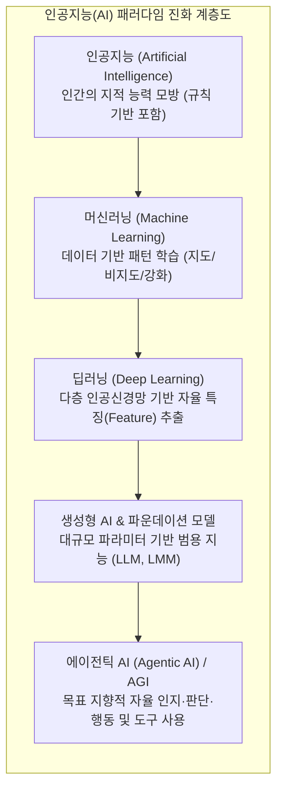

# 인공지능 (Artificial Intelligence)

---

## I. 인간의 지적 능력을 모방하는 컴퓨팅 시스템, 인공지능의 개요

* **정의**: 인간의 학습, 추론, 지각, 언어 이해 등의 지능적 능력을 컴퓨터 프로그램과 기계 시스템(하드웨어)으로 실현하는 포괄적인 정보 통신 기술
* **배경**: 빅데이터의 폭발적 증가, 병렬 컴퓨팅 인프라([[GPU]]/[[NPU]])의 발전, [[트랜스포머|트랜스포머(Transformer)]] 등 고도화된 [[딥러닝]] 알고리즘의 등장
* **특징**: 데이터 기반 자율 특징 추출(Feature Learning), 패턴 인식 및 비선형적 추론, 초거대화(Foundation Model) 및 자율화(Agentic AI)로의 패러다임 전환

---

## II. 인공지능의 진화 개념도 및 핵심 기술 요소

### 가. 인공지능의 패러다임 진화 개념도

* 특정 작업에 국한된 약인공지능(ANI)에서 범용 지식을 생성하는 파운데이션 모델을 거쳐, 도구를 활용해 자율적으로 임무를 수행하는 범용인공지능([[AGI]]) 및 에이전틱 AI로 진화 중

### 나. 인공지능의 핵심 기술 요소

| 구분 | 요소기술(키워드) | 세부 설명 |
| --- | --- | --- |
| **핵심 [[알고리즘]]** | Transformer | 병렬 처리 및 셀프 어텐션(Self-Attention) 메커니즘 기반 [[초거대 언어 모델]](LLM)의 핵심 아키텍처 |
| **핵심 알고리즘** | Diffusion | 노이즈 주입 및 복원 역과정을 통한 확률 분포 모델링으로 고품질 이미지/비디오 생성 |
| **학습/최적화** | RLHF | 인간의 피드백을 반영한 [[강화학습]] 기법으로, AI의 응답을 인간의 윤리 및 의도(Alignment)에 맞게 튜닝 |
| **지식 증강** | RAG (검색 증강 생성) | 외부의 신뢰할 수 있는 벡터 DB 지식을 검색하여 프롬프트에 결합, 환각(Hallucination) 현상 최소화 |
| **지능형 아키텍처** | Agentic AI | 프롬프트를 넘어 인지-계획-행동(Perception-Planning-Action) 사이클로 다단계 복합 임무 자율 수행 |
| **데이터 처리** | Multi-modal | 텍스트, 이미지, 음성, 비디오 등 다양한 형태의 이기종 데이터를 동시에 이해하고 생성하는 기술 |
| **컴퓨팅 인프라** | AI 가속기 (GPU/NPU) | 수천 개의 코어로 구성되어 딥러닝의 대규모 행렬 곱셈 연산([[MAC]])을 초고속으로 병렬 처리 |
| **[[신뢰성]]/보안** | [[AI TRiSM]] | AI 시스템의 신뢰성, 위험, 보안 관리를 위한 전사적 [[IT 거버넌스]] 및 모니터링 [[프레임워크]] |

---

## III. 인공지능의 활용 패러다임 비교 및 최신 동향

### 가. 판별형 AI와 생성형 AI의 비교

| 비교 항목 | 판별형 AI (Discriminative AI) | 생성형 AI (Generative AI) |
| --- | --- | --- |
| **핵심 목적** | 기존 데이터의 분류, 회귀, 예측, 식별 | 완전히 새로운 콘텐츠(텍스트, 이미지, 코드 등) 생성 |
| **학습 방식** | 주로 지도 학습(Supervised Learning) 기반 | 대규모 [[비지도 학습]](자기지도 학습) 및 사전학습 |
| **확률 모델링** | 조건부 확률 $P(Y\Vert{}X)$ (결정 경계 최적화) | 결합 확률 $P(X,Y)$ (데이터 분포 자체를 학습) |
| **대표 알고리즘** | [[서포트 벡터 머신|SVM]], Random Forest, [[CNN]], [[RNN (Recurrent Neural Network)|RNN]] | Transformer(LLM), [[GAN (Generative Adversarial Network)|GAN]], Diffusion, [[VAE]] |
| **주요 활용 분야** | 불량품 비전 검사, 수요 예측, 스팸 필터링 | 대화형 챗봇(ChatGPT), 자동 작곡, 코드 자동 완성 |

### 나. 최신 기술 동향 및 산업 적용 전망

* **[[에이전틱 AI]](Agentic AI)의 대두**: 단순 텍스트 생성 수준을 넘어 API 호출, 웹 검색, 코드 실행 등 도구를 직접 사용하며 복잡한 문제를 자율적으로 해결하는 자율형 에이전트(Autonomous Agent)로 비즈니스 워크플로우 혁신
* **[[온디바이스 AI]](On-Device AI) 및 [[sLLM (Smaller Large Language Model)|sLLM]] 확산**: 클라우드 의존성 및 정보 유출 방지를 위해 스마트폰, PC, 가전 기기 자체에서 구동되는 경량화된 소형 언어 모델(sLLM) 도입 가속화 (양자화, Pruning 기술 적용)
* **AI 신뢰성 확보 및 규제 강화(Trustworthy AI)**: 설명 가능한 AI([[XAI]])를 통한 블랙박스 모델의 해석력 강화 및 'EU AI Act(인공지능법)' 발효에 따른 고위험 AI 시스템에 대한 글로벌 컴플라이언스 대응 체계 구축 필수화

---

### 🔗 연관 토픽

- **소속 도메인**: [[00_인공지능_MOC|🤖 인공지능]]
- **세부 분류**: `3. 딥러닝 핵심 아키텍처 & 신경망`
- **핵심 연관 토픽**:
  - [[XAI]]
  - [[강화학습]]
  - [[GAN (Generative Adversarial Network)]]
  - [[AGI|AGI (Artificial General Intelligence)]]
  - [[에이전틱 AI|에이전틱 AI(Agentic AI)]]
