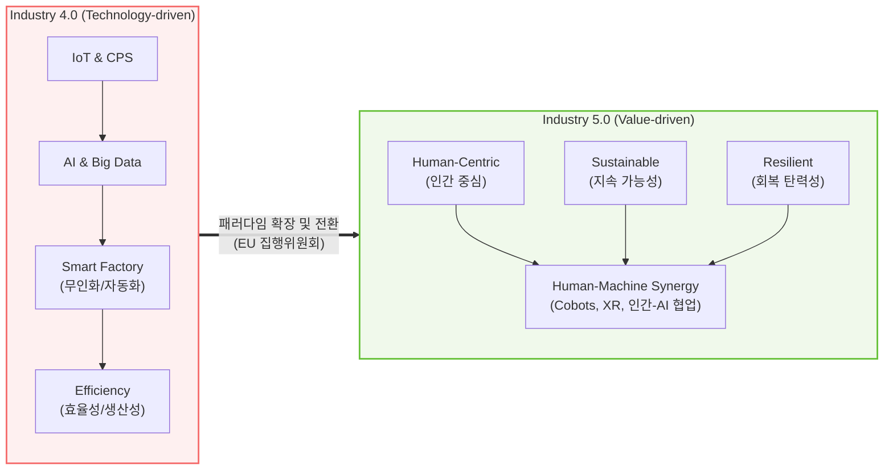

## I. 기술 중심에서 가치 중심으로의 진화, 인더스트리 4.0과 5.0의 개요

**가. 인더스트리 4.0과 5.0의 정의**
- **인더스트리 4.0**: 사물인터넷(IoT), [[인공지능]](AI), 사이버 물리 시스템([[CPS]]) 기술을 융합하여 초연결·초지능 기반의 공정 자동화와 생산 효율성 극대화를 추구하는 4차 산업혁명 패러다임.
- **인더스트리 5.0**: 인더스트리 4.0의 기술적 토대 위에 '인간 중심(Human-centric)', '지속가능성(Sustainability)', '회복탄력성(Resilience)'을 3대 핵심 가치로 삼아 인간과 기계의 시너지를 지향하는 차세대 산업 패러다임.

**나. 인더스트리 패러다임 전환의 필요성 및 배경**
- **기술 만능주의의 한계**: 극단적 무인화와 자동화로 인한 인간 소외 현상 발생 및 기계에 의한 노동력 대체 우려 증가.
- **글로벌 복합 위기 대응**: 기후 변화, 팬데믹, 지정학적 갈등 등에 대응하기 위한 탄력적 공급망 구축 및 친환경 순환 경제로의 전환 요구 대두 (EU 집행위원회 주도).

---

## II. 인더스트리 4.0과 5.0의 개념도 및 핵심 기술 요소

**가. 인더스트리 패러다임 진화 개념도**

* 단순히 기술 기반의 효율성을 좇던 4.0에서 벗어나, 기술이 인류의 복지와 지구 환경을 위해 복무하는 5.0 체계로 진화함.

**나. 인더스트리 4.0과 5.0의 핵심 기술 및 구성 요소**

| 구분 | 요소기술(키워드) | 세부 설명 |
| --- | --- | --- |
| **Industry 4.0** | 사이버 물리 시스템 (CPS) | - 현실의 제조 설비를 디지털 환경([[디지털 트윈]])에 통합하여 실시간 제어 및 최적화 |
| **Industry 4.0** | 산업용 사물인터넷 (IIoT) | - 공장 내 모든 센서와 설비를 초연결하여 방대한 데이터를 수집하고 네트워크화 |
| **Industry 4.0** | 예지보전 (Predictive Maint.) | - AI를 활용하여 설비 고장을 사전 예측하고 가동 중지 시간(Downtime)을 최소화 |
| **Industry 5.0** | 협동 로봇 (Cobot) | - 인간 작업자와 물리적으로 동일한 공간에서 안전하게 상호 협력하는 로봇 시스템 |
| **Industry 5.0** | 인지 증강 (XR/AR) | - 증강현실 기술을 통해 작업자에게 실시간 조립 가이드 및 현장 상황 인지 능력 부여 |
| **Industry 5.0** | 증강형 AI (Human-in-the-Loop) | - 인간의 의사결정을 대체하지 않고 보조하며, 설명 가능성([[XAI]])을 제공하여 인지 부하 감소 |
| **Industry 5.0** | 순환 경제 인프라 | - 탄소 배출 추적, 에너지 효율 극대화, 재활용 소재 활용 등 친환경 제조 인프라 구현 |
| **Industry 5.0** | 적응형 공급망 관리 ([[SCM (Supply Chain Management)|SCM]]) | - 예측 불가능한 외부 위기(원자재 부족 등) 시 동적으로 복구되는 스마트 장애 조치 기술 |

---

## III. 인더스트리 4.0과 5.0의 비교 및 향후 전망

**가. 인더스트리 4.0과 5.0의 주요 특징 비교**

| 비교 항목 | 인더스트리 4.0 (Industry 4.0) | 인더스트리 5.0 (Industry 5.0) |
| --- | --- | --- |
| **핵심 철학/관점** | 기술 중심 (Technology-driven) | 가치 중심 (Value-driven) |
| **최우선 목표** | 생산성 극대화, 공정 최적화, 원가 절감 | 인류의 복지, 지속 가능성, 공급망 복원력 |
| **인간의 역할** | 시스템 모니터링 및 노동력 대체 대상 | 로봇 및 AI와 상호작용하는 창의적 주체(투자 대상) |
| **제조 패러다임** | 기계 간 연결을 통한 무인화 ([[Smart Factory]]) | 인간-기계 융합을 통한 시너지 창출 (Human-Machine Synergy) |
| **사회 및 환경** | 비용 절감 목적의 한정적 에너지 최적화 구현 | 순환 경제, [[ESG 경영]] 및 탄소 중립 등 적극적 책무 수행 |

**나. 향후 산업 적용 전망 및 동향**

* **대체에서 증강(Augmentation)으로**: 공장 내 AI 및 로봇의 역할이 단순 자동화를 넘어 인간 기술자의 부족한 경험과 지식을 보완해 주는 '지식 관리 및 진단 지원 도구'로 발전 중임.
* **ESG 거버넌스와의 결합**: 기업의 기술 투자가 재무적 이익(4.0)뿐만 아니라, 탄소 배출 저감 및 근로자 안전 확보라는 ESG 목표(5.0)를 동시에 달성하도록 각국 정부의 규제 및 지원 정책이 강화되는 추세임.

---

### 🔗 연관 토픽

- **소속 도메인**: [[00_디지털서비스_MOC|🚀 디지털서비스]]
- **세부 분류**: `3. 사물인터넷 (IoT) & 스마트 플랫폼 · 메타버스`
- **핵심 연관 토픽**:
  - [[Smart Factory|Smart Factory/스마트 팩토리(공장)]]
  - [[디지털 트윈|디지털 트윈 (Digital Twin)]]
  - [[CPS]]
  - [[물리적 AI]]
  - [[인공지능]]
