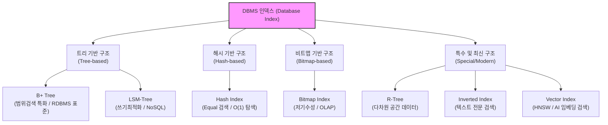

# 인덱스 구조에 따른 분류 (Index Structure Classification)

---

## I. DBMS 성능 최적화의 핵심, 인덱스 구조의 개요

* **정의**: 데이터베이스에서 원하는 데이터를 빠르게 검색하기 위해 레코드의 물리적 주소(RowID)와 키(Key) 값을 매핑하여 특정 알고리즘으로 구성한 데이터 접근 논리적 자료구조
* **필요성**: 디스크 I/O 최소화, 쿼리 응답 시간 단축, 병목 현상 해소 및 시스템 전체 [[처리량]](Throughput) 향상
* **특징**:
* Trade-off: 검색 속도는 향상되나 데이터 [[DML]](Insert, Update, Delete) 발생 시 인덱스 갱신 오버헤드 발생
* 워크로드 의존성: [[OLTP]](읽기 위주), [[NoSQL (CAP 이론 BASE 속성)|NoSQL]](쓰기 위주), [[OLAP]](분석 위주), AI([[유사도]] 검색) 등 목적에 따라 최적의 인덱스 구조 선정 필수

---

## II. 인덱스 구조 분류 개념도 및 핵심 구조 유형

### 가. 인덱스 구조 분류 개념도

* 데이터의 특성(기수성, 다차원성) 및 질의 형태(점 검색, 범위 검색, 근사 검색)에 따라 분기하여 최적화된 자료구조 적용

### 나. 인덱스 구조별 핵심 기술 요소

| 구분 | 요소기술 (인덱스 구조) | 세부 설명 |
| --- | --- | --- |
| **트리 구조** | **B+ Tree** | 리프 노드에만 실제 데이터를 저장하고, 리프 노드 간 Linked List로 연결하여 범위 검색(Range Scan) 성능 극대화 (대부분의 RDBMS 기본 구조) |
| **트리 구조** | **LSM-Tree (Log-Structured)** | 메모리(MemTable)와 디스크(SSTable)를 분리하고 순차 쓰기를 유도하여 디스크 쓰기 병목을 제거한 구조 (Cassandra, RocksDB 적용) |
| **해시 구조** | **Hash [[RDBMS 인덱스(index)|Index]]** | 해시 함수를 통해 키 값을 버킷 주소로 변환, 시간 복잡도 O(1) 달성. 단, 부등호(<, >) 등 범위 검색 불가 (Memory DB, Key-Value Store) |
| **비트맵 구조** | **Bitmap Index** | 컬럼의 값을 Bit(0과 1)로 매핑, Bitwise 연산(AND, OR)으로 다중 조건 검색이 매우 빠름. 기수성(Cardinality)이 낮은 성별, 직급 등에 유리 |
| **공간 구조** | **R-Tree (Rectangle)** | MBR(Minimum Bounding Rectangle)을 활용하여 2차원 또는 다차원 공간 데이터(좌표, 폴리곤)의 포함 관계를 인덱싱 (GIS, 위치반환 서비스) |
| **텍스트 구조** | **Inverted Index (역인덱스)** | 문서 내 단어(Term)를 추출하여 키로 삼고, 해당 단어가 포함된 문서 ID(DocID)를 매핑하는 구조 (Elasticsearch 등 전문 검색 엔진) |
| **클러스터링** | **Clustered Index** | 인덱스의 순서와 실제 디스크에 저장된 데이터의 물리적 정렬 순서가 동일한 구조 (테이블당 1개만 생성 가능, PK 기본 적용) |
| **AI/벡터** | **Vector Index (HNSW)** | 고차원 임베딩 벡터 간의 거리를 계층적 그래프 모델(HNSW)로 구성하여 가장 근접한 데이터를 찾는 ANN(근사 최근접 이웃) 검색 최적화 |

---

## III. 핵심 인덱스 구조 비교 및 최신 동향

### 가. 워크로드별 주요 인덱스 구조 비교 (B+ Tree vs LSM-Tree vs Vector Index)

| 비교 항목 | B+ Tree | LSM-Tree (Log-Structured Merge) | Vector Index (HNSW 등) |
| --- | --- | --- | --- |
| **설계 철학** | 읽기(Read) 최적화, 범위 검색 | 쓰기(Write) 최적화, 순차 I/O | 고차원 벡터의 유사도 검색 |
| **주요 워크로드** | OLTP (일반적인 RDBMS 환경) | NoSQL, 빅데이터 로깅 스토리지 | Vector DB, [[초거대 언어 모델|LLM]] RAG 파이프라인 |
| **데이터 탐색** | 트리를 타고 내려가는 O(log N) 탐색 | MemTable 탐색 후 SSTable 병합 탐색 | 근사 최근접 이웃(ANN) 탐색 방식 |
| **삽입/삭제 비용** | 높음 (페이지 분할 및 정렬 오버헤드) | 낮음 (메모리에 순차 추가 후 플러시) | 중간 (그래프 계층 재구성 비용 발생) |
| **핵심 장점** | 일관된 읽기 성능, 범위(Range) 스캔 우수 | 압도적인 쓰기(Insert/Update) 성능 | 비정형 데이터(이미지, 텍스트) 의미 검색 |
| **주요 적용 DB** | Oracle, MySQL, PostgreSQL | Cassandra, HBase, RocksDB | Milvus, Pinecone, pgvector |

### 나. 인덱스 기술 전망 및 최신 동향

* **Learned Index의 부상**: 기계학습 모델을 사용하여 데이터의 누적 분포 함수(CDF)를 학습, B-Tree를 대체하여 메모리 사용량을 줄이고 탐색 속도를 높이는 연구(Google 등) 진행
* **AI 결합 및 Vector DB 표준화**: LLM 기반 RAG(검색 증강 생성) 아키텍처가 대중화됨에 따라 관계형 DB 내에 HNSW, IVFFlat 등 벡터 인덱스 확장이 필수 기능으로 자리매김 (예: PostgreSQL의 pgvector)
* **HTAP 최적화**: [[트랜잭션]](OLTP)과 분석(OLAP)을 동시 처리하는 HTAP 환경을 위해 Row 단위 인덱스(B+ Tree)와 Column 단위 인덱스(Bitmap/Columnar)를 하이브리드로 적용하는 메모리 중심 아키텍처 진화

---

### 🔗 연관 토픽

- **소속 도메인**: [[00_데이터베이스_MOC|🗄️ 데이터베이스]]
- **세부 분류**: `4. 물리 저장 구조 & 인덱스 최적화`
- **핵심 연관 토픽**:
  - [[OLAP]]
  - [[OLTP]]
  - [[트랜잭션]]
  - [[DML]]
  - [[NoSQL (CAP 이론 BASE 속성)]]
