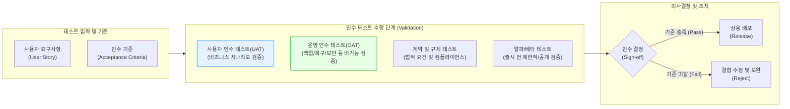

# 인수 테스트 (Acceptance Test)

---

## I. 사용자 요구사항 충족 여부 확인을 위한 최종 관문, 인수 테스트의 개요

* **정의**: 개발 완료된 소프트웨어가 실제 운영 환경에서 사용자의 비즈니스 요구사항(인수 조건)을 충족하는지 최종적으로 확인(Validation)하고 시스템 인수를 결정하는 테스트 활동
* **필요성 및 특징**:
* **Validation(확인) 중심**: "올바른 제품을 만들었는가(Build the right product)?"에 대한 최종 해답 제공
* **사용자 주도**: 개발자나 테스터가 아닌 실제 비즈니스 사용자, 고객, 운영자가 주체적으로 수행
* **블랙박스 접근**: 시스템의 내부 로직(코드)을 배제하고, [[요구사항 명세서]] 기반의 기능적/비기능적 동작 위주로 검증

---

## II. 인수 테스트의 개념도 및 핵심 기술 요소

### 가. 인수 테스트의 프로세스 및 유형 개념도

* V-모델의 우측 최상단에 위치하며, 사전 정의된 인수 기준(Acceptance Criteria)을 바탕으로 시스템의 상용 환경 배포 가능 여부(Sign-off)를 판별함

### 나. 인수 테스트의 핵심 구성 및 기술 요소

| 분류 | 요소기술(키워드) | 세부 설명 |
| --- | --- | --- |
| **테스트 유형** | **UAT (User Acceptance Test)** | - 실제 시스템 사용자가 비즈니스 [[프로세스]] 시나리오를 바탕으로 요구사항 충족 여부를 검증 |
| **테스트 유형** | **OAT (Operational Acceptance Test)** | - 시스템 관리자가 IT 운영 환경(백업, 복구, 재난 복구, 보안 점검, 유지보수성)의 적합성을 검증 |
| **테스트 유형** | **Alpha / Beta Test** | - 통제된 내부 환경에서 선택된 사용자(알파) 및 통제되지 않은 외부 환경의 불특정 다수(베타) 대상 테스트 |
| **판단 기준** | **인수 기준 (Acceptance Criteria)** | - 애자일([[Agile]]) 환경의 User Story 완료를 판단하기 위한 명확하고 측정 가능한 비즈니스 조건 (DoD 확보) |
| **개발 방법론** | **ATDD (인수 테스트 주도 개발)** | - 개발 전 기획자, 개발자, 테스터가 협업하여 인수 테스트를 먼저 정의하고 이를 통과하는 코드를 구현하는 기법 |
| **개발 방법론** | **BDD (행위 주도 개발)** | - Given-When-Then 문법을 사용하여 비즈니스 요구사항을 자연어 형태의 자동화 가능한 테스트 시나리오로 작성 |
| **검증 기법** | **[[블랙박스 테스트]] (Black-box)** | - 내부 소스코드 구조를 보지 않고, 입력값에 대한 출력 결과가 인수 기준에 부합하는지만을 확인 |
| **자동화 도구** | **Cucumber / Selenium** | - BDD 기반의 시나리오를 코드화하여 CI/CD 파이프라인 내에서 인수 테스트의 반복(회귀) 수행을 자동화 |

---

## III. 시스템 테스트와의 비교 및 향후 동향

### 가. 시스템 테스트(System Test)와 인수 테스트(Acceptance Test) 비교

| 비교 항목 | [[시스템 테스트]] (System Test) | 인수 테스트 (Acceptance Test) |
| --- | --- | --- |
| **검증 목적** | **Verification (검증)**: "제품을 제대로 만들었는가?" | **Validation (확인)**: "올바른 제품을 만들었는가?" |
| **수행 주체** | 전문 테스터 (QA), 개발 조직 | 실제 비즈니스 사용자 (End-User), 고객, 운영자 |
| **테스트 기반** | 시스템 요구사항 명세서 (SRS), 설계 산출물 | 비즈니스 요구사항, 인수 기준(Acceptance Criteria) |
| **테스트 환경** | 개발 환경과 분리된 통제된 테스트 서버 | 실제 상용 운영 환경(Production)과 동일/유사한 환경 |
| **발견 결함** | 기능적 버그, 인터페이스 오류, 리소스 누수 | 비즈니스 로직 결함, 사용성 문제, 요구사항 누락 |

### 나. 최신 동향 및 산업 적용 방향

* **애자일 및 지속적 테스팅(Continuous Testing) 결합**: 릴리즈 주기가 짧아짐에 따라 수동 UAT의 병목을 해소하기 위해 ATDD/BDD 방법론을 도입하고, 인수 테스트를 CI/CD 파이프라인에 통합하여 자동화하는 추세임.
* **Shift-Left 패러다임 확산**: 개발 후반부에 수행되던 인수 테스트의 시나리오를 프로젝트 초기(요구사항 분석 단계)에 이해관계자 전원(3 Amigos: 기획, 개발, QA)이 참여하여 조기 도출함으로써, 후반부 결함 수정 비용(Rework Cost)을 획기적으로 절감함.

---

### 🔗 연관 토픽

- **소속 도메인**: [[00_소프트웨어공학_MOC|🏗️ 소프트웨어공학]]
- **세부 분류**: `3. 요구사항 공학 & UML 객체지향 분석/설계`
- **핵심 연관 토픽**:
  - [[시스템 테스트]]
  - [[Agile]]
  - [[요구사항 명세서|요구사항 명세서 SRS]]
  - [[요구 공학|요구 공학 (Requirements Engineering)]]
  - [[블랙박스 테스트]]
