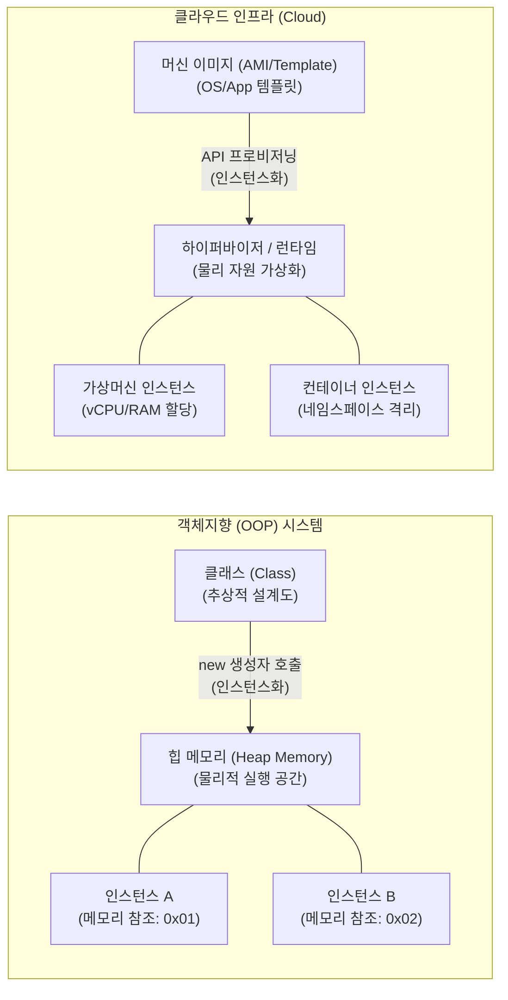

# 인스턴스 (Instance)

---

## I. 객체지향 및 클라우드 환경의 핵심 실행 단위, 인스턴스의 개요

* **정의**: [[객체지향]] 프로그래밍(OOP)에서는 [[클래스]](설계도)를 바탕으로 메모리(Heap)에 물리적으로 할당된 실체(객체)를 의미하며, 클라우드 환경에서는 머신 이미지(AMI 등)를 기반으로 가상화된 컴퓨팅 리소스가 프로비저닝되어 실행 중인 가상 서버를 의미함.
* **특징**:
* **상태와 행위 보유**: 고유한 식별자(Identity)와 상태 데이터(변수)를 가지며, 정의된 행위(메서드/[[프로세스]])를 수행함.
* **독립적 생명주기 (Lifecycle)**: 동적으로 생성(할당/[[프로비저닝]])되고, 사용이 끝나면 메모리 또는 인프라 자원에서 해제(GC/Terminate)됨.
* **원본과의 [[관계성]]**: 항상 원본인 추상적 개념(클래스, 템플릿, 머신 이미지)에 종속되어 파생되는 '구체적 사례'의 특성을 가짐.

---

## II. 인스턴스의 아키텍처 및 핵심 구성 요소

### 가. 환경별 인스턴스화(Instantiation) 아키텍처 및 동작 원리

* **동작 흐름**: (OOP) 클래스 설계도 기반으로 `new` 키워드를 통해 힙 영역에 인스턴스 생성 $\rightarrow$ (Cloud) 정의된 머신 이미지를 바탕으로 하이퍼바이저가 자원을 할당하여 가상 서버 인스턴스 실행

### 나. 인스턴스의 핵심 기술 및 구성 요소

| 구분 | 요소기술(키워드) | 세부 설명 |
| --- | --- | --- |
| **객체지향 (OOP)** | **클래스 (Class)** | - 인스턴스 생성을 위한 상태(속성)와 행위(메서드)를 정의한 정적 템플릿 |
| **객체지향 (OOP)** | **생성자 (Constructor)** | - 힙(Heap) 메모리에 인스턴스를 물리적으로 할당하고 초기 상태값을 부여하는 메서드 |
| **객체지향 (OOP)** | **레퍼런스 (Reference)** | - 생성된 인스턴스를 제어하기 위해 스택([[Stack]]) 영역에 저장되는 메모리 주소(참조값) |
| **객체지향 (OOP)** | **가비지 컬렉터 (GC)** | - 참조가 끊어져 더 이상 사용되지 않는 인스턴스를 메모리에서 자동 해제하는 메커니즘 |
| **클라우드 (Cloud)** | **머신 이미지 (AMI)** | - 클라우드 인스턴스를 구동하기 위한 [[OS(운영체제)|운영체제]], 애플리케이션, 설정 정보가 포함된 템플릿 |
| **클라우드 (Cloud)** | **프로비저닝 (Provisioning)** | - 템플릿을 바탕으로 사용자의 요청에 따라 vCPU, Memory, Network 자원을 인스턴스에 매핑 |
| **클라우드 (Cloud)** | **테넌시 (Tenancy)** | - 인스턴스가 물리적 하드웨어를 타 사용자와 공유(Multi-tenant)할지 독점(Dedicated)할지 결정 |
| **클라우드 (Cloud)** | **수명주기 (Lifecycle)** | - Pending, Running, Stopped, Terminated 등 클라우드 인스턴스의 상태 변화 제어 및 모니터링 |

---

## III. 인스턴스 유사 개념 비교 및 최신 동향

### 가. 객체지향 환경에서의 클래스, 객체, 인스턴스 비교

| 비교 항목 | 클래스 (Class) | 객체 (Object) | 인스턴스 (Instance) |
| --- | --- | --- | --- |
| **개념적 위치** | 추상적인 설계도, 사양서 | 설계도를 통해 구현해야 할 대상 | 객체가 메모리에 할당되어 실체화된 상태 |
| **존재 공간** | 소스 코드, 클래스 영역 | 인간의 현실 세계 및 관념적 세계 | 소프트웨어 구동 환경 (힙 메모리) |
| **포커스(강조점)** | 데이터 타입의 정의 | 실재(Entity) 그 자체의 성질 | 클래스와 객체 간의 **'관계(Relation)'** 중심 |
| **비유(예시)** | '자동차'라는 개념, 도면 | 구현된 '내 자동차', '너의 자동차' | 도면(클래스)을 바탕으로 공장에서 생산된 '특정 자동차(인스턴스)' |

### 나. 클라우드 인스턴스 아키텍처의 향후 발전 동향

* **마이크로 VM(MicroVM)의 부상**: 기존 무거운 가상머신(VM) 인스턴스의 부팅 지연 시간을 밀리초(ms) 단위로 단축한 Firecracker(AWS) 기반 경량 인스턴스 확산
* **서버리스(Serverless) 및 [[컨테이너]] 인스턴스**: 인프라 관리를 추상화하고 애플리케이션 코드가 실행될 때만 동적으로 인스턴스가 생성되었다가 소멸되는 상태 비저장(Stateless) 아키텍처(Fargate, Cloud Run 등)로 진화 중

---

### 🔗 연관 토픽

- **소속 도메인**: [[00_소프트웨어공학_MOC|🏗️ 소프트웨어공학]]
- **세부 분류**: `4. 아키텍처 스타일 & 객체지향 설계 원리`
- **핵심 연관 토픽**:
  - [[객체지향]]
  - [[클래스]]
  - [[Singleton (전역 인스턴스)]]
  - [[MSA (Micro Service Architecture)]]
  - [[프로세스]]
