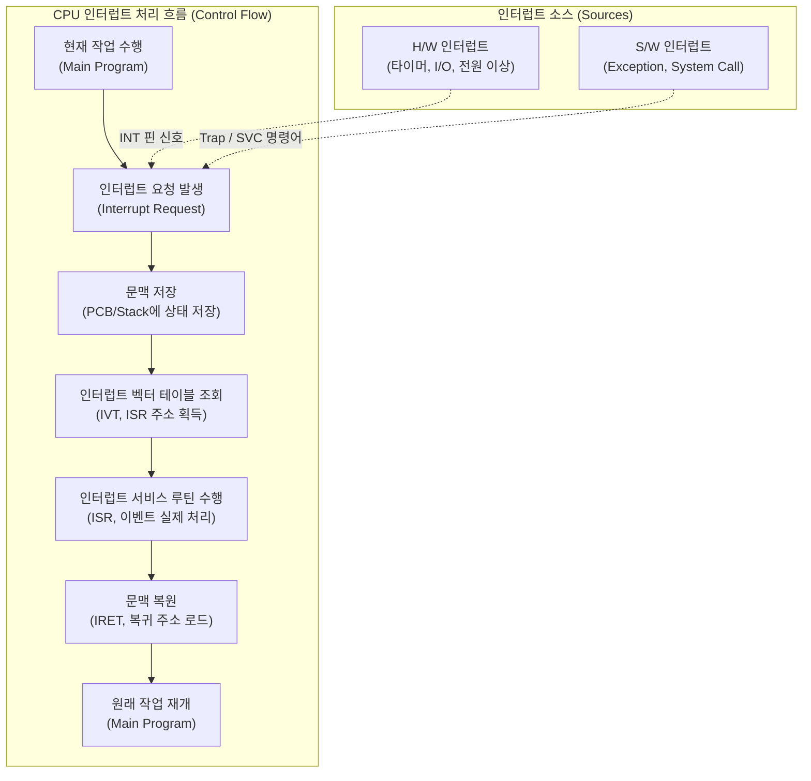

# 인터럽트 (Interrupt)

---

## I. CPU 활용률 극대화 및 비동기 이벤트 처리 메커니즘, 인터럽트의 개요

* **정의**: [[CPU]]가 프로그램 실행 중에 하드웨어나 소프트웨어의 예외 및 긴급 상황 발생 시, 현재 작업을 일시 중단하고 해당 이벤트를 우선적으로 처리한 후 원래 작업으로 복귀하는 제어 흐름 메커니즘
* **필요성 및 특징**:
* **자원 효율화**: CPU와 I/O 장치 간의 속도 차이 극복 및 CPU 유휴 시간(Idle Time) 방지
* **다중 프로그래밍 지원**: 타이머 인터럽트를 통한 시분할(Time-Sharing) [[OS(운영체제)|운영체제]] 구현
* **안정성 확보**: 0 나누기(Divide by Zero), 페이지 폴트(Page Fault) 등 예외 상황에 대한 안전한 처리 보장

---

## II. 인터럽트의 개념도 및 핵심 기술 요소

### 가. 인터럽트 처리 프로세스 및 동작 원리

* 하드웨어나 커널 요청 시 CPU는 기존 [[프로세스]] 상태를 [[PCB(Process Control Block)|PCB]]에 보존(Context Saving)한 뒤, IVT를 참조하여 ISR을 실행하고 IRET 명령을 통해 복귀함

### 나. 인터럽트의 핵심 구성 및 기술 요소

| 분류 | 요소기술(키워드) | 세부 설명 |
| --- | --- | --- |
| **H/W 인터럽트** | NMI / Maskable | - **NMI**: 무시 불가(전원 이상, 하드웨어 오류) 

 - **Maskable**: 마스크 레지스터로 제어 가능(I/O, 타이머) |
| **S/W 인터럽트** | Trap / Exception | - 0 나누기, 페이지 폴트 등 명령어 실행 중 발생하는 예외 상황 처리를 위한 동기적 인터럽트 |
| **S/W 인터럽트** | System Call (SVC) | - 사용자 모드(User) 프로세스가 커널 모드([[커널|Kernel]])의 특권 명령을 요청하기 위해 의도적으로 발생 |
| **핵심 자료구조** | IVT (인터럽트 벡터 테이블) | - 인터럽트 고유 번호(Vector)와 해당 이벤트를 처리할 함수(ISR)의 메모리 시작 주소를 매핑한 테이블 |
| **실행 주체** | ISR (인터럽트 서비스 루틴) | - 인터럽트 핸들러(Handler)로도 불리며, 특정 인터럽트 발생 시 실제 로직을 처리하는 커널 모드 함수 |
| **제어 하드웨어** | APIC | - 멀티 코어 환경에서 발생하는 인터럽트를 각 CPU 코어로 적절히 분배하고 우선순위를 제어하는 컨트롤러 |
| **현대화 규격** | MSI / MSI-X | - 물리적 INT 핀 대신 PCIe 메모리 쓰기(In-band) 방식을 사용하여 신호를 전달하는 메시지 기반 인터럽트 |
| **상태 관리** | [[문맥 교환]] (Context Switch) | - 인터럽트 처리 전후로 CPU 레지스터 및 프로그램 카운터(PC) 상태를 PCB 및 스택에 저장/복원하는 오버헤드 발생 |

---

## III. 인터럽트와 폴링(Polling)의 비교 및 최신 최적화 동향

### 가. 인터럽트와 폴링(Polling) 방식 비교

| 비교 항목 | 인터럽트 (Interrupt) | 폴링 (Polling) |
| --- | --- | --- |
| **이벤트 감지 주체** | 하드웨어 컨트롤러 (Event-Driven) | 소프트웨어 / CPU (Loop-Driven) |
| **CPU 효율성** | **높음** (이벤트 발생 시에만 개입) | **낮음** (루프를 돌며 상태를 지속 확인하여 자원 낭비) |
| **시스템 오버헤드** | 문맥 교환(Context Switch) 비용 발생 | 문맥 교환 없음 (연속적인 단순 처리에 유리) |
| **반응 속도** | 이벤트 발생 시 즉각 응답 보장 | 상태 확인 주기에 따라 응답 지연(Latency) 발생 가능 |
| **주요 활용 분야** | 일반적인 I/O 처리, 키보드/마우스 입력 | 고속 네트워크 패킷 수신, 임베디드 루프 시스템 |

### 나. 고성능 컴퓨팅 환경의 인터럽트 최적화 동향

* **인터럽트 폭풍(Storm) 방지 및 NAPI**: 10Gbps 이상의 초고속 네트워크 환경에서는 너무 잦은 인터럽트로 인해 시스템이 마비되는 현상을 막기 위해, 리눅스의 NAPI(New API)처럼 **'인터럽트 병합(Coalescing)'** 기법과 '폴링'을 동적으로 혼합하여 패킷을 처리함
* **유저 레벨 인터럽트 (UINTR)**: 최근 인텔(Intel) 아키텍처 등에서는 커널을 거치지 않고 사용자 공간(User-Space) 프로세스로 직접 인터럽트를 전달하는 UINTR 기술을 도입하여, NVMe 스토리지 및 마이크로서비스 환경에서 문맥 교환 지연(Latency)을 극한으로 최소화하는 추세임

---

### 🔗 연관 토픽

- **소속 도메인**: [[00_운영체제_MOC|⚙️ 운영체제]]
- **세부 분류**: `1. 프로세스 & 스레드 관리`
- **핵심 연관 토픽**:
  - [[프로세스]]
  - [[커널|커널(Kernel)]]
  - [[문맥 교환|문맥 교환 (Context Switching)]]
  - [[PCB(Process Control Block)]]
  - [[OS(운영체제)]]
