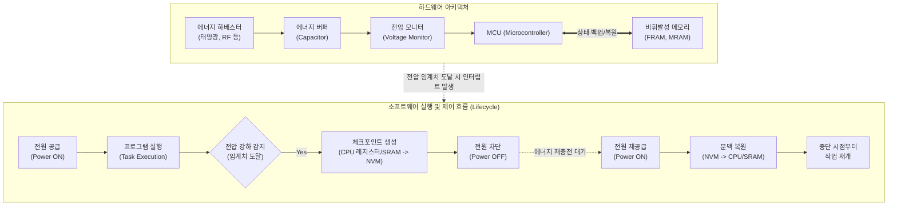

# 인터미턴트 컴퓨팅 (Intermittent Computing)

---

## I. 무전원 IoT 환경의 연속성 보장 기술, 인터미턴트 컴퓨팅의 개요

* **정의**: 에너지 하베스팅(Energy Harvesting)으로 수집된 불규칙적이고 단속적(Intermittent)인 전력 환경에서도, 잦은 전원 차단에 대비해 시스템 상태를 보존하고 작업을 끊김 없이 연속적으로 수행하는 컴퓨팅 패러다임
* **등장배경 및 특징**:
* **배터리 [[유지보수]] 한계**: 수백억 개 단위로 급증하는 초연결 IoT 기기의 배터리 교체 비용 및 환경 오염 문제 대두
* **전력의 불안정성**: 태양광, 진동, RF 등 자연/주변 환경 에너지는 지속 공급이 불가하여 잦은 전원 꺼짐(Power Failure) 발생
* **특징**: 전원 차단을 예외(Exception)가 아닌 정상(Normal) 상태로 간주, 비휘발성 메모리(NVM) 기반 체크포인팅(Checkpointing) 기술 필수

---

## II. 인터미턴트 컴퓨팅의 개념도 및 핵심 기술 요소

### 가. 인터미턴트 컴퓨팅의 아키텍처 및 동작 원리

* 에너지 버퍼(Capacitor)의 전압이 특정 임계치 이하로 떨어지면, 하드웨어 인터럽트를 통해 현재의 연산 상태(Context)를 NVM에 저장(Checkpoint)하고, 전력 회복 시 복원하여 작업을 이어감.

### 나. 인터미턴트 컴퓨팅의 핵심 구성 및 기술 요소

| 분류 | 요소기술(키워드) | 세부 설명 |
| --- | --- | --- |
| **하드웨어** | 에너지 하베스팅 (Energy Harvesting) | - 주변 환경의 미세한 에너지(태양광, 압전, 열전, RF)를 포집하여 전기 에너지로 변환하는 기술 |
| **하드웨어** | 비휘발성 메모리 (NVM) | - FRAM, MRAM 등 전원이 차단되어도 데이터가 유지되며, 쓰기 속도가 빨라 빈번한 체크포인팅에 적합한 메모리 |
| **소프트웨어** | 체크포인팅 (Checkpointing) | - 전원 차단 직전, [[CPU]] 레지스터, PC(Program Counter), 스택([[Stack]]) 등 휘발성 상태를 NVM에 안전하게 백업하는 기법 |
| **소프트웨어** | 태스크 기반 모델 (Task-based Model) | - 프로그램을 멱등성(Idempotence)을 가지는 작은 논리적 단위(Task)로 분할하여 전원 차단 시 Task 단위로 재실행 보장 |
| **소프트웨어** | JIT (Just-In-Time) 체크포인트 | - 프로그램 코드에 고정된 백업 지점을 두지 않고, 하드웨어 전압 강하 모니터링을 통해 동적으로 백업을 수행하는 최적화 기법 |
| **[[신뢰성]]/디버깅** | 메모리 불일치 (Memory Inconsistency) 해결 | - 정전 후 연산 재개 시 발생하는 WAR(Write-After-Read) 오류 등을 방지하기 위한 메모리 버저닝(Versioning) 및 복사본 유지 기법 |
| **신뢰성/디버깅** | Intermittent Timekeeping | - 전원이 꺼져 있는 동안의 시간 경과를 추적하기 위해 잔류 전하 감쇠(Decay) 특성을 활용하는 무전원 타이머 기술 |
| **응용 아키텍처** | Intermittent TinyML | - 컴퓨팅 자원이 극히 제한적인 무전원 디바이스에서 [[딥러닝]](NN) 추론 과정을 태스크 단위로 쪼개어 연속 실행하는 기술 |

---

## III. 전통적 컴퓨팅과의 비교 및 향후 전망

### 가. 전통적 배터리 컴퓨팅과 인터미턴트 컴퓨팅 비교

| 비교 항목 | 전통적 배터리 컴퓨팅 (Battery-powered) | 인터미턴트 컴퓨팅 (Batteryless / Intermittent) |
| --- | --- | --- |
| **전력 공급 특성** | 연속적, 안정적 (배터리, 유선 전력) | 단속적, 예측 불가능 (에너지 하베스팅 의존) |
| **정전(Power Failure) 인식** | 비정상적인 시스템 오류(Exception/Fault) | 시스템 라이프사이클의 일상적/정상적 현상 |
| **주요 메모리 구조** | SRAM, DRAM 등 휘발성 메모리 중심 연산 | FRAM, MRAM 등 비휘발성 메모리(NVM) 중심 연산 |
| **소프트웨어 패러다임** | 단일 스레드/[[프로세스]] 기반 연속 실행 | 상태 보존(Checkpoint) 및 태스크 단위 단속 실행 |
| **유지보수 비용** | 높음 (정기적인 배터리 교체 필수) | 매우 낮음 (반영구적 운영 가능, Zero-Maintenance) |

### 나. 최신 기술 동향 및 산업 적용 전망

* **극한 환경의 무전원 IoT 확산**: 심우주 탐사, 해저 생태계 모니터링, 체내 이식형 의료기기(Bio-Implant) 등 배터리 교체가 물리적으로 불가능한 극한 도메인에서의 적용이 본격화되고 있음.
* **TinyML과의 융합 가속**: 센서 데이터의 단순 수집을 넘어, 무전원 엣지([[EDGE|Edge]]) 단에서 실시간 객체 인식 및 이상 징후 탐지 딥러닝 모델을 수행하는 'Intermittent Intelligence' 연구가 엣지 AI의 차세대 핵심 화두로 대두됨.

---

### 🔗 연관 토픽

- **소속 도메인**: [[00_디지털서비스_MOC|🚀 디지털서비스]]
- **세부 분류**: `3. 사물인터넷 (IoT) & 스마트 플랫폼 · 메타버스`
- **핵심 연관 토픽**:
  - [[프로세스]]
  - [[Stack]]
  - [[디지털 트윈|디지털 트윈 (Digital Twin)]]
  - [[ISO 26262]]
  - [[CPS]]
