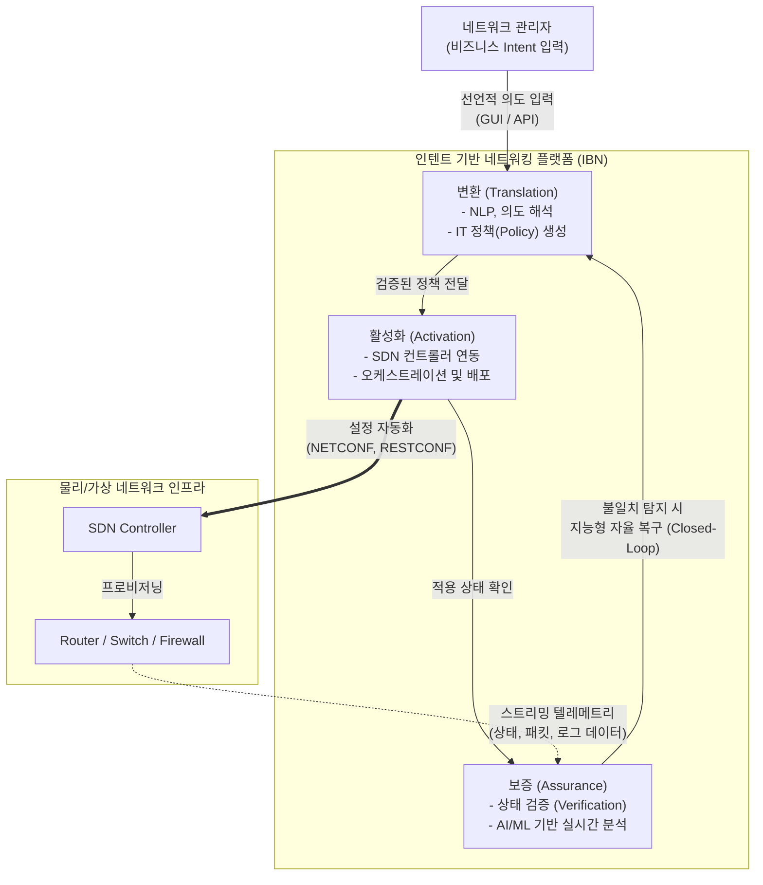

# 인텐트 기반 네트워킹 (Intent-Based Networking)

---

## I. 비즈니스 목적 중심의 지능형 네트워크 제어, IBN의 개요

* **정의**: 관리자가 "어떻게(How)" 구성할지가 아닌 "무엇(What)"을 달성할 것인지 선언적(Declarative) 비즈니스 의도(Intent)를 입력하면, AI/ML을 통해 네트워크 정책으로 자동 변환, 배포 및 지속 검증하는 폐쇄 루프(Closed-Loop) 기반 지능형 네트워킹 기술
* **등장배경 및 특징**:
* **[[SDN(Software Defined Network)|SDN]]의 한계 극복**: SDN은 제어/데이터 평면 분리로 유연성을 높였으나, 여전히 엔지니어의 수동 설정과 복잡성 존재
* **선언적(Declarative) 제어**: 복잡한 CLI 명령어 없이, 비즈니스 목적("특정 부서의 화상회의 품질 보장" 등) 기반으로 시스템 자율 제어
* **폐쇄 루프(Closed-Loop) 보증**: 설정된 의도와 실제 네트워크 상태 간의 일치 여부를 실시간 텔레메트리(Telemetry)를 통해 수학적으로 지속 검증 및 자동 보정

---

## II. IBN의 개념도 및 핵심 기술 요소

### 가. IBN의 아키텍처 및 동작 원리

* 사용자의 '의도'가 **변환(Translation) $\rightarrow$ 활성화(Activation) $\rightarrow$ 보증(Assurance)** 의 순환 주기를 거치며, 인프라의 상태가 비즈니스 목적과 불일치할 경우 AI가 자율적으로 정책을 재조정(Self-Healing)함

### 나. IBN의 핵심 기술 및 구성 요소

| 구분 | 요소기술(키워드) | 세부 설명 |
| --- | --- | --- |
| **변환 (Translation)** | 자연어 처리 (NLP) / NLU | 관리자의 자연어 또는 상위 레벨의 선언적 요구사항을 기계가 이해할 수 있는 구체적 네트워크 보안/[[QoS]] 정책으로 자동 매핑 |
| **변환 (Translation)** | 정책 엔진 (Policy Engine) | 변환된 정책이 기존 인프라에 충돌 없이 적용 가능한지 시뮬레이션(What-if 분석) 및 정형적 검증 수행 |
| **활성화 (Activation)** | SDN 컨트롤러 & API | [[오픈플로우|오픈플로우(OpenFlow)]], NETCONF, REST API 등을 활용하여 [[스위치 (Layer 3 Switch)|스위치]], [[라우터]] 등 이기종 인프라에 논리적 정책을 자동 [[프로비저닝]] |
| **활성화 (Activation)** | 데이터 모델링 (YANG) | 네트워크 설정 및 상태 데이터를 구조화하여 제조사에 종속되지 않는(Vendor-Agnostic) 표준 모델링 포맷 제공 |
| **보증 (Assurance)** | 스트리밍 텔레메트리 (Telemetry) | SNMP 대비 초고속/초정밀 데이터 수집 기술로, 인프라의 트래픽, 지연시간, 로그 상태를 초/밀리초 단위로 중앙 플랫폼에 푸시(Push) |
| **보증 (Assurance)** | 지속적 상태 검증 | 수학적 그래프 모델을 기반으로 '의도된 상태(Desired State)'와 '실제 인프라 상태(Actual State)' 간의 정합성을 실시간 비교 |
| **AI/ML (지능화)** | AIOps / 자동 복구 (Self-Healing) | 머신러닝 알고리즘으로 네트워크 이상 징후를 사전 예측(Predictive)하고, 장애 발생 시 원인 분석(RCA) 및 자율적 정책 수정 조치 수행 |
| **보안 (Security)** | 마이크로 [[세그멘테이션]] | 사용자 역할, 단말 상태 기반의 인텐트에 따라 논리적 망분리 및 세분화된 접근 통제([[제로 트러스트 보안모델|Zero Trust]]) 동적 적용 |

---

## III. IBN과 SDN의 비교 및 향후 전망

### 가. IBN과 SDN(Software-Defined Networking) 비교

| 비교 항목 | SDN (소프트웨어 정의 네트워킹) | [[IBN(Intent-Based Networking)|IBN]] (인텐트 기반 네트워킹) |
| --- | --- | --- |
| **제어 관점 (Paradigm)** | 명령적 (Imperative) - "어떻게 설정할 것인가" | 선언적 (Declarative) - "무엇을 달성할 것인가" |
| **핵심 목적** | 제어부(Control)와 데이터부(Data Plane)의 분리 | 비즈니스 의도의 번역, 적용 및 지속적인 상태 보증 |
| **제어 흐름 구조** | 개방 루프 (Open-Loop) / 수동 모니터링 필요 | 폐쇄 루프 (Closed-Loop) / 상태 불일치 시 자동 보정 |
| **인텔리전스 수준** | 중앙 집중형 소프트웨어 기반 룰(Rule) 제어 | AI/ML 기반 상태 추론, 사전 예방(Proactive) 및 자율 복구 |
| **상태 인식** | 인프라 관점의 단편적 모니터링 (별도 NMS 의존) | 전체 네트워크 컨텍스트 인지 및 텔레메트리 기반 딥 애널리틱스 |

### 나. IBN의 최신 트렌드 및 산업 적용 전망

* **GenAI(생성형 AI)와의 융합**: [[초거대 언어 모델|LLM]](대규모 언어 모델)이 IBN 플랫폼에 탑재되어, 사용자가 대화형(Chat) 인터페이스로 복잡한 트러블슈팅을 지시하거나 신규 정책("금일 오후 3시 임원 화상회의 트래픽 최우선 할당")을 자연어로 입력하면 네트워크가 자율 구성되는 AIOps의 완성형으로 진화 중임
* **Zero Trust Architecture(ZTA) 통제 중심점 역할**: 엣지, 클라우드, 온프레미스가 혼재된 하이브리드 환경에서 IBN은 사용자 및 디바이스 컨텍스트를 실시간으로 모니터링(Assurance)하여 지속적이고 동적인 접근 제어를 수행하는 제로 트러스트의 핵심 오케스트레이터로 활용됨

---

### 🔗 연관 토픽

- **소속 도메인**: [[00_네트워크_MOC|🌐 네트워크]]
- **세부 분류**: `5. 통신 인프라 & 차세대 네트워크 기술`
- **핵심 연관 토픽**:
  - [[SDN(Software Defined Network)]]
  - [[라우터]]
  - [[IBN(Intent-Based Networking)]]
  - [[오픈플로우|오픈플로우(OpenFlow)]]
  - [[스위치 (Layer 3 Switch)]]
