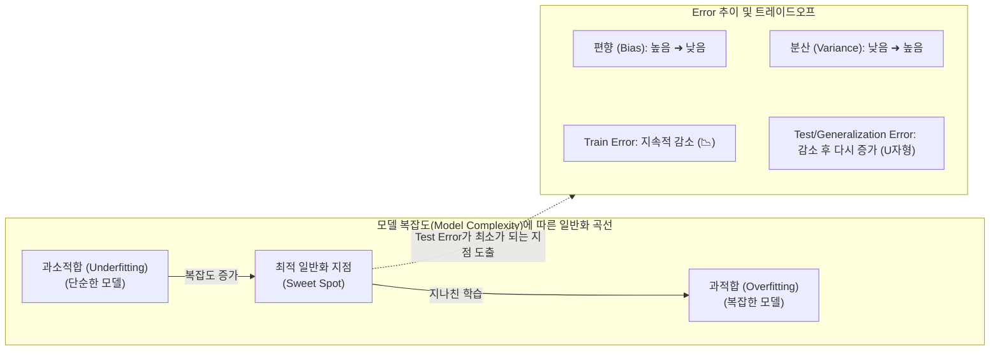

# 일반화 (Generalization)

---

## I. 머신러닝 예측 성능의 핵심, 일반화(Generalization)의 개요

* **정의**: 머신러닝/[[딥러닝]] 모델이 훈련 데이터(Train Data)에만 과적합(Overfitting)되지 않고, 이전에 본 적 없는 새로운 데이터(Test Data, Unseen Data)에서도 정확하게 예측할 수 있는 범용적 성능(능력)
* **필요성 및 특징**:
* [[편향]]-분산 트레이드오프(Bias-Variance Tradeoff)의 최적 균형점 확보가 핵심임
* 훈련 오차(Training Error)와 일반화 오차(Generalization Error) 간의 차이(Gap)를 최소화하여 실제 운영 환경(Production)에서의 실효성을 보장함

---

## II. 일반화의 개념도 및 핵심 기술 요소

### 가. 일반화의 개념도 및 동작 원리

* 일반화 오차는 $Bias^2 + Variance + Irreducible Error$로 구성되며, 훈련 반복 및 모델 복잡도가 증가할수록 Train Error는 감소하지만 Test Error는 U자형으로 증가하는 과적합 현상이 발생함

### 나. 일반화 성능 확보를 위한 핵심 기술 및 요소 (표)

| 분류 | 요소기술(키워드) | 세부 설명 |
| --- | --- | --- |
| **이론적 근간** | **편향-분산 트레이드오프** | - 모델의 단순성(Bias)과 지나친 복잡성(Variance) 간의 반비례적 상충관계 (균형점 탐색이 목표) |
| **정규화 기법** | **L1/L2 Regularization** | - 손실 함수에 가중치(Weight)의 절대값(L1)이나 제곱(L2) 페널티를 부여하여 모델 복잡도를 억제함 |
| **구조적 규제** | **[[Dropout]] (드롭아웃)** | - 신경망 학습 시 뉴런을 무작위 확률로 비활성화하여 특정 노드에 대한 의존도를 분산시키는 기법 |
| **학습 최적화** | **Early Stopping (조기 종료)** | - 검증 데이터셋(Validation Set)의 오차가 더 이상 감소하지 않고 증가하기 시작할 때 학습을 중단함 |
| **데이터 검증** | **Cross-Validation (교차검증)** | - 전체 데이터를 K개의 폴드(Fold)로 나누어 학습과 평가를 반복함으로써 특정 데이터 편향을 방지함 |
| **데이터 확장** | **Data Augmentation** | - 이미지 회전, 크롭, 노이즈 추가 등을 통해 데이터의 다양성과 양을 늘려 범용적 패턴 학습 유도 |
| **최신 현상** | **Double Descent (이중 하강)** | - 오버 파라미터(초거대) 모델에서 과적합 구간(U자)을 지나면 Test Error가 다시 급감하는 현상 |
| **최신 현상** | **Grokking (지연된 일반화)** | - Train Error가 0이 된 이후에도 장기간 추가 학습을 진행하면 갑자기 일반화 성능이 비약적으로 상승하는 현상 |

---

## III. 일반화 성능 향상을 위한 최신 동향 및 향후 전망

### 가. 일반화의 한계 극복 및 최신 트렌드 전망

| 구분              | 주요 동향 및 발전 방향                       | 세부 내용 및 산업 적용                                                                                         |
| --------------- | ----------------------------------- | ----------------------------------------------------------------------------------------------------- |
| **분포 외 데이터 대응** | **OOD (Out-of-Distribution) 일반화**   | - 학습 데이터와 다른 분포(환경, 도메인 등)를 가진 데이터가 입력되어도 강건하게 동작하도록 Domain Adaptation 기술 고도화                         |
| **초거대 AI 적용**   | **파운데이션 모델의 Zero-shot 일반화**         | - [[초거대 언어 모델|LLM]](거대언어모델) 등장 이후, 모델 크기와 데이터 스케일을 극대화하여 미세조정([[Fine-Tuning|Fine-tuning]]) 없이도 새로운 태스크를 수행하는 In-context Learning 활용 |
| **학습 이론 변화**    | **Double Descent 및 Grokking 적극 활용** | - 전통적 통계학의 U자형 오차 곡선 한계를 넘어, 딥러닝에서 파라미터를 데이터 수보다 훨씬 크게 설계(Over-parameterization)하여 최상의 성능을 끌어냄        |

---

### 🔗 연관 토픽

- **소속 도메인**: [[00_데이터베이스_MOC|🗄️ 데이터베이스]]
- **세부 분류**: `5. 분산 데이터베이스 & NoSQL & 대용량`
- **핵심 연관 토픽**:
  - [[배깅]]
  - [[편향]]
  - [[딥러닝]]
  - [[지도학습]]
  - [[경사하강법|경사하강법 (Gradient Descent Algorithm)]]
