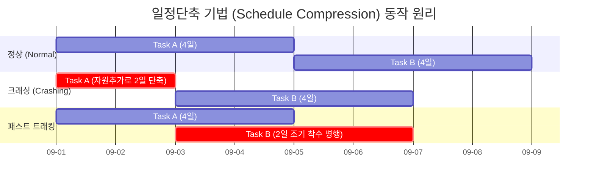

# 일정단축 기법 (Schedule Compression Techniques)

---

## I. 프로젝트 납기 준수와 리스크 최소화, 일정단축 기법의 개요

* **정의**: 프로젝트의 원래 범위(Scope)를 축소하지 않고, 목표 납기 준수 또는 지연된 일정을 만회하기 위해 프로젝트 기간을 단축하는 프로젝트 관리(PMBOK) 기법
* **배경 및 특징**:
* **지체상금(Penalty) 방지**: 납기 지연으로 인한 비즈니스 손실 및 위약금 예방
* **주공정(Critical Path) 집중**: 여유 시간(Float)이 없는 주공정 상의 활동에만 적용해야 전체 일정 단축 가능
* **트레이드오프(Trade-off)**: 일정 단축 시 필연적으로 비용(Cost) 증가 또는 리스크(Risk) 증가 수반

---

## II. 일정단축 기법의 개념도 및 핵심 구성요소

### 가. 일정단축 기법의 개념도 (정상 vs 크래싱 vs 패스트 트래킹)

* 크래싱(Crashing)은 자원을 투입하여 개별 작업 기간을 물리적으로 단축하며, 패스트 트래킹(Fast Tracking)은 작업 간의 순서를 조정하여 중첩(Overlapping) 수행함

### 나. 일정단축 기법의 핵심 요소 기술

| 구분 | 요소기술(키워드) | 세부 설명 |
| --- | --- | --- |
| **핵심 기법** | 크래싱 (Crashing) | - 주공정 상의 활동에 인력, 장비 등 추가 자원을 투입하여 기간 단축 (비용 증가 수반) |
| **핵심 기법** | 패스트 트래킹 (Fast Tracking) | - 순차적으로 수행하던 선후행 활동을 병행(Overlapping)하여 수행 (재작업 리스크 증가) |
| **적용 대상** | 주공정 (Critical Path) | - 전체 프로젝트 일정을 결정하는 가장 긴 경로, 단축의 최우선 적용 대상 (여유 시간 0) |
| **비용 관리** | 비용-시간 교환 (Time-Cost Trade-off) | - 일정 단축으로 인한 추가 비용과 납기 지연 페널티 간의 손익 분기점(최소 비용점) 분석 |
| **자원 관리** | 한계 수확 체감 (Diminishing Returns) | - 자원을 지속 추가해도 소통 비용 증가 등으로 단축 효과가 점차 감소하는 현상 (브룩스의 법칙) |
| **위험 관리** | 재작업 (Rework) 통제 | - 선행 작업 미완료 상태에서 후행 작업 진행에 따른 논리적 결함 및 재작업 리스크 관리 |
| **일정 통제** | 자원 평준화 (Resource Leveling) | - 단축 후 발생할 수 있는 특정 기간의 자원 과부하를 해소하기 위한 자원 재배치 수행 |
| **도구/기법** | [[몬테카를로 시뮬레이션]] | - 일정 단축 후 리스크 증가에 따른 프로젝트 성공 확률 및 불확실성 예측 모델링 |

---

## III. 일정단축 기법 간 비교 및 최신 적용 동향

### 가. 크래싱(Crashing)과 패스트 트래킹(Fast Tracking) 비교

| 비교 항목 | 크래싱 (Crashing) | 패스트 트래킹 (Fast Tracking) |
| --- | --- | --- |
| **핵심 방식** | 자원(인력, 시간 외 근무, 장비) 추가 투입 | 순차적 작업을 병행(Overlapping)하여 수행 |
| **주요 트레이드오프** | **비용(Cost) 증가** | **위험(Risk) 및 재작업 증가** |
| **선행 조건** | 자원 확충 시 기간 단축이 가능한 활동 존재 | 선후행 활동 간의 유연한 의존성(SS, FF) 존재 |
| **주요 한계점** | 브룩스의 법칙(의사소통 비용 급증) 우려 | 물리적/기술적 제약으로 병행 불가 시 적용 불가 |
| **우선순위** | 리스크 수용 불가, 예산에 여유가 있을 때 | 예산 추가 불가, 리스크 수용이 가능할 때 |

### 나. 최신 프로젝트 환경의 일정 관리 동향

* **CCPM (Critical Chain Project Management)**: 기존 [[CPM]]의 한계를 극복하기 위해 후행 작업의 병목을 방지하는 프로젝트 버퍼(Project Buffer)와 피딩 버퍼(Feeding Buffer)를 배치하여 일정 지연을 흡수하는 전략 적용.
* **AI 기반 지능형 일정 최적화**: 최신 PMIS(프로젝트 관리 정보 시스템)는 AI/ML을 도입하여 과거 유사 프로젝트 데이터를 학습하고, 최소 비용으로 최대 효과를 낼 수 있는 최적의 크래싱 포인트를 자동 추천하는 Data-Driven 관리로 진화 중임.

---

### 🔗 연관 토픽

- **소속 도메인**: [[00_프로젝트관리_MOC|📋 프로젝트관리]]
- **세부 분류**: `1. PMBOK 표준 & 프로젝트 거버넌스`
- **핵심 연관 토픽**:
  - [[몬테카를로 시뮬레이션]]
  - [[CPM|CPM (Critical Path Management)]]
  - [[프로젝트 관리 계획서]]
  - [[CCM|CCM (Critical Chain Management)]]
  - [[SCRUM]]
