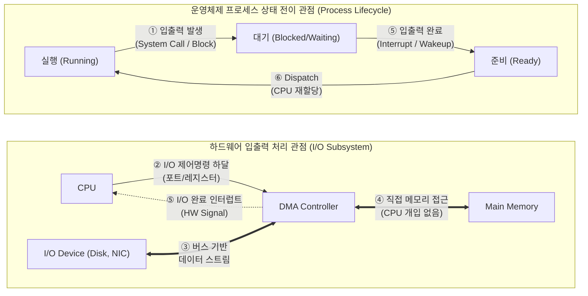

# 입출력발생 (I/O Generation)

---

## I. 시스템 자원 효율화를 위한 프로세스 제어 흐름, 입출력발생의 개요

* **정의**: [[CPU]]에서 실행(Running) 중인 프로세스가 디스크 읽기/쓰기, 네트워크 통신 등의 외부 기기 접근을 요청(System Call)하여, 스스로 CPU 점유를 포기하고 대기(Blocked) 상태로 전이되는 일련의 과정
* **특징 및 필요성**:
* **CPU 유휴시간(Idle Time) 방지**: 입출력 처리는 CPU 연산 대비 속도가 매우 느리므로, I/O 발생 시 다른 프로세스에게 CPU를 할당(다중 프로그래밍)
* **오버헤드 수반**: 커널 모드 전환, [[PCB(Process Control Block)]] 저장 및 복원을 위한 [[문맥 교환]](Context Switching) 발생
* **하드웨어 비동기 연계**: DMA([[DMA(Direct Memory Access)|Direct Memory Access]])와 인터럽트(Interrupt) 메커니즘을 통한 CPU 개입 최소화

---

## II. 입출력발생의 개념도 및 핵심 기술 요소

### 가. 입출력발생 프로세스 상태 전이 및 하드웨어 처리 개념도

* 유저 프로세스가 입출력을 요청(①)하면 OS는 해당 프로세스를 대기 큐로 이동시키고, DMA를 통해(②~④) 비동기적으로 I/O를 처리한 후, 인터럽트(⑤)를 통해 프로세스를 다시 준비 큐로 깨움(Wakeup)

### 나. 입출력발생의 핵심 구성 및 기술 요소

| 구분 | 요소기술(키워드) | 세부 설명 |
| --- | --- | --- |
| **[[OS(운영체제)|운영체제]] / SW** | **시스템 콜 (System Call)** | - 유저 모드에서 커널 모드로 전환하여 OS에게 물리적 I/O 자원 접근을 요청하는 인터페이스 |
| **운영체제 / SW** | **문맥 교환 (Context Switch)** | - I/O 발생 시 현재 실행 중인 프로세스의 상태(레지스터, PC 등)를 PCB에 저장하고 다른 프로세스를 적재 |
| **운영체제 / SW** | **대기 큐 (Wait/Device [[Queue]])** | - I/O 장치별로 할당되어, 해당 장치의 입출력 완료를 기다리는 프로세스들의 리스트 자료구조 |
| **운영체제 / SW** | **디바이스 드라이버** | - OS가 다양한 이기종 I/O 하드웨어 장치를 표준화된 인터페이스로 제어하기 위한 소프트웨어 |
| **하드웨어 / I/O** | **DMA (Direct Memory Access)** | - PIO(Programmed I/O)의 한계를 극복, CPU 개입 없이 I/O 컨트롤러가 직접 메모리와 데이터를 교환 |
| **하드웨어 / I/O** | **[[인터럽트|인터럽트 (Interrupt)]]** | - I/O 작업이 완료되었을 때 장치 컨트롤러가 CPU에 신호를 보내 OS가 후속 작업(Wakeup)을 하도록 유도 |
| **성능 최적화** | **버퍼링 (Buffering)** | - CPU와 I/O 장치 간의 극심한 속도 차이를 완화하기 위해 메모리 일부를 임시 저장소로 활용 |
| **성능 최적화** | **스풀링 (Spooling)** | - 디스크를 거대한 버퍼처럼 사용하여, 다수 프로세스의 I/O 요청(예: 프린터 출력)을 순차적으로 백그라운드 처리 |

---

## III. 입출력 모델 비교 및 고성능 I/O 최신 동향

### 가. 어플리케이션 관점의 입출력 제어 모델 비교 (동기 vs 비동기)

| 비교 항목 | 동기식 입출력 (Synchronous I/O) | 비동기식 입출력 (Asynchronous I/O) |
| --- | --- | --- |
| **작동 방식** | I/O 요청 후 완료될 때까지 애플리케이션 블로킹(대기) | I/O 요청 후 즉시 리턴하여 애플리케이션은 다른 작업 계속 수행 |
| **상태 전이** | Running $\rightarrow$ **Blocked** $\rightarrow$ Ready | Running 유지 (콜백이나 이벤트 루프를 통해 추후 완료 확인) |
| **CPU 활용성** | 단일 스레드 기준 CPU 활용도 낮음 | I/O 대기 시간 동안 연산 수행 가능 (CPU 활용도 높음) |
| **구현 복잡도** | 직관적이고 구현이 쉬움 (순차적 코드 흐름) | 콜백 지옥(Callback Hell), 컨텍스트 관리 등 구현 복잡도 높음 |
| **주요 활용** | 일반적인 파일 읽기/쓰기, 단순 배치 작업 | Node.js, 고성능 네트워크 서버(Nginx), 멀티미디어 스트리밍 |

### 나. 최신 고성능 I/O 병목 해소 동향

* **[[커널|Kernel]] Bypass (Zero-Copy) 기술의 확산**: 고성능 NVMe SSD 및 100G+ 닉(NIC) 환경에서 OS 커널의 컨텍스트 스위칭과 인터럽트 오버헤드가 병목이 됨에 따라, 유저 스페이스에서 직접 하드웨어에 접근하는 **DPDK(Data Plane Development Kit)** 및 **SPDK(Storage Performance Development Kit)** 활용이 클라우드/AI 인프라의 표준으로 자리잡음.
* **io_uring의 도입**: 리눅스 커널 5.1 이후 도입된 비동기 I/O 인터페이스인 **io_uring**은 제출(Submission) 큐와 완료(Completion) 큐를 링 버퍼(Ring Buffer) 형태로 공유하여 시스템 콜 횟수를 극단적으로 줄이고, 대규모 동시성 I/O 처리 성능을 혁신적으로 끌어올림.

---

### 🔗 연관 토픽

- **소속 도메인**: [[00_운영체제_MOC|⚙️ 운영체제]]
- **세부 분류**: `1. 프로세스 & 스레드 관리`
- **핵심 연관 토픽**:
  - [[커널|커널(Kernel)]]
  - [[OS(운영체제)]]
  - [[인터럽트|인터럽트 (Interrupt)]]
  - [[문맥 교환|문맥 교환 (Context Switching)]]
  - [[PCB(Process Control Block)]]
