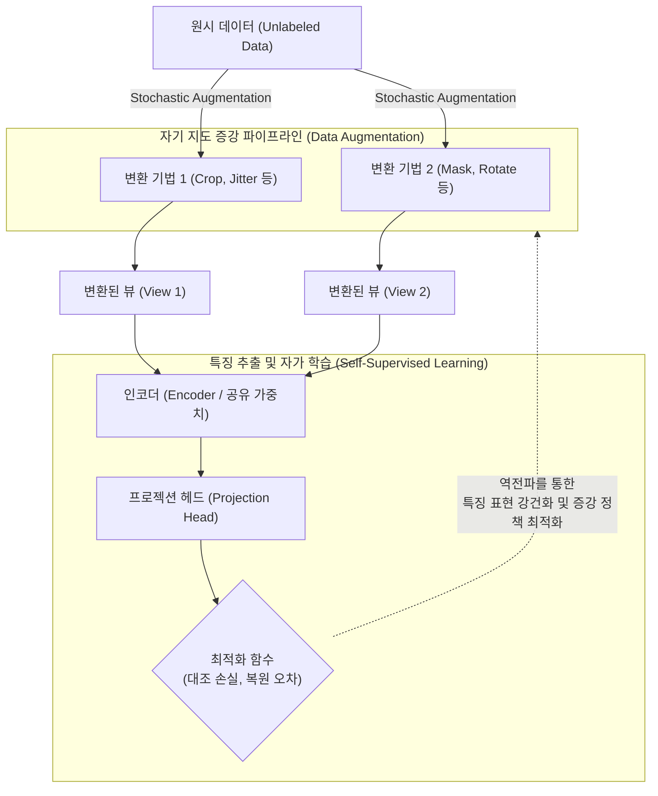

# 자기 지도 증강 (Self-Supervised Augmentation)

---

## I. 라벨링 한계 극복을 위한 비지도 학습의 핵심, 자기 지도 증강의 개요

* **정의**: 정답 레이블(Label)이 없는 원시 데이터에 회전, 자르기, 마스킹 등의 변형(Augmentation)을 가한 뒤, 자가 지도 학습(SSL) 목적 함수와 결합하여 데이터의 내재적 특징(Feature) 표현을 자동 학습하거나 최적의 증강 정책을 탐색하는 [[인공지능]] 기법
* **필요성 및 등장배경**:
* **라벨링 비용 폭증**: 대규모 [[파운데이션 모델]] 학습 시 수동 레이블링에 소요되는 시간적, 재무적 한계 극복 필요
* **증강 정책 자동화**: 도메인 특화 증강 기법을 사람이 직접 휴리스틱하게 설계하는 한계를 극복하고 자동 탐색(Self-Augment) 요구

* **특징**: 대조 학습(Contrastive Learning) 및 마스크드 오토인코더(MAE) 모델의 핵심 동인, 레이블 없는 [[다형성]] 확보, 생성적 적대 신경망([[GAN (Generative Adversarial Network)|GAN]]) 기반 고품질 증강 데이터 생성 지원

---

## II. 자기 지도 증강의 개념도 및 핵심 기술 요소

### 가. 자기 지도 증강의 아키텍처 및 동작 원리

* 레이블이 없는 단일 원시 데이터를 서로 다른 두 가지 이상의 증강 기법으로 변환(View 생성)하여, 두 뷰 간의 특징적 유사도를 극대화(대조 학습)하거나 변환 상태를 예측하도록 자가 학습을 수행함

### 나. 자기 지도 증강의 핵심 기술 요소

| 분류 | 요소기술(키워드) | 세부 설명 |
| --- | --- | --- |
| **이미지 증강 기법** | 기하학적/색상 변환 | Random Crop, Flip, Color Jitter링을 통해 이미지의 공간적 및 시각적 변형을 생성 (SimCLR 등에 활용) |
| **언어/비전 증강** | 마스킹 (Masking) | 입력 데이터(텍스트 토큰 또는 이미지 패치)의 일부를 무작위로 은닉하여 모델이 주변 맥락을 통해 복원하도록 유도 |
| **지도 학습 연계** | 대조 학습 (Contrastive) | 하나의 원본에서 분할된 긍정(Positive) 뷰 간의 거리는 가깝게, 부정(Negative) 뷰 간의 거리는 멀게 학습 |
| **지도 학습 연계** | 사전 작업 예측 (Pretext) | 데이터에 가해진 인위적 증강 상태(회전 각도, 퍼즐 배치 등) 자체를 임시 정답(Pseudo-label)으로 활용 |
| **정책 자동화** | 자기 지도 정책 탐색 | 다운스트림 레이블 없이 자기 지도 평가 지표만을 활용하여 최적의 데이터 증강 정책(Policy)을 자동 도출 |
| **지식 전이** | 자가 증류 (Self-Distillation) | 자기 지도 증강을 통해 스스로 생성한 임시 타겟 데이터를 교사(Teacher) 모델 없이 스스로에게 증류(학습)하는 기법 |
| **생성형 증강** | GAN / Diffusion 결합 | 적대적 훈련 메커니즘을 자기 지도 학습과 결합하여, 실제 데이터 분포에 근접한 고품질 가상 샘플을 생성 |
| **손실 함수** | InfoNCE Loss | 양성(Positive) 증강 쌍에 대한 상호 정보량(Mutual Information)의 하한선을 최대화하는 [[딥러닝]] 손실 함수 |

---

## III. 데이터 증강 기법의 비교 및 활용 동향

### 가. 전통적 지도 학습 증강과 자기 지도 증강 비교

| 비교 항목 | 전통적 데이터 증강 (Supervised Augmentation) | 자기 지도 증강 (Self-Supervised Augmentation) |
| --- | --- | --- |
| **주요 목적** | 모델의 과적합(Overfitting) 방지 및 데이터 양적 확대 | 레이블 없이 데이터 구조의 내재적 특징(Representation) 학습 |
| **구동 및 최적화** | 정답(Label) 의미 보존 여부 기반 수동/휴리스틱 적용 | 원본과 변환본 간의 대조 손실 및 복원 오차를 통한 자동 최적화 |
| **적용 시점** | 다운스트림(Downstream) 정교화 모델의 지도 학습 시 | 파운데이션 모델 등의 대규모 사전 학습(Pre-training) 시 |
| **대표 모델/기법** | Mixup, Cutout, AutoAugment | SimCLR, MoCo, MAE, Self-Augment, BYOL |

### 나. 발전 동향 및 활용 전망

* **이기종 도메인 확산**: 과거 이미지 및 자연어 처리에 국한되었던 자기 지도 증강이 시계열(Time-Series), 추천 시스템용 그래프(Graph), 의료 뇌파(EEG) 등 다중 모달리티 데이터 분야의 핵심 학습 방법론으로 채택되어 확산됨
* **데이터 중심 AI(Data-Centric AI)의 핵심 기술**: 대규모 모델 학습에서 휴먼 인 더 루프(Human-in-the-Loop)의 비싼 라벨링 비용을 최소화하고, 자기 지도 기반의 일관성 증강(Augmentation Consistency)을 통해 [[Smart Car(자율주행)|자율주행]], 위성 이미지 분석 등 고비용 도메인 적응성을 가속화할 전망임

---

### 🔗 연관 토픽

- **소속 도메인**: [[00_인공지능_MOC|🤖 인공지능]]
- **세부 분류**: `2. 머신러닝 기초 & 핵심 알고리즘`
- **핵심 연관 토픽**:
  - [[인공지능]]
  - [[강화학습]]
  - [[GAN (Generative Adversarial Network)]]
  - [[자기지도학습]]
  - [[모방 강화학습]]
