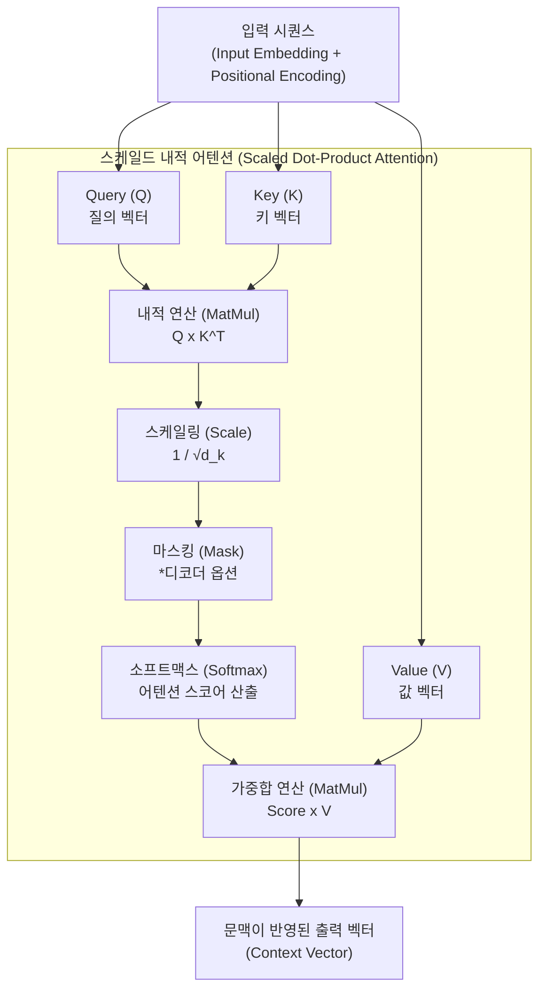

# 자기 집중 (Self-Attention)

---

## I. 트랜스포머(Transformer) 아키텍처의 핵심, 자기 집중의 개요

* **정의**: 입력 시퀀스(문장 등) 내의 각 요소(단어)가 서로 어떻게 연관되어 있는지를 병렬적으로 계산하여, 문맥적 의미와 장기 의존성(Long-term Dependency)을 파악하는 [[딥러닝]] 메커니즘
* **등장배경 및 특징**:
* **순차 처리 한계 극복**: 기존 [[RNN (Recurrent Neural Network)|RNN]]/[[LSTM (Long Short-Term Memory)|LSTM]]의 순차적 연산으로 인한 병목 현상 및 기울기 소실(Vanishing Gradient) 문제 해결
* **병렬 연산(Parallelization)**: 전체 시퀀스를 한 번에 입력받아 행렬 연산을 수행하므로 [[GPU]] 병렬 처리에 최적화
* **문맥적 가중치 부여**: 거리에 상관없이 문장 내 모든 단어 간의 상호작용(Attention Score)을 $O(1)$의 경로 길이로 직접 계산

---

## II. 자기 집중의 개념도 및 핵심 기술 요소

### 가. 자기 집중(Self-Attention)의 아키텍처 및 동작 원리

* Query, Key, Value 3개의 가중치 행렬을 통해 입력 데이터를 선형 변환하고, Q와 K의 내적을 통해 연관성(Score)을 구한 후 V와 가중합하여 최종 문맥 벡터를 도출함
* 연산 수식: $Attention(Q, K, V) = softmax(\frac{QK^T}{\sqrt{d_k}})V$

### 나. 자기 집중 메커니즘의 핵심 구성 요소

| 구분 | 요소기술(키워드) | 세부 설명 |
| --- | --- | --- |
| **연산 객체** | **Query (Q)** | - 현재 집중(Attention) 기준이 되는 단어의 의미를 담고 있는 질의 벡터 |
| **연산 객체** | **Key (K)** | - 다른 단어들이 Query와 얼마나 연관되어 있는지 판별하기 위한 대상 벡터 |
| **연산 객체** | **Value (V)** | - 어텐션 스코어(가중치)와 곱해져 최종적으로 전달될 단어의 실제 정보 벡터 |
| **핵심 연산** | **Scaled Dot-Product** | - Q와 K의 내적 값을 Key 차원 수의 제곱근($\sqrt{d_k}$)으로 나누어 Softmax의 기울기 소실 방지 |
| **확률 변환** | **Softmax 함수** | - 도출된 연관성 점수를 0~1 사이의 확률값(가중치)으로 정규화하여 총합을 1로 생성 |
| **구조 확장** | **Multi-Head Attention** | - Q, K, V를 N개의 서로 다른 관점(Head)으로 분할 연산 후 병합하여 문맥의 [[다형성]] 확보 |
| **순서 보정** | **Positional Encoding** | - 병렬 처리로 인해 상실된 단어의 위치(순서) 정보를 사인/코사인 함수로 생성하여 더해주는 기술 |
| **제어 기법** | **Masked Self-Attention** | - 생성 모델(디코더)에서 미래 시점의 단어를 참조하지 못하도록 내적 값을 $-\infty$로 가리는 기법 |

---

## III. 자기 집중 메커니즘의 비교 및 향후 전망

### 가. 전통적 시계열 모델(RNN)과 자기 집중(Self-Attention) 비교

| 비교 항목 | RNN / LSTM | 자기 집중 (Self-Attention) |
| --- | --- | --- |
| **데이터 처리 방식** | **순차적 처리** (Sequential) | **병렬적 처리** (Parallel) |
| **장기 의존성(Long-Term)** | 거리가 멀어질수록 정보 손실 발생 (한계) | 거리와 무관하게 직접 참조 (우수) |
| **최대 경로 길이** | $O(N)$ (단어 길이에 비례) | $O(1)$ (상수 시간 내 직접 연결) |
| **연산 복잡도 (Layer당)** | $O(N \cdot d^2)$ ($d$: 표현 차원) | $O(N^2 \cdot d)$ (시퀀스 길이의 제곱에 비례) |
| **주요 활용 모델** | [[seq2seq|Seq2Seq]], 번역기 초기 모델 | GPT, [[BERT]], LLaMA 등 초거대 LLM |

### 나. 최신 기술 동향 및 한계 극복 전망

* **시퀀스 길이 한계 극복 (Quadratic Bottleneck)**: 자기 집중 연산은 시퀀스 길이($N$)의 제곱($O(N^2)$)에 비례하는 메모리와 연산량을 요구함. 이를 해결하기 위해 메모리 접근 패턴을 최적화한 **FlashAttention** 및 연산 복잡도를 선형($O(N)$)으로 줄인 선형 어텐션(Linear Attention) 연구가 대세로 자리 잡음
* **메모리 최적화 (KV Cache 줄이기)**: [[초거대 언어 모델]](LLM) 추론 시 발생하는 KV 메모리 병목 현상을 해소하기 위해, 다수의 Query가 하나의 Key/Value를 공유하는 **GQA (Grouped Query Attention)** 및 **MQA (Multi-Query Attention)** 기법이 LLaMA 등 최신 오픈소스 모델에 기본 탑재되고 있음
* **비전 도메인으로의 확장**: 텍스트를 넘어 이미지를 패치(Patch) 단위로 분할하여 자기 집중을 수행하는 **ViT (Vision Transformer)** 가 [[CNN]]을 대체하며 멀티모달(LMM) 인공지능의 표준 아키텍처로 진화 중임

---

### 🔗 연관 토픽

- **소속 도메인**: [[00_인공지능_MOC|🤖 인공지능]]
- **세부 분류**: `3. 딥러닝 핵심 아키텍처 & 신경망`
- **핵심 연관 토픽**:
  - [[초거대 언어 모델|초거대 언어 모델(Large Language Model)]]
  - [[딥러닝]]
  - [[RNN (Recurrent Neural Network)]]
  - [[LSTM (Long Short-Term Memory)]]
  - [[seq2seq]]
