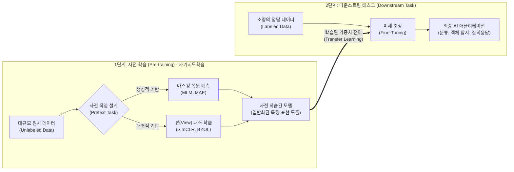

# 자기지도학습 (Self-Supervised Learning)

---

## I. 라벨링 한계 극복과 파운데이션 모델의 핵심 기반, 자기지도학습의 개요

* **정의**: 레이블(Label)이 없는 대규모 원시 데이터 자체의 구조나 일부분을 임시 정답(Pseudo-label)으로 활용하여, 데이터의 내재적 특징(Representation)을 스스로 학습하는 [[인공지능]] 학습 패러다임
* **등장배경 및 특징**:
* **라벨링 비용 폭증**: 수동 데이터 라벨링(Human [[Annotation]])에 소요되는 시간적, 재무적 한계 극복 필요
* **데이터 중심 AI 구현**: 인터넷에 흩어진 방대한 미분류 데이터를 그대로 활용하여 대규모 [[파운데이션 모델]] 구축
* **전이 학습(Transfer Learning)**: 강력한 사전 학습(Pre-training)을 거쳐, 소량의 라벨 데이터만으로도 다운스트림 태스크에서 최고 수준의 성능(SOTA) 달성

---

## II. 자기지도학습의 아키텍처 및 핵심 기술 요소

### 가. 자기지도학습의 개념도 및 동작 원리

* 레이블 없이 데이터 자체를 정답으로 삼는 사전 작업(Pretext Task)을 통해 범용적 가중치를 선행 학습한 후, 목적에 맞게 세부 튜닝함

### 나. 자기지도학습의 핵심 기술 및 구성 요소

| 구분 | 요소기술(키워드) | 세부 설명 |
| --- | --- | --- |
| **핵심 원리** | **Pretext Task (사전 작업)** | - 이미지 회전 예측, 직소 퍼즐, 색상화 등 데이터의 변형 상태를 모델이 맞추도록 임시 정답(Pseudo-label)을 설계 |
| **생성적 학습** | **MLM (Masked Language Model)** | - 문장 내 일부 단어(토큰)를 가리고(Mask) 주변 문맥을 바탕으로 해당 토큰을 예측하는 기법 ([[BERT]] 대표적) |
| **생성적 학습** | **MAE (Masked Autoencoder)** | - 이미지 패치의 70~80%를 고도로 가린 후, 남은 픽셀 정보로 원본 전체 이미지를 재구성(Reconstruction)하는 기법 |
| **대조적 학습** | **대조 학습 (Contrastive Learning)** | - 동일 이미지의 서로 다른 증강 뷰(Positive)는 가깝게, 다른 이미지(Negative)는 멀게 특징 벡터 거리를 학습 |
| **비대조 학습** | **BYOL (비대조 대조학습)** | - Negative 쌍 없이 두 개의 네트워크(Online, Target) 간 Positive 쌍만으로 표현 붕괴(Collapse) 없이 학습하는 기법 |
| **목적 함수** | **InfoNCE Loss** | - 긍정 쌍(Positive)에 대한 상호 정보량(Mutual Information)의 하한선을 최대화하기 위해 사용되는 손실 함수 |
| **모델 활용** | **전이 학습 (Transfer Learning)** | - 자기지도학습으로 확보한 고품질 가중치를 기반(Backbone)으로 타 도메인에 이식하여 학습 효율성 극대화 |
| **평가 지표** | **Linear Probing (선형 탐색)** | - 사전 학습된 가중치를 동결(Freeze)하고, 마지막 선형 분류기만 훈련시켜 모델의 특성 추출 능력을 평가 |

---

## III. 자기지도학습의 비교 및 향후 전망

### 가. 기계학습 주요 패러다임 비교 (지도학습 vs 비지도학습 vs 자기지도학습)

| 비교 항목 | [[지도학습]] (Supervised) | 비지도학습 (Unsupervised) | 자기지도학습 (Self-Supervised) |
| --- | --- | --- | --- |
| **학습 데이터** | 명확한 정답(Label)이 포함된 데이터 | 정답(Label)이 전혀 없는 데이터 | **정답이 없는 대규모 원시 데이터** |
| **주요 목적** | 입력-출력 간의 맵핑 관계 및 분류 | 군집화(Clustering), [[차원 축소]] | **데이터의 일반화된 특징(Representation) 학습** |
| **동작 메커니즘** | 인간이 부여한 라벨 기반 손실 계산 | 데이터 간 밀도 및 거리 기반 연산 | **데이터 자체에서 임시 정답(Pseudo-label) 생성** |
| **주요 [[알고리즘]]** | [[CNN]], [[RNN (Recurrent Neural Network)|RNN]], Random Forest | K-Means, [[PCA(Principal Component Analysis)|PCA]], [[DBSCAN(밀도 기반 클러스터링)|DBSCAN]] | **SimCLR, BERT, MAE, DINO** |
| **한계점** | 라벨링에 막대한 비용과 시간 소요 | 명확한 성능 평가 지표 부재 | 막대한 컴퓨팅 파워([[GPU]] 클러스터) 요구 |

### 나. 최신 동향 및 산업 적용 전망

* **초거대 [[초거대 언어 모델|LLM]] 및 멀티모달(LMM)의 디팩토 표준**: GPT-4, LLaMA 등 현대의 생성형 AI 파운데이션 모델들은 다음 단어를 예측하는 자기지도학습(Causal Language Modeling)을 근간으로 사전 학습을 수행함
* **비전 파운데이션 모델(VFM)의 진화**: 메타(Meta)의 DINOv2와 같이 텍스트 프롬프트 없이 이미지 자체의 의미적 유사성을 자기지도학습으로 완벽히 이해하여, [[Smart Car(자율주행)|자율주행]] 및 의료 영상 분석에서 소량의 데이터만으로 상용 수준의 추론 성능 보장

---

### 🔗 연관 토픽

- **소속 도메인**: [[00_인공지능_MOC|🤖 인공지능]]
- **세부 분류**: `2. 머신러닝 기초 & 핵심 알고리즘`
- **핵심 연관 토픽**:
  - [[지도학습]]
  - [[인공지능]]
  - [[RNN (Recurrent Neural Network)]]
  - [[DBSCAN(밀도 기반 클러스터링)]]
  - [[초거대 언어 모델|초거대 언어 모델(Large Language Model)]]
