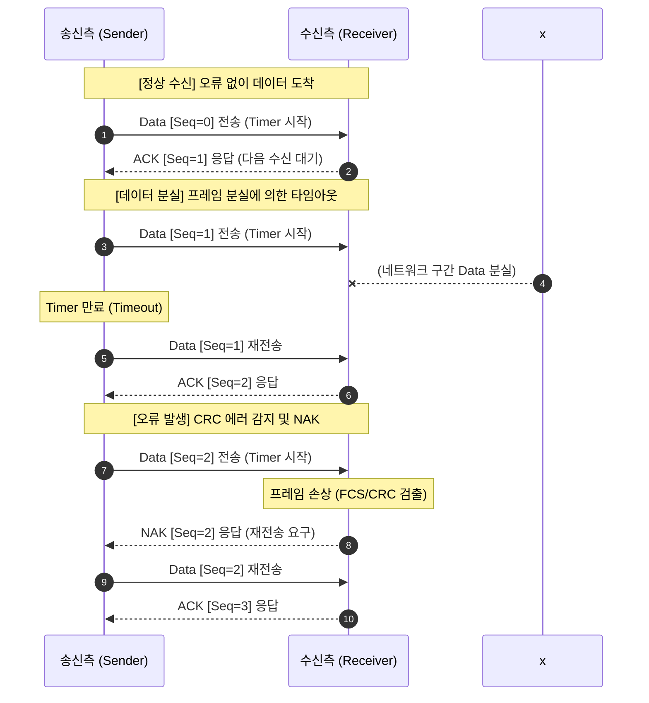

# 자동재송요구 (ARQ: Automatic Repeat Request)

---

## I. 신뢰성 있는 데이터 전송을 위한 에러 제어 기법, ARQ의 개요

* **정의**: 통신망에서 데이터 프레임 전송 시 오류가 발생하거나 분실되었을 때, 수신측의 응답(ACK/NAK)과 송신측의 타이머(Timer)를 통해 데이터를 재전송하여 신뢰성을 보장하는 에러 제어 [[프로토콜]]
* **필요성 및 특징**:
* **[[신뢰성]] 보장 (Reliability)**: 무선 구간 등 신뢰할 수 없는 전송 매체에서의 데이터 손실 및 손상 복구
* **오류 및 흐름 제어**: 수신 버퍼 상태와 연계된 슬라이딩 윈도우(Sliding Window) 기반의 오류 및 흐름 제어 동시 수행
* **오버헤드 트레이드오프**: 재전송으로 인한 네트워크 대역폭 소비 및 지연(Latency) 발생 수반

---

## II. ARQ의 개념도 및 핵심 기술 요소

### 가. ARQ의 기본 동작 원리 개념도

* 송신측은 데이터를 전송함과 동시에 타이머를 가동하며, 수신측의 ACK 수신, NAK 수신 또는 타임아웃 발생 여부에 따라 재전송(Retransmission)을 수행함

### 나. ARQ의 핵심 기술 및 구성 요소

| 구분 | 요소기술(키워드) | 세부 설명 |
| --- | --- | --- |
| **제어 메시지** | **ACK** (Positive Acknowledgement) | 정상적으로 프레임을 수신했음을 송신측에 알리고 다음 프레임을 요청하는 긍정 응답 |
| **제어 메시지** | **NAK** (Negative Acknowledgement) | 수신된 프레임에 오류([[CRC]] 에러 등)가 검출되었음을 알리며 재전송을 요구하는 부정 응답 |
| **제어 메커니즘** | **Timer** (타임아웃) | 프레임 전송 후 일정 시간 내에 응답(ACK)이 오지 않으면 프레임 분실로 간주하고 재전송 트리거 |
| **제어 메커니즘** | **Sequence Number** | 프레임의 순서 역전, 중복 수신 방지 및 재전송 대상 식별을 위해 부여하는 고유 순서 번호 |
| **프로토콜 유형** | **Stop-and-Wait** (정지-대기) | 송신측이 1개의 프레임을 전송하고 응답을 받을 때까지 대기하는 가장 단순한 방식 (효율성 최하) |
| **프로토콜 유형** | **Go-Back-N (GBN)** | 슬라이딩 윈도우 기반으로 여러 프레임 전송 중 오류 발생 시, 오류 프레임부터 이후 모든 프레임을 재전송 |
| **프로토콜 유형** | **Selective Repeat** (선택적 재전송) | 오류가 발생한(분실된) 특정 프레임만을 선별하여 재전송 (효율성 최고, 수신측 버퍼 및 재조립 로직 복잡) |
| **기반 기술** | **Sliding Window** (슬라이딩 윈도우) | 수신측의 응답을 기다리지 않고 미리 설정된 윈도우 크기(W)만큼 연속적으로 프레임을 전송하는 기법 |

---

## III. ARQ 프로토콜 비교 및 최신 발전 동향 (HARQ)

### 가. 슬라이딩 윈도우 기반 ARQ 방식 비교 (Go-Back-N vs Selective Repeat)

| 비교 항목 | Go-Back-N (GBN) ARQ | Selective Repeat ARQ |
| --- | --- | --- |
| **재전송 대상** | 오류 발생 프레임 **이후의 모든 프레임** | 오류가 발생한 **해당 프레임만** 단독 재전송 |
| **수신측 윈도우 크기** | 1 (순서대로 수신하지 않으면 모두 폐기) | 송신 윈도우 크기와 동일 (W > 1) |
| **전송 효율 (대역폭)** | 중간 (에러율이 높을 경우 중복 전송 심각) | **높음** (중복 전송 최소화로 대역폭 절약) |
| **버퍼/구현 복잡도** | 단순함 (수신 버퍼 크기 최소화 가능) | 복잡함 (순서가 엇갈린 프레임을 재조립하기 위한 버퍼 필수) |

### 나. 차세대 통신망(5G/6G)에서의 ARQ 진화 전망 (HARQ)

* **HARQ (Hybrid ARQ)의 대두**: 순수 ARQ의 잦은 재전송으로 인한 지연(Latency) 한계를 극복하기 위해, 전진 에러 수정(FEC, Forward Error Correction) 기술과 ARQ를 결합한 HARQ 기법이 4G LTE 및 5G NR(New Radio)의 핵심 표준으로 적용됨
* **오류 정정 및 결합 기술 (Soft Combining)**:
* **체이스 결합 (Chase Combining)**: 재전송된 동일한 패킷을 버리지 않고 이전 패킷의 연성 정보(Soft Metric)와 결합하여 디코딩 성공률(SNR)을 높임
* **점진적 중복 (Incremental Redundancy, IR)**: 재전송 시 원본 데이터 대신 추가적인 패리티 비트(Parity Bits)만 전송하여 에러 정정 능력을 극대화하고 무선 구간의 스루풋(Throughput)을 비약적으로 향상시킴

---

### 🔗 연관 토픽

- **소속 도메인**: [[00_네트워크_MOC|🌐 네트워크]]
- **세부 분류**: `1. OSI 7계층 & 데이터링크 계층 (L1/L2)`
- **핵심 연관 토픽**:
  - [[프로토콜]]
  - [[CRC|CRC(Cyclic Redundancy Check)]]
  - [[데이터 링크 계층|데이터 링크 계층 (Data Link Layer)]]
  - [[Data Link(2) 레이어]]
  - [[TCP]]
