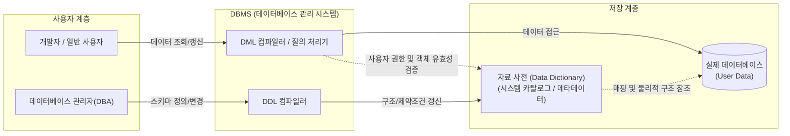

# 자료 사전 (Data Dictionary)

---

## I. 메타데이터의 중앙 집중식 저장소, 자료 사전의 개요

* **정의**: [[데이터베이스]] 시스템이나 소프트웨어 공학(구조적 분석) 환경에서 데이터의 의미, 구성, 형식, 제약조건 등의 메타데이터(Metadata)를 일관성 있게 정의하고 관리하는 중앙 저장소
* **필요성 및 특징**:
* **표준화 및 일관성**: 시스템 내 모든 데이터 요소에 대한 명확한 정의를 제공하여 개발자 및 이해관계자 간 의사소통 오류 방지
* **[[시스템 카탈로그]]**: RDBMS에서는 시스템이 자체적으로 생성 및 유지하는 딕셔너리(System Catalog) 형태로 존재하며 사용자/DBA에게 권한 및 [[스키마]] 정보 제공
* **구조적 명세**: DFD([[데이터 흐름도]])에 나타난 데이터 흐름 및 저장소의 구체적인 구성 내역을 기호로 명세화

---

## II. 자료 사전의 개념도 및 핵심 구성요소

### 가. 자료 사전의 아키텍처 및 동작 원리

* [[DBMS]]는 [[DDL]]을 통해 자료 사전을 갱신하며, 사용자의 모든 [[DML]] 질의는 실제 DB에 접근하기 전 반드시 자료 사전의 메타데이터(권한, 스키마 등)를 참조하여 유효성을 검증함

### 나. 자료 사전의 핵심 기술 및 명세 기호 (구조적 분석 기준)

| 구분 | 요소기술(키워드) | 세부 설명 |
| --- | --- | --- |
| **명세 기호** | **= (정의, is composed of)** | 특정 데이터 항목이 우측의 항목들로 구성되어 있음을 정의 (예: `주소 = 도시 + 번지`) |
| **명세 기호** | **+ (연결, and)** | 데이터 항목들이 함께 모여 결합됨을 의미 (AND 관계) |
| **명세 기호** | **( ) (생략 가능, optional)** | 해당 기호 안의 데이터 항목은 상황에 따라 생략될 수 있음 |
| **명세 기호** | **{ } (반복, iteration)** | 데이터 항목이 반복됨을 의미, 하단/상단에 반복 횟수(최소/최대) 표기 가능 (예: `1{항목}N`) |
| **명세 기호** | **[ | ] (선택, selection)** | 대괄호 내에 나열된 여러 항목(파이프로 구분) 중 반드시 하나를 선택해야 함을 의미 |
| **명세 기호** | *** * (주석, comment)** | 별표 사이에 기재된 내용은 데이터에 대한 설명표기(주석)로 논리적 구성에 영향 없음 |
| **DB 요소** | **시스템 카탈로그** | 릴레이션, 인덱스, 뷰, 사용자 권한 등에 대한 정보를 DBMS 스스로 유지하는 딕셔너리 테이블 집합 |
| **DB 요소** | **데이터 디렉토리** | 자료 사전이 의미적 정보를 담는다면, 디렉토리는 데이터에 접근하기 위한 물리적 위치(포인터) 정보 제공 |

---

## III. 자료 사전과 데이터 카탈로그의 비교 및 최신 동향

### 가. 전통적 자료 사전(DD)과 현대적 데이터 카탈로그(Data Catalog) 비교

| 비교 항목 | 자료 사전 (Data Dictionary) | 데이터 카탈로그 (Data Catalog) |
| --- | --- | --- |
| **주요 목적** | IT 시스템 내 데이터 정의 및 구조 명세 | 전사적 데이터 자산 발견, 거버넌스 및 활용 |
| **사용 주체** | DBA, 시스템 엔지니어, 개발자 | 데이터 과학자, 비즈니스 분석가, CDO |
| **관리 대상** | 단일 DB 또는 특정 애플리케이션 내 메타데이터 | 클라우드, 데이터 레이크 등 전사 이기종 데이터 소스 |
| **메타데이터 성격** | 수동적(Passive) 특성의 기술적 메타데이터 | 능동적(Active) 특성의 비즈니스/운영 메타데이터 |
| **자동화 여부** | 주로 수동 작성 및 DDL 스키마 종속적 갱신 | AI/ML 기반 자동 스캐닝 및 데이터 계보(Lineage) 추적 |

### 나. 향후 전망 및 동향

* **능동적 메타데이터(Active Metadata)로의 진화**: 과거 수동적으로 조회만 하던 정적인 자료 사전에서 벗어나, 데이터 사용 패턴을 분석하고 실시간으로 알람과 추천을 제공하는 능동형 체계로 발전 중임
* **데이터 패브릭(Data Fabric) 기반 아키텍처 결합**: 분산된 이기종 환경에서 기업의 통합된 데이터 거버넌스를 확보하기 위해, 자료 사전의 역할이 AI 기반의 전사 데이터 카탈로그 및 데이터 계보 관리 솔루션으로 대체 및 통합되는 추세임

---

### 🔗 연관 토픽

- **소속 도메인**: [[00_데이터베이스_MOC|🗄️ 데이터베이스]]
- **세부 분류**: `1. 데이터 모델링 & 관계형 DB 설계`
- **핵심 연관 토픽**:
  - [[데이터베이스]]
  - [[DDL]]
  - [[시스템 카탈로그|시스템 카탈로그 (System Catalog)]]
  - [[스키마]]
  - [[DBMS]]
