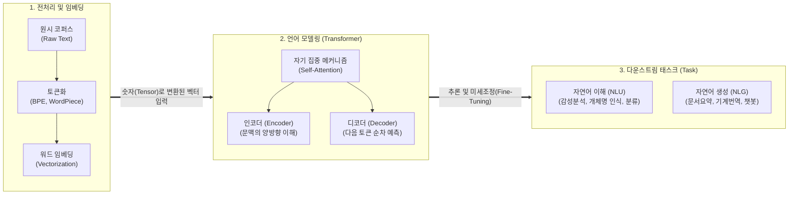

# 자연어처리 (NLP)

---

## I. 기계와 인간 언어의 가교, 자연어처리(NLP)의 개요

* **정의**: 인공지능이 인간의 자연어(텍스트 및 음성)를 기계가 이해(NLU)하고 의미 있게 생성(NLG)할 수 있도록 분석, 조작, 모델링하는 컴퓨터 과학 및 인공지능의 핵심 분야
* **등장배경 및 특징**:
* **패러다임의 진화**: 과거 규칙(Rule) 및 통계(머신러닝) 기반에서 현재 [[딥러닝]] 기반의 [[트랜스포머|트랜스포머(Transformer)]] 및 대규모 언어 모델([[초거대 언어 모델|LLM]]) 체제로 완벽히 전환됨
* **맥락 인지(Contextual)**: 단순히 단어의 빈도수를 넘어서 문맥의 뉘앙스, 순서, 다의어를 병렬적 연산을 통해 동적으로 파악함
* **초거대 AI의 근간**: 번역, 요약, 감성 분석뿐만 아니라 생성형 AI(Generative AI)의 질의응답 및 추론 능력을 제공하는 핵심 기술

---

## II. 자연어처리(NLP)의 개념도 및 핵심 기술 요소

### 가. 트랜스포머(Transformer) 기반 최신 자연어처리 프로세스 개념도

* 입력된 텍스트를 토큰화하여 벡터로 임베딩한 후, 트랜스포머 신경망의 [[자기 집중]](Self-Attention) 메커니즘을 통해 단어 간의 연관성을 학습하여 NLU/NLG 태스크를 수행함

### 나. 자연어처리의 핵심 기술 및 구성 요소

| 구분 | 요소기술(키워드) | 세부 설명 |
| --- | --- | --- |
| **전처리/표현** | **토큰화 (Tokenization)** | - 텍스트를 의미를 가지는 최소 단위(Subword, BPE)로 분할하여 미등록 단어(OOV) 문제를 해결 |
| **전처리/표현** | **임베딩 (Embedding)** | - 분할된 토큰을 다차원 벡터 공간의 좌표로 변환하여 단어 간의 의미적 거리([[유사도]])를 기계가 연산 가능하도록 매핑 |
| **핵심 모델링** | **트랜스포머 (Transformer)** | - 순차 처리([[RNN (Recurrent Neural Network)|RNN]]) 한계를 극복하고 자기 집중 메커니즘을 통해 입력 데이터 전체를 병렬 처리하는 최신 NLP 아키텍처 |
| **학습 방법론** | **사전 학습 (Pre-training)** | - 레이블이 없는 방대한 텍스트 코퍼스를 자가지도학습(Self-Supervised) 방식으로 미리 학습하여 범용적 언어 규칙 습득 |
| **학습 방법론** | **SFT (지도 미세조정)** | - 사전 학습된 파운데이션 모델에 사람이 구성한 질문-답변 쌍(Instruction)을 추가 학습시켜 특정 의도에 맞게 튜닝 |
| **인간 정렬** | **RLHF / DPO** | - 인간의 피드백을 반영하는 [[강화학습]](RLHF)을 통해 무해하고 도움이 되는(Helpful & Harmless) 답변을 생성하도록 모델 교정 |
| **품질 고도화** | **RAG (검색 증강 생성)** | - LLM의 환각(Hallucination) 현상을 방지하기 위해, 답변 생성 전 외부의 신뢰할 수 있는 지식베이스를 검색(Retrieval)하여 결합 |
| **활용 기법** | **[[프롬프트 엔지니어링]]** | - 모델의 가중치 수정 없이, Few-shot(소수 샷), [[COT|CoT]](생각의 사슬) 등의 입력 지시어 구조화를 통해 최적의 추론 결과를 유도 |

---

## III. 전통적 NLP와 LLM 기반 NLP의 비교 및 최신 동향

### 가. 패러다임 변화: 전통적 NLP vs 최신 대규모 언어 모델(LLM) 기반 NLP

| 비교 항목 | 전통적 / 통계적 NLP | LLM 기반 최신 NLP |
| --- | --- | --- |
| **핵심 [[알고리즘]]** | [[서포트 벡터 머신|SVM]], Hidden Markov, [[TF-IDF (Term Frequency - Inverse Document Frequency)|TF-IDF]] | Transformer 구조 (GPT, [[BERT]], LLaMA) |
| **학습 방식** | 특정 Task를 위한 정답 라벨 데이터 기반 [[지도학습]] | 대규모 코퍼스 자가지도 사전학습 + 미세조정 |
| **아키텍처 성격** | 번역, 분류 등 Task별로 별도의 전용 모델 개별 구축 | 하나의 파운데이션 모델로 Zero-shot 기반 다중 Task 동시 해결 |
| **한계 및 과제** | 문맥 인지 부족(단어 독립성 가정), 희소성 문제 | 과도한 연산 비용([[GPU]]), [[할루시네이션]](환각) 리스크 |

### 나. 자연어처리(NLP) 분야의 최근 동향 및 산업 적용 전망

* **[[sLLM (Smaller Large Language Model)|sLLM]](소형 언어 모델) 및 온디바이스(On-Device) AI의 부상**: 클라우드 비용 증가와 보안/프라이버시 이슈를 해결하기 위해, 수십억 개의 매개변수(Parameter) 수준으로 경량화된 sLLM을 모바일 기기 자체에서 구동하는 엣지 지향 NLP 기술이 2024~2025년의 핵심 트렌드로 대두됨.
* **Agentic AI(자율 에이전트)와의 결합**: 자연어를 단순 인식하는 것을 넘어, 사용자의 모호한 요청(자연어)을 계획(Planning) 단계로 분해하고, 도구(Tool) 및 API를 스스로 호출하여 작업을 자동 완수하는 인지 추론 에이전트 체계로 기술적 진화가 가속화되고 있음.

---

### 🔗 연관 토픽

- **소속 도메인**: [[00_인공지능_MOC|🤖 인공지능]]
- **세부 분류**: `1. 수학 · 통계학 & 데이터 전처리`
- **핵심 연관 토픽**:
  - [[유사도|유사도(Similarity)]]
  - [[할루시네이션|할루시네이션(Hallucination)]]
  - [[TF-IDF (Term Frequency - Inverse Document Frequency)]]
  - [[서포트 벡터 머신|서포트 벡터 머신 SVM(Support Vector Machine)]]
  - [[초거대 언어 모델|초거대 언어 모델(Large Language Model)]]
