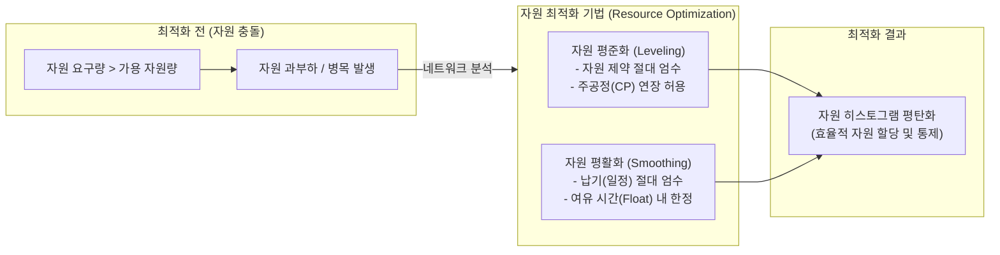

# 자원 최적화 (Resource Optimization)

---

## I. 프로젝트 자원 과부하 해소와 일정 균형, 자원 최적화의 개요

* **정의**: 프로젝트 일정 모델에서 자원의 수요(요구량)와 공급(가용량)의 균형을 맞추기 위해, 활동의 시작일과 종료일을 동적으로 조정하는 일정 네트워크 분석 및 통제 기법
* **필요성 및 특징**:
* **자원 제약 극복**: 특정 핵심 인력이나 물리적 장비에 과부하가 걸리거나(Over-allocated) 특정 기간에만 가용한 제약 문제 해결
* **일정과 자원의 트레이드오프(Trade-off)**: 자원 제약 준수를 우선할 것인지(자원 평준화), 목표 납기 준수를 우선할 것인지(자원 평활화)에 대한 전략적 선택 필요
* **자원 히스토그램 평탄화**: 자원 사용의 굴곡을 줄여 프로젝트 전반에 걸쳐 균일하고 안정적인 자원 투입 유도

---

## II. 자원 최적화의 개념도 및 핵심 기술 요소

### 가. 자원 최적화의 아키텍처 및 동작 원리

* 활동 간 논리적 의존성을 유지하면서, 가용 자원의 물리적 한계 또는 프로젝트 납기 제약조건에 맞춰 일정(Activity)을 전후로 이동시켜 자원 사용량을 평탄화(Flattening)함

### 나. 자원 최적화의 핵심 기법 및 구성 요소

| 구분 | 요소기술(키워드) | 세부 설명 |
| --- | --- | --- |
| **핵심 기법** | **자원 평준화 (Leveling)** | - 자원 제약을 준수하기 위해 일정을 조정하며, 이 과정에서 **주공정(Critical Path)이 변경(지연)될 수 있음** |
| **핵심 기법** | **자원 평활화 (Smoothing)** | - 납기(일정) 준수를 최우선으로 하여, **여유 시간(Float) 범위 내에서만** 자원 요구량을 조정 |
| **분석 지표** | **여유 시간 (Float/Slack)** | - 프로젝트 최종 납기를 지연시키지 않고 개별 활동의 시작을 늦출 수 있는 시간 (Total/Free Float) |
| **분석 지표** | **주공정 (Critical Path)** | - 여유 시간이 '0'인 활동들의 최장 연결 경로로, 전체 프로젝트의 최단 완료 기간을 결정 |
| **시각화 도구** | **자원 히스토그램** | - 특정 기간 동안 필요한 자원의 양(수요)을 막대그래프로 시각화하여 과부하 구간을 직관적으로 식별 |
| **배분 [[알고리즘]]** | **휴리스틱 (Heuristics)** | - 수학적 최적해가 아닌 경험적 규칙("가장 짧은/긴 작업 먼저" 등)을 우선 순위로 적용하여 자원을 배분 |
| **유연성 확보** | **작업 분할 (Splitting)** | - 연속적인 활동을 중간에 일시 중단하고 다른 우선순위 작업에 자원을 투입한 뒤 추후 잔여 작업을 재개 |
| **일정 복구** | **일정 단축 (Compression)** | - 자원 평준화로 인해 주공정이 지연될 경우, 크래싱(Crashing)이나 패스트 트래킹을 병행 결합하여 납기 복구 |

---

## III. 핵심 기법 비교 및 최신 동향 (IT 인프라 확장)

### 가. 자원 평준화와 자원 평활화 상세 비교

| 비교 항목 | 자원 평준화 (Resource Leveling) | 자원 평활화 (Resource Smoothing) |
| --- | --- | --- |
| **최우선 순위** | **가용 자원 우선** (자원 제약 엄수) | **프로젝트 납기 우선** (일정 제약 엄수) |
| **주공정(CP) 변화 여부** | 주공정이 변경되거나 전체 일정이 **지연될 수 있음** | 주공정의 변경이 없음 (**일정 지연 불가**) |
| **여유 시간(Float) 활용** | 여유 시간 유무와 무관하게 제약 해소 시까지 이동 | **여유 시간(Float)의 한도 내**에서만 제한적으로 이동 조정 |
| **과부하 해소 수준** | 자원 한도를 절대 초과하지 않음 (목표 100% 해소) | 여유 시간 부족 시 일부 과부하가 남을 수 있음 (부분 해소) |
| **적용 권장 상황** | 전문 인력 및 핵심 장비의 추가 확보가 불가능할 때 | 프로젝트 예산 및 납기가 픽스되어 지연이 불가능할 때 |

### 나. 자원 최적화의 발전 동향 및 클라우드 생태계로의 진화

* **AI/ML 기반 PMIS의 지능화**: 과거 단순 휴리스틱 기반의 수동 배분에서 벗어나, AI 알고리즘(AIOps)이 과거 유사 프로젝트 데이터를 학습하여 최소 지연 시간과 최적의 자원 배분 시나리오(What-If 분석)를 자동 추천하는 추세임.
* **클라우드 인프라 자원 최적화(FinOps)로의 개념 확장**: PMBOK의 인적/물적 자원 최적화 개념이 현대 IT 시스템 아키텍처 관점으로 확장되어, 클라우드 환경에서 워크로드 요구량에 맞춰 가용 자원을 동적으로 조절(Auto-scaling, Right-sizing)하고 낭비 요소를 제거하는 **FinOps(재무적 클라우드 최적화)** 체계로 진화 및 융합되고 있음.

---

### 🔗 연관 토픽

- **소속 도메인**: [[00_프로젝트관리_MOC|📋 프로젝트관리]]
- **세부 분류**: `2. 프로젝트 범위 & 일정 관리 (Scope & Schedule)`
- **핵심 연관 토픽**:
  - [[알고리즘]]
  - [[프로젝트 일정관리|프로젝트 일정관리(Project Schedule Management)에 대하여 설명하시오]]
  - [[그리디 알고리즘|그리디 (탐욕) 알고리즘]]
  - [[3점 산정]]
  - [[QoS|QoS (Quality of Service)]]
