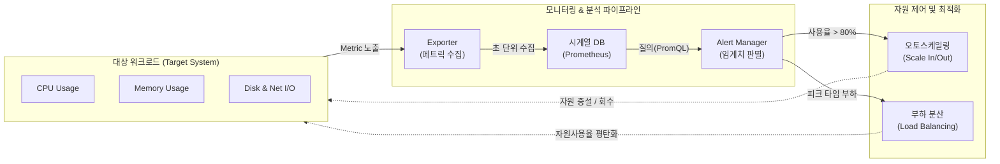

# 자원사용율 (Resource Utilization)

---

## I. 시스템 성능 모니터링과 비용 최적화의 척도, 자원사용율의 개요

* **정의**: IT 인프라 시스템에 할당된 전체 가용 컴퓨팅 자원([[CPU]], 메모리, 디스크, 네트워크 등) 대비, 현재 애플리케이션과 OS가 실질적으로 점유하고 처리 중인 자원의 비율(%)
* **필요성 및 특징**:
* **성능 병목(Bottleneck) 식별**: 특정 서브시스템의 사용률 포화(Saturation) 상태를 조기 탐지하여 서비스 지연(Latency) 방지
* **동적 자원 제어**: 클라우드/[[컨테이너]] 환경에서 오토스케일링(Auto-scaling)을 트리거하는 핵심 임계치(Threshold) 지표로 활용
* **비용 최적화 (FinOps)**: 유휴 자원(Idle Resource)을 식별하고 적정 규모(Right-sizing)로 재배치하여 TCO(총소유비용) 절감

---

## II. 자원사용율 수집 아키텍처 및 핵심 측정 지표

### 가. 자원사용율 기반 모니터링 및 자원 제어(Closed-Loop) 아키텍처

* 노드/컨테이너에서 발생하는 CPU, 메모리 등의 자원사용율 메트릭을 수집 및 시계열 저장소에 적재하고, 설정된 임계치(예: CPU 80% 이상) 도달 시 오토스케일링 등 자율 제어를 수행함

### 나. 자원사용율 핵심 측정 지표 및 구성 요소

| 분류 | 요소기술(키워드) | 세부 설명 |
| --- | --- | --- |
| **CPU 지표** | %usr, %sys | - 사용자 공간(애플리케이션) 및 [[커널]] 공간(OS)에서 프로세스가 CPU를 점유한 시간의 비율 |
| **CPU 지표** | %iowait | - 디스크나 네트워크 등의 I/O 작업이 완료되기를 CPU가 대기하며 유휴 상태로 있는 시간 비율 |
| **메모리 지표** | Active / Swap | - 실제 사용 중인 물리 메모리 사용률 및 메모리 고갈 시 사용되는 디스크 스왑 영역 활성도 |
| **디스크 지표** | IOPS / %util | - 초당 디스크 입출력 처리 횟수 및 디스크 컨트롤러가 데이터 처리에 활성화된 대역폭 비율 |
| **네트워크 지표** | Throughput / Drop | - 전체 링크 대역폭 대비 실제 전송된 트래픽의 비율 및 버퍼 오버플로우로 인한 패킷 손실률 |
| **수집 기술** | Exporter / cAdvisor | - 호스트 장비, VM 또는 [[도커]]/[[쿠버네티스]] 컨테이너 레벨의 자원사용율 메트릭을 추출하는 에이전트 |
| **저장 기술** | TSDB (시계열 DB) | - 시간에 따른 자원사용율의 연속적 변화 추이(Trend)를 시계열 데이터 구조로 저장 (Prometheus 등) |
| **활용 기술** | Right-Sizing | - 과거 자원사용율 이력(Historical Data)을 분석하여 오버스펙된 인스턴스를 최적 규격으로 축소 변경 |

---

## III. 자원 할당 관점의 자원사용율 비교 및 최신 동향

### 가. 자원사용율 임계치에 따른 프로비저닝 상태 비교

| 비교 항목 | 자원 과소 할당 (Under-provisioning) | 자원 최적 할당 (Right-sizing) | 자원 과다 할당 (Over-provisioning) |
| --- | --- | --- | --- |
| **자원사용율** | **지속적 90% 이상 (포화 상태)** | **평균 60~70% 내외 (안정적)** | **평균 20% 미만 (유휴 상태)** |
| **시스템 영향** | 병목 현상 발생, 응답 지연, 시스템 다운 리스크 | 갑작스러운 피크 트래픽(Spike)을 흡수할 버퍼 유지 | 여유 리소스 충분, 응답 속도 최상 유지 |
| **비즈니스 영향** | 서비스 중단([[SLA]] 위반)으로 인한 신뢰도 및 매출 하락 | 성능과 비용 간의 최적화된 트레이드오프 달성 | 막대한 클라우드/인프라 유지비용 낭비 초래 |
| **대응 전략** | Scale-Up(스펙 상향), Scale-Out(노드 추가), 쿼리 튜닝 | 추세(Trend) 지속 모니터링 및 주기적 벤치마크 테스트 | [[인스턴스]] 타입 하향 조정, 유휴 자원 회수(Terminate) |

### 나. 자원사용율 관리의 최신 동향 및 발전 방향

* **예측형 오토스케일링(Predictive Auto-scaling)**: 과거에는 자원사용율이 임계치를 초과한 '이후'에 대응하는 사후(Reactive) 스케일링 방식이었으나, 최근 머신러닝을 도입하여 트래픽 패턴을 사전 학습하고 사용률 급증 전에 자원을 선제적(Proactive)으로 할당하는 AIOps로 진화 중임
* **FinOps 프레임워크와의 융합**: 클라우드 자원사용율 데이터를 재무 대시보드(Cost Explorer 등)와 직접 연동하여, 사용률이 낮은(Zombie/Idle) 인스턴스를 자동으로 식별 및 회수함으로써 클라우드 요금 낭비를 원천 차단하는 거버넌스 체계가 표준으로 정착 중임

---

### 🔗 연관 토픽

- **소속 도메인**: [[00_운영체제_MOC|⚙️ 운영체제]]
- **세부 분류**: `2. CPU 스케줄링 알고리즘`
- **핵심 연관 토픽**:
  - [[커널|커널(Kernel)]]
  - [[컨테이너|컨테이너 (Container)]]
  - [[도커|도커 (Docker)]]
  - [[쿠버네티스|쿠버네티스(Kubernates)]]
  - [[기한부 스케줄링|기한부(Deadline) 스케줄링]]
