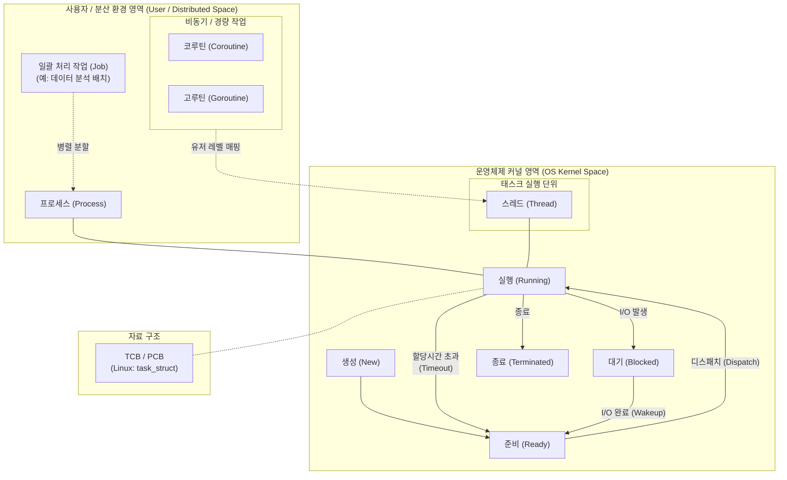

# 작업 (Task / Job)

---

## I. 운영체제 및 분산 컴퓨팅의 핵심 실행 단위, 작업(Task)의 개요

* **정의**: 컴퓨터 시스템(OS)에서 [[CPU]]와 메모리 자원을 할당받아 실행되는 독립적인 명령어와 데이터의 집합이자, 시스템 스케줄러에 의해 관리되는 최소 연산 수행 단위
* **등장배경 및 특징**:
* **자원 활용의 극대화**: 다중 프로그래밍(Multi-programming) 및 시분할(Time-sharing) 시스템에서 CPU 유휴 시간을 최소화하기 위해 도입
* **실행 단위의 세분화**: 과거 거시적 일괄 처리(Job)에서 [[프로세스]](Process), 스레드(Thread)를 거쳐 최근 초경량 비동기 작업(Coroutine) 및 분산 클러스터의 실행 단위(Task)로 진화
* **문맥(Context) 유지**: 각 작업은 고유의 상태 정보(레지스터, PC 등)를 TCB/[[PCB(Process Control Block)|PCB]] 구조체에 저장하여 시분할 전환(Context Switching)을 지원함

---

## II. 작업(Task)의 개념도 및 핵심 기술 요소

### 가. 작업(Task)의 상태 전이 및 계층 구조 개념도

* 사용자의 큰 논리적 흐름인 Job은 다수의 프로세스/스레드(Task)로 분할되며, [[커널]] 스케줄러에 의해 Ready $\rightarrow$ Running $\rightarrow$ Blocked 상태를 전이하며 CPU를 점유함

### 나. 작업(Task)의 핵심 구성 및 기술 요소

| 구분 | 요소기술(키워드) | 세부 설명 |
| --- | --- | --- |
| **[[OS(운영체제)|운영체제]] 제어** | **PCB / TCB** | - 작업의 상태, 프로그램 카운터(PC), 레지스터, 메모리 정보를 저장하는 자료구조 (리눅스의 `task_struct`) |
| **운영체제 제어** | **[[문맥 교환]] (Context Switch)** | - CPU가 다른 작업을 실행하기 위해 현재 작업 상태를 TCB에 저장하고 다음 작업 상태를 적재하는 과정 |
| **[[스케줄링]]** | **[[스케줄러|스케줄러 (Scheduler)]]** | - CPU 등 한정된 자원을 대기 중인 작업(Task)들에 공정하게 배분하는 커널 [[알고리즘]] (예: Linux CFS) |
| **실행 단위** | **스레드 (LWP)** | - 한 프로세스 내에서 자원(Code, Data, Heap)을 공유하며 스택([[Stack]])만 별도 할당받는 경량화된 작업 단위 |
| **실행 단위** | **코루틴 (Coroutine)** | - 커널 개입 없이 유저 레벨에서 상태를 일시 중지(Suspend) 및 재개(Resume)할 수 있는 초경량 비동기 작업 |
| **동기화/통신** | **IPC / 동기화 객체** | - 독립적인 작업 간 데이터 교환(Shared Memory, Message [[Queue]]) 및 상호배제(Mutex, Semaphore) 메커니즘 |
| **분산 처리** | **분산 태스크 (Map/Reduce)** | - Hadoop/Spark 등에서 대규모 데이터를 처리하기 위해 노드 단위로 분산 할당되는 병렬 연산의 최소 단위 |
| **클라우드** | **[[컨테이너]] 태스크 (ECS Task)** | - [[MSA (Micro Service Architecture)|MSA]] 환경에서 배포 및 스케일링의 기준이 되는 컨테이너들의 논리적 묶음 (AWS ECS Task, K8s Pod) |

---

## III. 작업 처리 단위 비교 및 향후 동향

### 가. 시스템 계층별 작업(Task) 처리 단위 비교

| 비교 항목 | 프로세스 (Process) | 스레드 (Thread) | 코루틴 / 가상 스레드 (Coroutine / Virtual Thread) |
| --- | --- | --- | --- |
| **작업 레벨** | OS 커널 레벨 (무거움) | OS 커널 레벨 (중간) | 사용자 공간 레벨 (User-Level, 매우 가벼움) |
| **메모리 구조** | 독립적인 메모리 공간 할당 | Code, Data, Heap 공유, Stack 독립 | 스레드 내에서 동작하며 수십 KB 수준의 최소 메모리 |
| **문맥 교환 비용** | 매우 높음 (캐시 미스 발생) | 보통 (메모리 영역 공유로 비교적 빠름) | **매우 낮음** (커널 개입 및 시스템 콜 없음) |
| **주요 활용도** | 독립 애플리케이션, 크롬 탭 | 백그라운드 I/O, 멀티코어 병렬 처리 | 대규모 동시성 I/O 처리 (Node.js, Go, Java 21) |
| **격리성(Isolation)** | 매우 높음 (안정성 보장) | 낮음 (동기화 이슈 발생) | 낮음 (스레드 세이프티 고려 필요) |

### 나. 작업(Task) 관리 기술의 최근 동향 및 전망

* **사용자 수준 초경량 작업(Task)의 표준화**: I/O 바운드 작업 시 발생하는 스레드 블로킹 오버헤드를 극복하기 위해, Go언어의 Goroutine 및 Java 21의 Virtual Thread와 같이 수백만 개의 작업을 동시 처리할 수 있는 유저 레벨 런타임 기술이 백엔드 아키텍처의 디팩토(De facto)로 자리잡음.
* **오케스트레이션 기반의 Task 오프로딩**: 엣지 컴퓨팅 및 AI 클라우드 환경에서는 단일 기기의 자원 한계를 극복하기 위해 작업을 잘게 쪼개어 가용한 유휴 엣지 노드로 동적 분산 처리(Task Offloading)하는 지능형 스케줄링(AIOps) 체계가 고도화되고 있음.

---

### 🔗 연관 토픽

- **소속 도메인**: [[00_운영체제_MOC|⚙️ 운영체제]]
- **세부 분류**: `1. 프로세스 & 스레드 관리`
- **핵심 연관 토픽**:
  - [[스케줄링]]
  - [[프로세스]]
  - [[커널|커널(Kernel)]]
  - [[OS(운영체제)]]
  - [[문맥 교환|문맥 교환 (Context Switching)]]
