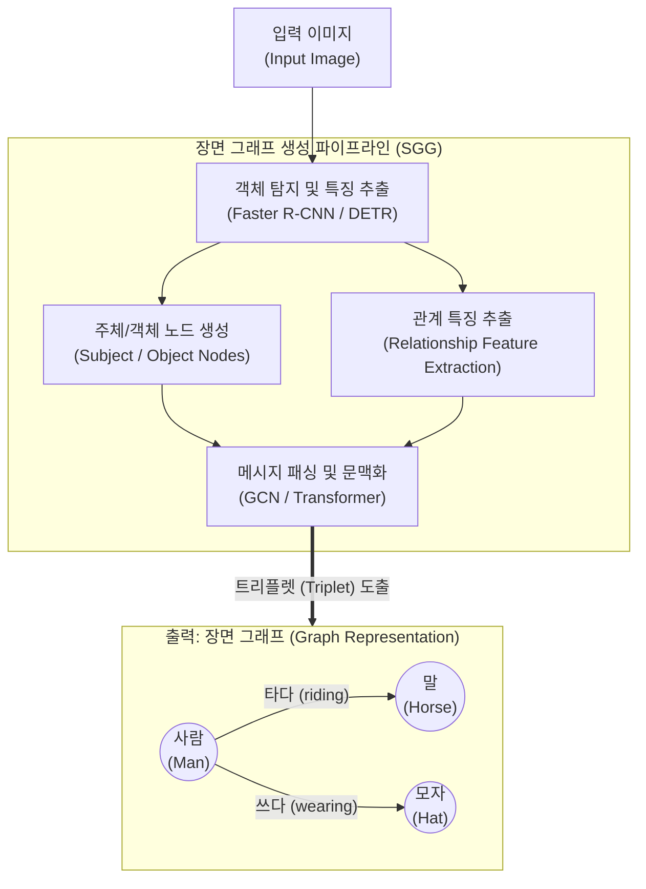

# 장면 그래프 (Scene Graph)

---

## I. 시각적 맥락 이해를 위한 구조화된 지식 표현, 장면 그래프의 개요

* **정의**: 이미지나 비디오 내의 객체(Object), 속성(Attribute), 객체 간의 관계(Relationship)를 노드(Node)와 간선([[EDGE|Edge]])으로 모델링하여 기계가 이해할 수 있는 그래프 형태로 구조화한 시각적 지식 표현 기법
* **필요성 및 등장배경**:
* **시각적 의미 이해(Semantic Understanding) 요구**: 단순한 객체 탐지(BBox)를 넘어, 픽셀 간의 맥락적(Contextual) 관계 파악 필요성 대두
* **멀티모달 AI의 브릿지**: 시각(Vision) 데이터와 언어(Language) 데이터를 연결(Grounding)하여 VQA(Visual Question Answering) 및 이미지 캡셔닝 성능 극대화
* **특징**: 트리플렛(Subject-Predicate-Object) 구조, 설명 가능한 AI([[XAI]]) 기반 제공, 환각(Hallucination) 현상 완화

---

## II. 장면 그래프의 개념도 및 핵심 기술 요소

### 가. 장면 그래프 생성(SGG) 아키텍처 및 동작 원리

* 입력 이미지에서 객체와 속성을 추출하여 노드로 구성하고, 객체 쌍(Pair) 간의 시각적·의미적 특징을 결합하여 관계(Predicate)를 추론함

### 나. 장면 그래프의 핵심 기술 및 구성 요소

| 구분 | 요소기술(키워드) | 세부 설명 |
| --- | --- | --- |
| **기본 구조** | **트리플렛 (Triplet)** | - `<주체(Subject) - 관계(Predicate) - 객체(Object)>` 형태의 최소 단위 지식 표현 |
| **객체 분석** | **객체 탐지 (Object Detection)** | - 이미지 내 존재하는 객체의 위치(BBox)와 클래스를 식별 (YOLO, Faster R-[[CNN]] 활용) |
| **속성 분석** | **속성 분류 (Attribute Classification)** | - 탐지된 객체의 상태, 색상, 크기 등의 부가적인 세부 특성을 추출하여 노드에 부여 |
| **관계 추론** | **관계 분류기 (Relationship Classifier)** | - 객체 간의 공간적(위, 아래), 행동적(타다, 먹다), 의미적 관계를 확률적으로 추론 |
| **그래프 연산** | **GCN (Graph Convolutional Network)** | - 노드와 간선의 특징 벡터를 인접 노드 간 메시지 패싱(Message Passing)으로 업데이트하여 문맥 강화 |
| **지식 결합** | **상식 주입 (Commonsense Injection)** | - 시각적 특징의 모호성을 해결하기 위해 외부 지식 베이스(ConceptNet 등)의 사전 지식 활용 |
| **[[모델 구조]]** | **One-stage / Two-stage SGG** | - 객체 탐지와 관계 예측을 순차적으로 수행(Two-stage)하거나, 단일 네트워크에서 동시 최적화(One-stage) |
| **데이터셋** | **Visual Genome** | - 대규모 이미지에 대한 객체, 속성, 관계가 레이블링된 대표적인 장면 그래프 학습용 데이터셋 |

---

## III. 유사 기술 비교 및 향후 동향

### 가. 객체 탐지(Object Detection)와 장면 그래프(Scene Graph) 비교

| 비교 항목 | 객체 탐지 (Object Detection) | 장면 그래프 (Scene Graph) |
| --- | --- | --- |
| **목적** | 객체의 위치(Localization) 및 종류(Class) 식별 | 객체 식별 및 **객체 간의 상호작용/관계(Relation) 이해** |
| **출력 형태** | 바운딩 박스(Bounding Box) 리스트 | 노드(객체/속성)와 간선(관계)으로 구성된 **그래프(Graph)** |
| **정보의 질** | 고립적, 단편적 시각 정보 | 구조적, 의미론적 **맥락(Context) 정보** |
| **활용 분야** | CCTV 감시, 불량 검출, 얼굴 인식 | VQA, 이미지 캡셔닝, LMM 시각 지식 베이스 |

### 나. 장면 그래프의 최근 동향 및 산업 적용 전망

* **LMM(대규모 멀티모달 모델)의 환각 억제**: 최신 GPT-4V, LLaVA 등의 LMM이 겪는 시각적 환각(Visual Hallucination)을 억제하기 위해, 장면 그래프를 텍스트로 변환하여 프롬프트에 주입하는 **Graph-RAG (Retrieval-Augmented Generation)** 기법으로 진화 중
* **3D 및 동적 장면 그래프(3D-DSG) 확장**: 2D 정지 이미지를 넘어 비디오 및 3차원 공간에서 시간적 변화까지 모델링하는 동적 장면 그래프(Dynamic Scene Graph) 연구가 활발하며, 이는 **로보틱스 내비게이션** 및 **[[Smart Car(자율주행)|자율주행]] 환경의 3D 공간 이해(3D Scene Understanding)** 를 위한 핵심 기술로 정착 중임

---

### 🔗 연관 토픽

- **소속 도메인**: [[00_인공지능_MOC|🤖 인공지능]]
- **세부 분류**: `5. 컴퓨터 비전 · 음성 & 에이전트`
- **핵심 연관 토픽**:
  - [[XAI]]
  - [[CNN|CNN (Convolutional Neural Network)]]
  - [[모델 구조]]
  - [[멀티모달 AI|멀티모달(Multimodal) AI]]
  - [[Smart Car(자율주행)]]
