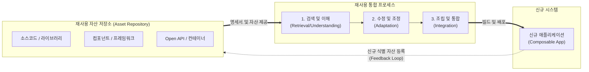

# 소프트웨어 재사용 (Software Reuse)

---

## I. 생산성 향상과 고품질 소프트웨어 확보의 핵심, 재사용의 개요

* **정의**: 이미 개발되어 검증된 소프트웨어 자원(소스코드, 컴포넌트, 아키텍처, 문서 등)을 새로운 소프트웨어 개발 시스템에 다시 활용하는 공학 기법
* **필요성 및 특징**:
* **개발 효율성 극대화**: Time-to-Market 단축, 개발 및 [[유지보수]] 비용 절감
* **품질 및 [[신뢰성]] 보장**: 이미 검증된 자산(Proven Asset)을 활용하여 시스템 결함(Defect) 최소화
* **패러다임의 진화**: 함수/[[클래스]] 단위(OOP) $\rightarrow$ 컴포넌트(CBD) $\rightarrow$ 서비스([[MSA (Micro Service Architecture)|MSA]]/API) $\rightarrow$ AI 기반 자동 추천 및 생성으로 진화

---

## II. 재사용의 프로세스 개념도 및 핵심 기술 요소

### 가. 소프트웨어 재사용 프로세스 및 아키텍처 개념도

* 기존 저장소에 축적된 자산을 도메인 분석을 통해 식별 및 검색하고, 신규 시스템의 요구사항에 맞게 조정(Adaptation)하여 통합하는 폐쇄 루프(Closed-loop) 구조

### 나. 재사용의 핵심 기술 및 구성 요소

| 구분 | 요소기술(키워드) | 세부 설명 |
| --- | --- | --- |
| **재사용 기법** | **화이트박스 (White-box) 재사용** | - 소스 코드 레벨에서 내부 구조를 이해하고 직접 수정, 상속(Inheritance)하여 재사용하는 기법 |
| **재사용 기법** | **블랙박스 (Black-box) 재사용** | - 내부 구현을 숨기고 공개된 인터페이스(API, [[프로토콜]])만을 호출하여 모듈 단위로 재사용하는 기법 |
| **설계 자산** | **[[디자인 패턴|디자인 패턴 (Design Pattern)]]** | - GoF 패턴 등 특정 문맥에서 반복적으로 발생하는 문제에 대한 객체지향적 설계 해결책 재사용 |
| **구현 자산** | **[[프레임워크]] (Framework)** | - Spring, React 등 공통된 기능과 제어 흐름(Inversion of Control)을 제공하는 반제품 형태의 뼈대 |
| **런타임 자산** | **마이크로서비스 (MSA) / API** | - 독립적으로 배포 및 실행 가능한 서비스 단위의 런타임 재사용 (Open API, RESTful 연동) |
| **인프라 자산** | **[[컨테이너]] 이미지 (Container)** | - [[도커|Docker]] 등을 활용하여 OS, 라이브러리, 실행 환경 전체를 패키징하여 환경 구성 비용 재사용 |
| **관리 도구** | **자산 저장소 (Artifact Repository)** | - Maven, NPM, Git 등 재사용 가능한 라이브러리 및 패키지의 형상과 버전을 중앙 관리하는 도구 |
| **AI 기술** | **생성형 AI 기반 코드 재사용** | - [[초거대 언어 모델|LLM]](GitHub Copilot 등)을 활용하여 과거 방대한 코드 베이스에서 최적의 코드 스니펫을 추출 및 생성 |

---

## III. 재사용 기법의 비교 및 최신 산업 동향

### 가. 화이트박스 재사용과 블랙박스 재사용 비교

| 비교 항목 | 화이트박스 (White-box) 재사용 | 블랙박스 (Black-box) 재사용 |
| --- | --- | --- |
| **접근 수준** | 소스 코드 (Source Code) 직접 접근 | 컴포넌트 실행 파일, 인터페이스(API) |
| **수정 여부** | 신규 요구사항에 맞춰 자유롭게 코드 수정 | 코드 수정 불가 (인터페이스 파라미터만 조정) |
| **재사용 방식** | 복사 앤 붙여넣기(Copy & Paste), 상속(Inheritance) | 위임(Delegation), 컴포지션(Composition), API 호출 |
| **유지보수성** | 낮음 (원본 코드가 변경되어도 동기화 어려움) | **높음** (인터페이스만 유지되면 내부 변경 영향 없음) |
| **주요 트렌드** | 오픈소스 포크(Fork), 사내 코드 공유 | SaaS 연동, MSA API 런타임 호출, SOA |

### 나. 소프트웨어 재사용 분야의 향후 전망 및 최신 동향

* **컴포저블 비즈니스 (Composable Business) 아키텍처의 확산**: 단순히 IT 부서의 코드 재사용을 넘어, PBC(Packaged Business Capabilities)라는 독립적인 비즈니스 기능 블록을 레고처럼 조립하여 신규 비즈니스를 런칭하는 전사적 재사용 생태계로 발전
* **이너소스 (InnerSource) 문화 정착**: 외부의 오픈소스 개발 방식을 기업 내부로 가져와, 사내 모든 개발자가 저장소에 접근하고 기여(PR)할 수 있도록 하여 사내 자산 재사용률을 극대화하는 문화 확산
* **RAG 및 AI 에이전트 결합**: 기업 내부의 레거시 코드와 설계 산출물을 벡터 DB화하고, RAG(검색 증강 생성) 기술과 결합된 AI 에이전트가 개발자의 의도에 맞는 사내 표준 컴포넌트를 즉각적으로 찾아내어 조립해주는 **지능형 재사용(Intelligent Reuse)** 시대로 진입 중임

---

### 🔗 연관 토픽

- **소속 도메인**: [[00_소프트웨어공학_MOC|🏗️ 소프트웨어공학]]
- **세부 분류**: `4. 아키텍처 스타일 & 객체지향 설계 원리`
- **핵심 연관 토픽**:
  - [[디자인 패턴|디자인 패턴 (Design Pattern)]]
  - [[도커|도커 (Docker)]]
  - [[클래스]]
  - [[프레임워크]]
  - [[MSA (Micro Service Architecture)]]
