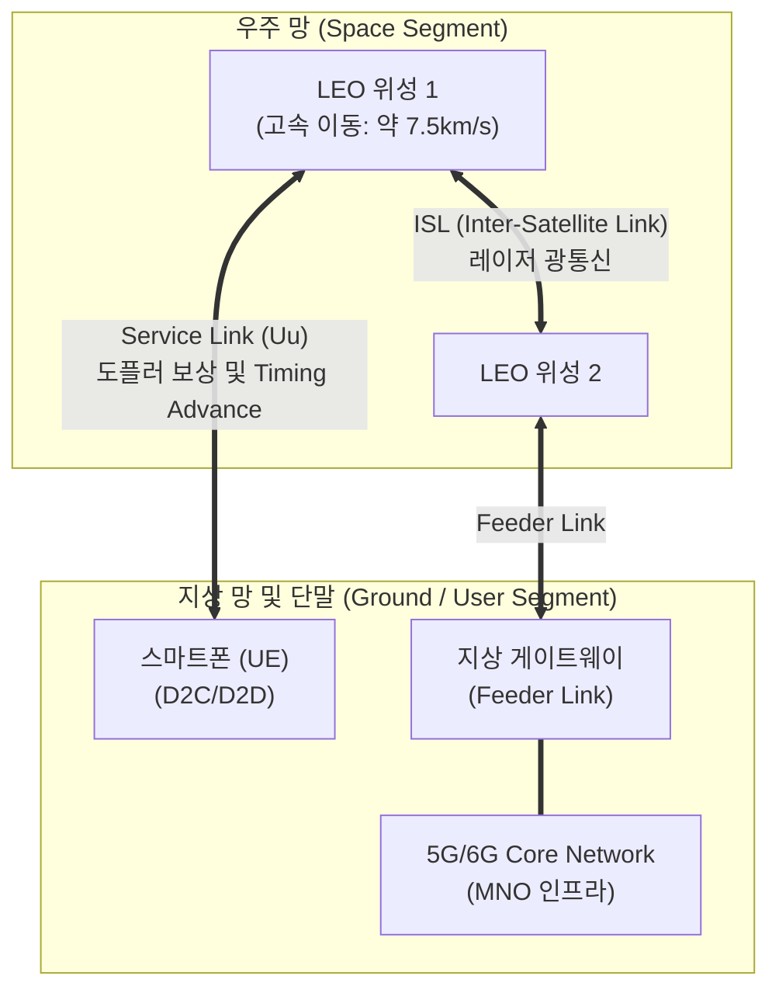

# 저궤도 위성 (LEO, Low Earth Orbit)

---

## I. 초공간 6G 통신의 핵심 인프라, 저궤도 위성의 개요

* **정의**: 고도 300~1,500km 상공에서 운용되며, 짧은 지연시간과 3GPP NTN(Non-Terrestrial Network) 표준을 기반으로 스마트폰과 직접 통신(D2D/D2C)하여 지상망 음영지역 없이 전 지구적 브로드밴드를 제공하는 차세대 통신 위성
* **등장배경 및 특징**:
* **초연결 통신망 확보**: 해상, 산악, 재난 상황 등 기존 지상망(Terrestrial Network)의 공간적 커버리지 한계를 극복
* **메가 콘스텔레이션(Mega Constellation)**: 발사 비용 하락 및 소형화 기술 발전으로 수천 개의 위성을 군집 운용하여 연속적인 글로벌 커버리지 보장
* **D2D(Direct-to-Device) 시대 개막**: 별도의 위성 안테나(VSAT) 없이, 기존 상용 스마트폰으로 위성에 직접 접속하는 기술 상용화(3GPP Rel-17/18 기반)

---

## II. 저궤도 위성의 시스템 아키텍처 및 핵심 기술 요소

### 가. 저궤도 위성의 3GPP NTN 기반 아키텍처

* **동작 원리**: 사용자의 스마트폰(UE)이 LEO 위성과 직접 통신(D2C)을 수행하며, 위성 간 연결(ISL)을 통해 지상 게이트웨이와 5G 코어망으로 트래픽을 라우팅함. 단말 측에서 GNSS를 활용해 사전 타이밍 및 주파수 보상을 수행

### 나. 저궤도 위성의 핵심 구성 및 기술 요소

| 구분 | 요소기술(키워드) | 세부 설명 |
| --- | --- | --- |
| **표준 [[프레임워크]]** | **3GPP NTN ([[비지상네트워크]])** | - Release-17/18에서 규격화된 위성 통신 표준으로, 5G NR 및 NB-IoT를 우주 환경으로 확장 적용 |
| **연결/접속** | **D2C (Direct-to-Cell / D2D)** | - 통신사의 지상 주파수 또는 위성 대역을 활용해 일반 스마트폰 하드웨어 변경 없이 위성과 직접 통신 |
| **네트워크 구조** | **ISL (Inter-Satellite Link)** | - 위성 간 레이저 기반의 광통신 백홀을 구축하여, 지상국을 거치지 않고 글로벌 데이터 전송 및 지연 최소화 |
| **무선/안테나** | **위상배열 (Phased Array)** | - 초고속으로 이동하는 위성에서 물리적 모터 구동 없이, 안테나 소자의 위상을 제어하여 전자적으로 다중 빔을 쏘고 추적 |
| **동기화 기술** | **도플러 편이 (Doppler Shift) 보상** | - 위성의 고속 이동(최대 24ppm 드리프트)에 따른 심각한 주파수 왜곡을 단말 및 네트워크 차원에서 사전 보상(Pre-compensation) |
| **동기화 기술** | **Timing Advance (지연 보정)** | - 지상 기지국과 달리 거리가 멀어 발생하는 왕복 지연을 단말(UE)이 자체 내장된 GNSS(GPS)를 통해 스스로 계산하고 보정 |
| **위성 구조** | **재생 중계 (Regenerative Payload)** | - 지상의 신호를 그대로 반사하는 투명 중계(Bent-pipe) 방식에서 벗어나, 위성 자체에 기지국(gNB) 기능을 탑재하는 고도화 구조 |
| **모빌리티** | **초고속 핸드오버 (Handover)** | - 위성이 빠르게 지구를 공전하므로, 단말의 끊김 없는 서비스 유지를 위해 위성 간, 빔(Beam) 간의 빈번한 핸드오버 제어 필수 |

---

## III. 위성 궤도별 비교 및 최신 동향

### 가. 정지궤도 위성(GEO)과 저궤도 위성(LEO) 비교

| 비교 항목 | 정지궤도 위성 (GEO) | 저궤도 위성 (LEO) |
| --- | --- | --- |
| **고도** | 35,786 km | 300 ~ 1,500 km |
| **공전 속도 / 주기** | 지구 자전 속도와 동일 (24시간 주기) | 초속 7km 이상 (약 90~120분 주기) |
| **전파 지연시간(RTT)** | 매우 길음 (약 500ms 이상) | **짧음 (약 20~40ms 수준)** |
| **필요 위성 수** | 3~4개로 글로벌(극지방 제외) 커버 | 수백 ~ 수천 개의 군집 위성 (Mega Constellation) |
| **사용자 단말** | 크고 지향성 강한 전용 단말(VSAT) 필수 | **일반 스마트폰 (D2C) 및 소형 평면 안테나** |
| **주요 사업자** | 인마샛, 무궁화 위성 등 전통 사업자 | 스타링크, 원웹, 카이퍼, AST 스페이스모바일 등 |

### 나. 저궤도 위성(LEO)의 최근 트렌드 및 향후 전망

* **지상-위성 6G 입체 통신망 융합**: 3GPP Rel-19 이후부터는 위성이 단순한 백홀 릴레이가 아닌 AI 빔 스케줄링과 기지국 기능을 완전히 내장하는 재생 중계 모델로 고도화되며, 지상망(Terrestrial)과 비지상망(NTN)이 완전한 단일 코어로 융합되는 6G 핵심 인프라로 자리매김할 전망
* **주파수 혼간섭 및 우주 환경 규제 이슈 대두**: 각국의 기업들이 메가 콘스텔레이션 구축 경쟁(스페이스 레이스 2.0)에 돌입하면서, 궤도 내 폐위성(우주 쓰레기) 충돌 위험성과 전파 간섭 문제가 심각해짐에 따라 ITU(국제전기통신연합) 및 WRC를 중심으로 글로벌 규제와 주파수 할당 표준화 논의가 활발히 진행 중

---

### 🔗 연관 토픽

- **소속 도메인**: [[00_네트워크_MOC|🌐 네트워크]]
- **세부 분류**: `4. 무선 및 차세대 이동통신 (5G/6G/Wi-Fi)`
- **핵심 연관 토픽**:
  - [[비지상네트워크|비지상네트워크(NTN, Non-Terrestrial Networks)]]
  - [[6G]]
  - [[프레임워크]]
  - [[다중화|다중화(Multiplexing)]]
  - [[SDR (Software Defined Radio)]]
