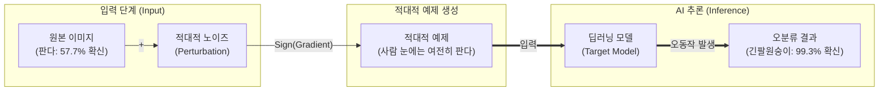

# 적대적 공격 (Adversarial Attacks)

---

## I. 인공지능 모델의 신뢰성 위협, 적대적 공격의 개요

* **정의**: [[인공지능]](특히 [[딥러닝]]) 모델이 오동작하도록 인간의 눈(육안)이나 청각으로는 인지할 수 없는 미세한 노이즈(섭동, Perturbation)를 의도적으로 추가하여 오분류를 유도하는 보안 위협
* **필요성/등장배경/특징**:
* **인지의 차이 악용**: 기계학습 모델의 고차원 선형성과 수학적 패턴 인식 특성을 악용
* **전이성 (Transferability)**: 특정 모델을 타겟으로 생성된 적대적 예제(Adversarial Example)가 다른 구조의 모델에서도 동일하게 오분류를 유발하는 특성 보유
* **보안 위협 현실화**: [[Smart Car(자율주행)|자율주행]](표지판 인식 교란), 안면 인식 무력화, [[초거대 언어 모델|LLM]] 탈옥(Jailbreak) 등 치명적 리스크 증가

---

## II. 적대적 공격의 개념도 및 핵심 기술 요소

### 가. 적대적 공격의 개념도 및 동작 원리

* 원본 데이터에 모델의 손실 함수(Loss Function) 기울기 방향을 계산하여 의도된 미세 노이즈를 더해, 정교하게 조작된 적대적 예제(Adversarial Example)를 생성 및 주입함

### 나. 적대적 공격 및 방어의 핵심 기술 요소

| 분류 | 요소기술(키워드) | 세부 설명 |
| --- | --- | --- |
| **공격 방식** | **White-box 공격** | - 공격자가 모델의 구조, 가중치, 손실 함수 등 내부 정보를 완벽히 알고 있는 상태에서 기울기(Gradient)를 역산하여 공격 |
| **공격 방식** | **Black-box 공격** | - 모델 내부 정보를 모른 채, 입력에 대한 출력(API 응답, Confidence Score)만을 반복 관찰하여 대리 모델(Substitute Model)을 학습 후 전이 공격 수행 |
| **대표 [[알고리즘]]** | **FGSM (Fast Gradient Sign Method)** | - 모델의 손실 함수 기울기(Gradient) 방향을 추출하여 한 번의 연산으로 빠르고 단순하게 노이즈를 생성하는 기법 |
| **대표 알고리즘** | **PGD (Projected Gradient Descent)** | - FGSM을 여러 번의 작은 스텝으로 반복 수행하여 가장 강력한 적대적 예제를 만들어내는 투영된 경사 하강법 |
| **공격 목적** | **Targeted / Untargeted** | - **Targeted**: 공격자가 원하는 특정 오답([[클래스]])으로 판별 유도 

 - **Untargeted**: 정답만 아니면 무작위 어떤 클래스로든 오분류 유도 |
| **방어 기술** | **적대적 훈련 (Adversarial Training)** | - 훈련 데이터셋에 적대적 예제를 섞어서 정답 라벨링과 함께 모델을 재학습시켜 인공지능의 강건성(Robustness)을 향상 |
| **방어 기술** | **방어적 증류 (Defensive Distillation)** | - 교사 모델의 연화된 확률 분포(Softmax Temperature)를 학생 모델에 전이하여 공격자의 기울기 추출(Gradient Masking)을 방해 |
| **방어 기술** | **입력 데이터 정제 (Input Transformation)** | - 추론 전 입력 이미지에 JPEG 압축, 블러(Blur), 양자화 등을 가하여 은닉된 적대적 노이즈를 파괴하는 기법 |

---

## III. 적대적 공격과 데이터 오염(Poisoning) 비교 및 향후 전망

### 가. AI 보안 위협 관점 비교 (적대적 공격 vs 데이터 오염)

| 비교 항목 | 적대적 공격 (Adversarial Attack) | 데이터 오염 공격 (Data Poisoning) |
| --- | --- | --- |
| **공격 발생 단계** | **추론 단계 (Inference Phase)** | **학습 단계 (Training Phase)** |
| **공격 대상** | 서비스 중인 완성된 AI 모델 (입력값 조작) | AI 모델이 학습할 원시 데이터 (학습셋 조작) |
| **공격 메커니즘** | 입력 데이터에 인지 불가 노이즈 삽입 (Evasion) | 백도어(Trigger) 삽입 및 악의적 데이터 주입 |
| **주요 방어책** | 적대적 훈련, Gradient Masking, 입력 전처리 | 학습 데이터 [[무결성]] 검증, 이상 탐지, 데이터 정제 |

### 나. 최신 동향 및 산업 적용 방향

* **LLM과 생성형 AI로의 위협 확장**: 이미지 분류를 넘어 텍스트 기반의 대규모 언어 모델(LLM)에 대한 [[프롬프트 인젝션|프롬프트 인젝션(Prompt Injection)]] 및 탈옥(Jailbreak) 공격이 언어적(Semantic) 적대적 공격의 형태로 급부상 중임.
* **물리적 세계의 적대적 공격 (Physical Attack) 심화**: 자율주행 차량의 카메라를 교란하기 위해 도로 표지판에 특수 제작된 패치(Adversarial Patch)를 부착하는 등 실세계 위협이 현실화됨에 따라, 설명 가능한 AI([[XAI]])를 통한 판단 근거 모니터링 및 센서 퓨전(Sensor Fusion) 교차 검증 체계 도입이 필수적으로 요구됨.

---

### 🔗 연관 토픽

- **소속 도메인**: [[00_보안_MOC|🛡️ 보안]]
- **세부 분류**: `2. 현대 암호학 & 키 관리 · 전자서명`
- **핵심 연관 토픽**:
  - [[알고리즘]]
  - [[딥러닝]]
  - [[인공지능]]
  - [[Smart Car(자율주행)]]
  - [[XAI]]
