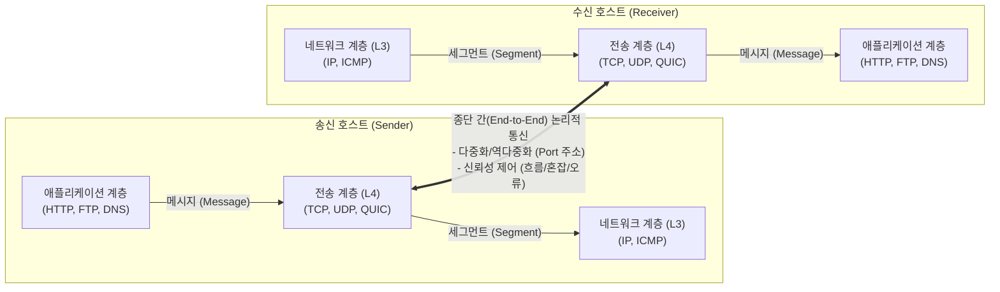

# 전송 계층 (Transport Layer)

---

## I. 종단 간(End-to-End) 신뢰성 통신의 핵심, 전송 계층의 개요

* **정의**: OSI 7계층의 제4계층(L4)으로, 송수신 호스트의 애플리케이션([[프로세스]]) 간 논리적 연결을 확립하고 데이터의 분할, 흐름 제어, 오류 제어를 통해 [[신뢰성]] 있는 데이터 전송을 보장하는 계층
* **필요성 및 특징**:
* **프로세스 간 통신 (Process-to-Process)**: IP(호스트 식별)의 한계를 넘어 포트(Port) 번호를 통해 특정 애플리케이션을 정확히 식별 및 [[다중화|다중화(Multiplexing)]]
* **신뢰성 및 효율성 보장**: 패킷 손실, 순서 바뀜 등의 하위 계층(L3) 결함을 은닉하고, 상위 계층(L5~L7)에 투명하고 안정적인 데이터 스트림 제공
* **전송 품질 최적화**: 트래픽 폭주를 막는 [[혼잡 제어]](Congestion Control)와 수신 버퍼 오버플로우를 막는 흐름 제어(Flow Control) 수행

---

## II. 전송 계층의 개념도 및 핵심 기술 요소

### 가. 전송 계층의 아키텍처 및 동작 원리

* 상위 계층의 '메시지'를 페이로드로 받아 헤더(Port 번호 등)를 붙여 '세그먼트(데이터그램)' 단위로 분할(Segmentation)하고 상대방 전송 계층과 논리적 통신 수행

### 나. 전송 계층의 핵심 기술 및 구성 요소

| 구분 | 요소기술(키워드) | 세부 설명 |
| --- | --- | --- |
| **주소 체계** | **포트 번호 (Port Number)** | - 통신을 수행하는 애플리케이션(프로세스)을 식별하기 위한 16비트 논리적 주소 (0 ~ 65535) |
| **제어 메커니즘** | **다중화 및 역다중화** | - 여러 애플리케이션의 데이터를 하나의 네트워크 라인으로 묶고(Multiplexing), 수신 시 포트별로 분배(Demultiplexing) |
| **제어 메커니즘** | **흐름 제어 (Flow Control)** | - 수신자의 처리 속도(버퍼)에 맞춰 송신 속도를 조절하는 기법 (Sliding Window, Stop-and-Wait) |
| **제어 메커니즘** | **혼잡 제어 (Congestion Control)** | - 네트워크 전체의 트래픽 혼잡도를 감지하여 송신량을 조절하는 기법 (Slow Start, AIMD, Fast Retransmit) |
| **제어 메커니즘** | **오류 제어 (Error Control)** | - 세그먼트 훼손(Checksum 검사) 및 분실(Timer/[[Timeout]]) 감지 시 ARQ 기법을 통한 재전송 수행 |
| **핵심 [[프로토콜]]** | **[[TCP]] (Transmission Control Protocol)** | - 3-Way Handshake로 연결을 지향하며, 데이터 순서와 신뢰성을 100% 보장하는 프로토콜 (HTTP, FTP 사용) |
| **핵심 프로토콜** | **UDP (User Datagram Protocol)** | - 비연결형으로 신뢰성보다 실시간성과 전송 속도를 극대화한 오버헤드가 적은 프로토콜 (VoIP, [[DNS(Domain Name System)|DNS]] 사용) |
| **차세대 프로토콜** | **[[SCTP (Stream Control Transmission Protocol)|SCTP]] (Stream Control Transmission)** | - 다중 스트림(Multi-streaming) 및 다중 홈(Multi-homing)을 지원하여 TCP와 UDP의 장점을 결합한 프로토콜 |

---

## III. 전송 계층 주요 프로토콜 비교 및 향후 동향

### 가. 4계층 주요 프로토콜 비교 (TCP vs UDP vs QUIC)

| 비교 항목 | TCP (전통적 신뢰성) | UDP (전통적 신속성) | QUIC (차세대 전송 표준) |
| --- | --- | --- | --- |
| **연결 방식** | 연결 지향형 (Connection-oriented) | 비연결형 (Connectionless) | **비연결형 기반 논리적 연결** |
| **신뢰성 보장** | 보장 (재전송, 순서 제어) | 보장하지 않음 (Best-Effort) | **보장 (UDP 위에서 자체 구현)** |
| **핸드셰이크 지연** | 1-RTT (TLS 연동 시 3-RTT) | 0-RTT (연결 설정 없음) | **0-RTT ~ 1-RTT (TLS 1.3 내장)** |
| **다중화 특성** | 단일 스트림 (HoL Blocking 발생) | 다중화 제어 없음 | **멀티 스트림 (HoL Blocking 해결)** |
| **주요 활용 분야** | 웹(HTTP/1.1, HTTP/2), 파일 전송 | 실시간 미디어, DNS, SNMP | **[[HTTP 3|HTTP/3]] (초저지연 웹 브라우징)** |

### 나. 전송 계층 기술의 최신 동향 및 전망

* **QUIC 기반의 HTTP/3 표준화**: 기존 TCP의 고질적 문제인 초기 연결 지연(Handshake)과 패킷 손실 시 발생하는 HoL(Head-of-Line) Blocking을 해결하기 위해, UDP 기반의 범용 전송 프로토콜인 **QUIC(RFC 9000)** 이 차세대 전송 계층의 디팩토(De facto) 표준으로 자리잡음.
* **커널 우회([[커널|Kernel]] Bypass) 및 유저 스페이스 전송**: 100Gbps 이상의 초고속 네트워크 환경에서 [[OS(운영체제)|운영체제]] 커널의 [[인터럽트]] 병목을 피하기 위해, DPDK와 결합하여 전송 계층(TCP/QUIC) 처리를 유저 스페이스에서 직접 수행하는 고성능 패킷 처리 아키텍처가 클라우드 인프라에 적극 도입 중임.
* **다중 경로 전송(MPTCP)**: 5G와 Wi-Fi 망을 동시에 묶어 대역폭을 확장하고 끊김 없는 핸드오버를 지원하는 **MPTCP(Multipath TCP)** 기술이 모바일 및 커넥티드 카(Connected Car) 환경의 핵심 전송 기술로 확산되고 있음.

---

### 🔗 연관 토픽

- **소속 도메인**: [[00_네트워크_MOC|🌐 네트워크]]
- **세부 분류**: `1. OSI 7계층 & 데이터링크 계층 (L1/L2)`
- **핵심 연관 토픽**:
  - [[프로토콜]]
  - [[HTTP 3|HTTP/3]]
  - [[SCTP (Stream Control Transmission Protocol)]]
  - [[TCP]]
  - [[BGP|BGP(Border Gateway Protocol)]]
