# 전송부호화 (소스 코딩, 채널 코딩, 라인 코딩)

---

## I. 통신 효율과 신뢰성 확보의 핵심, 전송부호화의 개요

* **정의**: 디지털 통신 시스템에서 정보의 압축(소스), 오류 제어(채널), 물리적 신호 변환(라인)을 통해 데이터를 효율적이고 [[신뢰성]] 있게 전송하기 위한 일련의 데이터 변환 과정
* **등장배경 및 특징**:
* **대역폭 효율성 및 신뢰성 확보**: 한정된 주파수 대역폭의 활용도를 높이고(압축), 전송 중 발생하는 잡음 및 간섭으로부터 데이터를 보호(오류 정정)
* **매체 적응력 향상**: 디지털 비트 스트림을 광케이블, 구리선 등 물리적 매체의 특성에 적합한 전기적/광학적 신호파형으로 변환
* **3단계 분리 및 최적화**: 섀넌의 정보이론(Shannon's theorem)에 기반하여 소스와 채널 코딩을 분리하여 각각 최적화하는 구조 지향

---

## II. 전송부호화의 개념도 및 핵심 기술 요소

### 가. 전송부호화의 단계별 프로세스 개념도

```mermaid
flowchart LR
    subgraph 송신측_Transmitter ["송신측 (Transmitter)"]
        direction TB
        Info["정보원<br/>(Information Source)"] 
        SourceEnc["소스 코딩<br/>(Source Encoder)"]
        ChannelEnc["채널 코딩<br/>(Channel Encoder)"]
        LineEnc["라인 코딩<br/>(Line/Baseband Encoder)"]
        
        Info -->|"원시 데이터"| SourceEnc
        SourceEnc -->|"압축된 비트열<br/>(Redundancy 제거)"| ChannelEnc
        ChannelEnc -->|"부호화된 비트열<br/>(Redundancy 추가)"| LineEnc
    end

    Medium(("전송 매체<br/>(Channel / Medium)"))

    subgraph 수신측_Receiver ["수신측 (Receiver)"]
        direction TB
        LineDec["라인 디코딩<br/>(Line Decoder)"]
        ChannelDec["채널 디코딩<br/>(Channel Decoder)"]
        SourceDec["소스 디코딩<br/>(Source Decoder)"]
        Dest["목적지<br/>(Destination)"]
        
        LineDec -->|"신호 -> 비트열"| ChannelDec
        ChannelDec -->|"오류 정정"| SourceDec
        SourceDec -->|"압축 해제"| Dest
    end

    LineEnc ==>|"전기적/광학적 신호파형"| Medium
    Medium ==>|"왜곡/잡음 포함 신호"| LineDec

```

* 송신측에서는 **정보 압축(소스) $\rightarrow$ 오류 제어 비트 추가(채널) $\rightarrow$ 전기적 파형 변환(라인)** 순으로 처리되며 수신측은 이의 역순으로 복호화 수행

### 나. 전송부호화 3대 영역의 핵심 기술 요소

| 구분 | 요소기술(키워드) | 세부 설명 |
| --- | --- | --- |
| **소스 코딩 (Source)** | **무손실 압축 기법** | - 정보의 손실 없이 잉여성(Redundancy)을 제거하는 섀넌-파노, 허프만(Huffman), LZW [[알고리즘]] |
| **소스 코딩 (Source)** | **VVC (H.266)** | - 차세대 비디오 압축 코딩 기술로, HEVC 대비 압축률을 50% 향상시킨 고효율 영상 부호화 기술 |
| **채널 코딩 (Channel)** | **FEC (전진 에러 수정)** | - 재전송(ARQ) 없이 수신측에서 자체적으로 에러를 검출하고 정정할 수 있도록 패리티 비트 등 잉여 비트 추가 |
| **채널 코딩 (Channel)** | **LDPC (Low Density Parity Check)** | - 5G 이동통신의 데이터 채널(eMBB)에 표준으로 채택된 기법으로, 섀넌 한계에 근접한 뛰어난 오류 정정 능력 제공 |
| **채널 코딩 (Channel)** | **Polar Code (폴라 코드)** | - 5G 이동통신의 제어 채널(Control Channel)에 적용되며, 채널 편극(Channel Polarization) 현상을 이용한 에러 정정 |
| **라인 코딩 (Line)** | **NRZ / RZ 계열** | - 0과 1을 전압의 높낮이로 표현(Non-Return to Zero)하거나 비트 중간에 0전압으로 회귀(Return to Zero)하는 기본파형 |
| **라인 코딩 (Line)** | **맨체스터 (Manchester)** | - 비트 구간의 중간에 항상 신호 천이(Transition)를 발생시켜 클럭 동기화 정보를 자체 내장하는 코딩 방식 (이더넷 사용) |
| **라인 코딩 (Line)** | **PAM4 / PAM8** | - 진폭을 4개(2비트) 또는 8개(3비트)의 레벨로 나누어 전송함으로써 대역폭 효율을 극대화하는 고속 라인 코딩 (400G/800G 이더넷 적용) |

---

## III. 전송부호화 요소 간 비교 및 최신 산업 동향

### 가. 소스 코딩, 채널 코딩, 라인 코딩 비교

| 비교 항목 | 소스 코딩 (Source Coding) | 채널 코딩 (Channel Coding) | 라인 코딩 (Line Coding) |
| --- | --- | --- | --- |
| **주요 목적** | **전송 효율성 극대화** | **전송 신뢰성([[무결성]]) 확보** | **물리 매체 전송(파형 변환)** |
| **데이터 처리 방식** | 잉여 데이터(Redundancy) **제거** | 에러 검출/정정용 잉여 비트 **추가** | 비트열을 전기/광 신호로 **매핑** |
| **핵심 평가지표** | 압축률, PSNR(화질 손실도) | BER(Bit Error Rate), 섀넌 한계 근접도 | 대역폭 효율성, DC 성분 최소화 |
| **대표 표준/기술** | MP3, JPEG, H.264, VVC | Convolution, Turbo, LDPC, Polar | NRZ, AMI, Manchester, PAM4 |

### 나. 전송부호화의 최근 동향 및 차세대 발전 방향

* **AI 기반 JSCC (Joint Source-Channel Coding)**: 전통적인 분리 이론을 넘어서, [[딥러닝]] 오토인코더(Autoencoder)를 활용해 소스 코딩과 채널 코딩을 하나의 신경망으로 결합하여 처리 속도와 복원력을 극대화하는 6G 통신의 핵심 연구 분야로 부상 중임.
* **초고속 통신망을 위한 다중 레벨 라인 코딩 확산**: AI 클러스터 및 데이터센터 내 트래픽 폭증에 따라, PCIe 6.0 버스 인터페이스 및 400G/800G 광 이더넷 인프라에서 대역폭 확장의 물리적 한계를 극복하기 위해 **PAM4(Pulse Amplitude Modulation 4-level)** 표준 도입이 디팩토(De-facto)로 확산됨.

---

### 🔗 연관 토픽

- **소속 도메인**: [[00_네트워크_MOC|🌐 네트워크]]
- **세부 분류**: `1. OSI 7계층 & 데이터링크 계층 (L1/L2)`
- **핵심 연관 토픽**:
  - [[알고리즘]]
  - [[무결성]]
  - [[딥러닝]]
  - [[BGP|BGP(Border Gateway Protocol)]]
  - [[CRC|CRC(Cyclic Redundancy Check)]]
