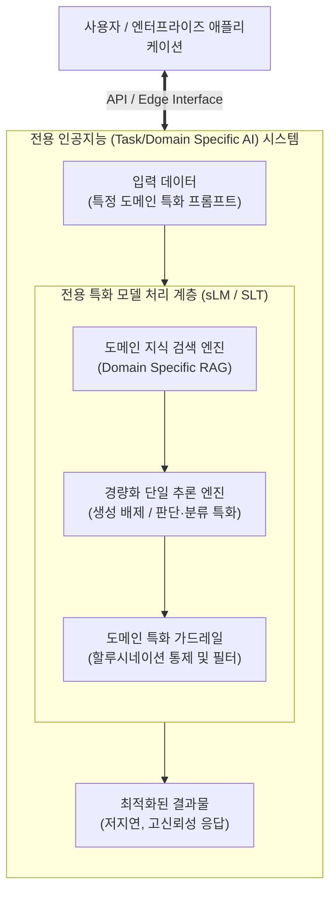

# 전용 인공지능 (Task/Domain-Specific AI)

---

## I. 저비용 고효율 도메인 최적화, 전용 인공지능의 개요

* **정의**: 방대한 범용 지식 처리 대신, 특정 산업 도메인이나 단일 태스크(분류, 판단, 코딩 등)에 특화되어 빠르고 정확한 결과를 도출하도록 최적화된 맞춤형 [[인공지능]] 시스템
* **등장배경**: 거대언어모델([[초거대 언어 모델|LLM]])의 높은 추론 비용 및 지연 시간(Latency) 문제, 환각(Hallucination) 현상 대두, 기업 보안을 위한 소버린 AI([[Sovereign AI (소버린 AI)|Sovereign AI]]) 요구 증대
* **특징**: 초저지연(초고속) 처리, 저비용 추론, 높은 도메인 전문성 및 정확도, 경량화(sLM) 기반 온프레미스 및 온디바이스(On-Device) 환경 구축 용이

---

## II. 전용 인공지능의 아키텍처 및 핵심 구성요소

### 가. 전용 인공지능의 아키텍처 및 동작 원리

* 특정 도메인 데이터로 미세조정([[Fine-Tuning]])된 소형 모델(sLM) 기반으로 아키텍처 구성
* 불필요한 텍스트 생성 연산을 배제하고, 특정 결괏값 도출 및 판단 영역에만 컴퓨팅 자원을 집중하여 응답 속도 극대화

### 나. 전용 인공지능의 핵심 기술 요소

| 분류 | 요소기술(키워드) | 세부 설명 |
| --- | --- | --- |
| **모델 최적화** | sLM (Small Language Model) | 불필요한 파라미터를 최소화하여 특정 태스크에 맞춘 경량화 모델 |
| **모델 최적화** | 양자화 (Quantization) | FP32 가중치를 INT8, FP4 등으로 변환하여 메모리 및 연산량 획기적 절감 |
| **학습 기술** | [[PEFT]] / [[LoRA(Low-rank adaptation)|LoRA]] | 사전 학습된 대형 모델의 가중치는 고정하고 핵심 파라미터만 미세조정 |
| **학습 기술** | DAPT (Domain-Adaptive PT) | 특정 산업군(의료, 금융, 법률)의 말뭉치를 활용한 도메인 적응 사전 학습 |
| **지식 증강** | 특화 RAG (검색 증강 생성) | 기업 내부 DB 및 전문 벡터 데이터베이스와 연동하여 최신 전문 지식 반영 |
| **아키텍처** | MoE ([[MOE(Mixture of Experts)|Mixture of Experts]]) | 여러 개의 전용 전문가 모델을 배치하고, 태스크 성격에 맞춰 라우팅 |
| **실행 환경** | [[온디바이스 AI]] (On-Device) | 클라우드 연결 없이 [[NPU]]가 탑재된 에지([[EDGE|Edge]]) 단에서 전용 AI 독립적 실행 |
| **태스크 엔진** | 판단 전용 엔진 (Task Engine) | 문장 생성을 배제하고 '분류, 판별, 코드 생성' 등 목적 함수에만 동작 |

---

## III. 전용 인공지능과 범용 인공지능 비교 및 향후 전망

### 가. 전용 인공지능(Specialized AI) vs 범용 인공지능(General AI) 비교

| 비교 항목 | 전용 인공지능 (Task/Domain-Specific AI) | [[범용 인공지능]] (General AI / Foundation Model) |
| --- | --- | --- |
| **주요 목적** | 특정 업무(코딩, 의료, 금융, 분류, 판단) 최적화 | 다목적 범용 태스크(대화, 창작, 요약, 번역 등) 수행 |
| **파라미터 규모** | 소규모 ~ 중규모 (수십억 ~ 백억 단위 파라미터) | 대규모 (수천억 ~ 조 단위 파라미터) |
| **비용 및 속도** | 추론 비용이 매우 저렴하며, 초저지연(초고속) 달성 | 막대한 컴퓨팅 자원 요구, 높은 토큰 비용 및 지연 발생 |
| **[[할루시네이션]]** | 특정 도메인 내로 답변을 제한하여 환각 리스크 최소화 | 광범위한 생성 과정에서 환각 발생 리스크 상대적 높음 |
| **보안 및 구축** | 온프레미스 및 기업 사내망 구축(소버린 AI) 유리 | 주로 클라우드 API 기반 의존 (민감 데이터 유출 우려) |
| **대표 서비스** | 판단 전용(Jev), 코딩 특화(Copilot), 법률/의료 특화 AI | ChatGPT(OpenAI), Gemini(Google), Claude(Anthropic) |

### 나. 전용 인공지능의 활용 동향 및 향후 전망

* **판단 전용 AI의 급부상**: 대화형 인터페이스를 과감히 버리고, 앱 간 라우팅 및 데이터 판단 연산에만 특화하여 비용 효율성을 극대화한 전용 AI 모델들의 기업 도입 가속화
* **[[에이전틱 AI]](Agentic AI)의 핵심 모듈로 진화**: 단일 거대 모델이 모든 것을 처리하는 방식에서 벗어나, 복잡한 워크플로우를 여러 개의 '전용 인공지능(전문가 에이전트)'들이 분업하고 상호 협력하는 멀티 에이전트 아키텍처로 발전 중

---

### 🔗 연관 토픽

- **소속 도메인**: [[00_인공지능_MOC|🤖 인공지능]]
- **세부 분류**: `2. 머신러닝 기초 & 핵심 알고리즘`
- **핵심 연관 토픽**:
  - [[에이전틱 AI|에이전틱 AI(Agentic AI)]]
  - [[초거대 언어 모델|초거대 언어 모델(Large Language Model)]]
  - [[인공지능]]
  - [[Fine-Tuning]]
  - [[PEFT|PEFT(Parameter-Efficient Fine-Tuning)]]
