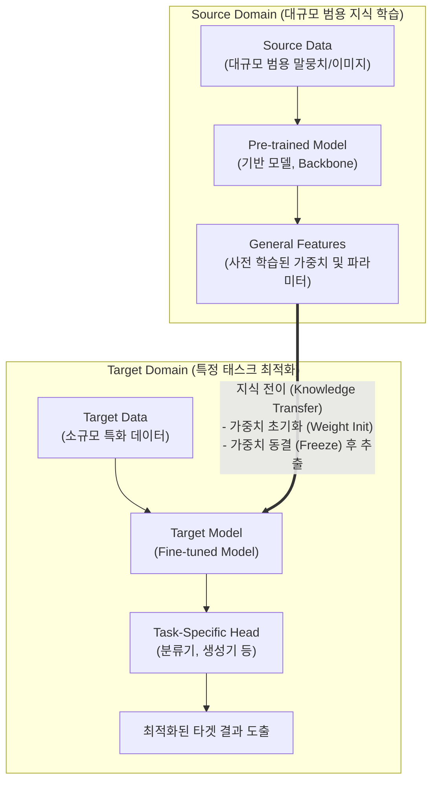

# 전이학습 (Transfer Learning)

---

## I. 소규모 데이터 한계 극복을 위한 지식 재활용, 전이학습의 개요

* **정의**: 소스 도메인(Source Domain)에서 대규모 데이터로 사전 학습(Pre-training)된 모델의 지식(가중치, 특징 등)을 타겟 도메인(Target Domain)의 새로운 문제 해결에 재사용하는 기계학습 기법
* **등장배경**: 타겟 태스크의 대규모 학습 데이터(Labeled Data) 부족 극복, 막대한 컴퓨팅 리소스 및 [[GPU]] 학습 시간 절감, [[파운데이션 모델]]([[초거대 언어 모델|LLM]])의 도메인 특화(Customization) 요구 증대
* **특징**: 초기 성능 향상(Higher Start), 모델 수렴 시간 단축(Faster Convergence), 최종 성능 한계치 개선(Higher Asymptote)

---

## II. 전이학습의 개념도 및 핵심 기술 요소

### 가. 전이학습의 아키텍처 및 동작 원리

* 소스 도메인에서 범용 특징(General Features)을 학습한 후, 타겟 도메인 모델에 지식을 전이(Transfer)하여 도메인 특화 계층(Task-Specific Head)을 결합 및 재학습하는 구조

### 나. 전이학습의 핵심 기술 및 구성 요소

| 구분 | 요소기술(키워드) | 세부 설명 |
| --- | --- | --- |
| **전이 방식** | 미세 조정 ([[Fine-Tuning]]) | 사전 학습 모델의 파라미터 전체 또는 일부를 타겟 데이터로 재학습하여 가중치 업데이트 |
| **전이 방식** | 특징 추출 (Feature Extraction) | 사전 학습 모델의 가중치를 고정(Freeze)하고, 추출된 특징 벡터를 새로운 분류기에 입력하여 학습 |
| **최신 기법** | [[PEFT]] (매개변수 효율적 미세조정) | 전체 가중치 대신 극히 일부의 파라미터만 학습하여 연산량 및 메모리 사용량 최소화 |
| **최신 기법** | LoRA ([[LoRA(Low-rank adaptation)|Low-Rank Adaptation]]) | 사전 학습 가중치는 고정하고, 랭크(Rank)를 낮춘 저차원 행렬만 추가 학습하는 대표적 PEFT 기법 |
| **적응 기술** | 도메인 적응 (Domain Adaptation) | 소스 도메인과 타겟 도메인 간의 데이터 분포 차이(Domain Shift)를 줄여 성능 하락 방지 |
| **학습 모델** | 파운데이션 모델 (Foundation Model) | 전이학습의 뼈대(Backbone)가 되는 대규모 모델 (예: [[BERT]], ResNet, GPT, Llama 등) |
| **학습 전략** | Zero-Shot / Few-Shot Learning | 전이학습의 확장 개념으로, 극소수 또는 데이터 없이 프롬프트만으로 사전 지식을 전이하여 추론 |
| **망각 통제** | EWC (Elastic Weight Consolidation) | 새로운 타겟 데이터 학습 시 기존에 학습된 중요 지식을 잊는 재앙적 망각(Catastrophic Forgetting) 방지 |

---

## III. 전통적 기계학습과 전이학습 비교 및 향후 전망

### 가. 전통적 기계학습(Traditional ML) vs 전이학습(Transfer Learning) 비교

| 비교 항목 | 전통적 기계학습 (Traditional ML) | 전이학습 (Transfer Learning) |
| --- | --- | --- |
| **학습 초기화** | 무작위 초기화 (Random Initialization) | 사전 학습된 가중치 활용 (Pre-trained Weights) |
| **데이터 요구량** | 타겟 도메인의 대규모 Labeled Data 필요 | 소규모 데이터(Few-Shot 가능)로도 높은 성능 발휘 |
| **학습 소요 시간** | 매우 김 (처음부터 특징을 모두 학습) | 짧음 (이미 학습된 특징을 활용하여 수렴이 빠름) |
| **도메인 의존성** | 단일 도메인/태스크에 독립적 ([[재사용]] 불가) | 도메인 간 지식 공유 및 확장 가능 |
| **비용 및 자원** | 모델 구축 시 막대한 컴퓨팅 리소스 반복 소요 | 재사용을 통한 GPU/[[NPU]] 컴퓨팅 리소스 획기적 절감 |

### 나. 전이학습의 최근 동향 및 향후 전망

* **sLM(소형 언어 모델) 최적화의 핵심 기술화**: 기업 데이터 유출을 방지하는 온프레미스(On-Premise) 환경 구축 시, 거대 모델(LLM)을 전이학습 기반의 경량화 미세조정(PEFT, QLoRA 등)을 거쳐 [[전용 인공지능]](sLM)으로 구축하는 트렌드 가속화
* **온디바이스(On-Device) AI로의 확장**: 모바일 기기 등 제한된 리소스 환경에서, 클라우드의 거대 모델 지식을 디바이스 내 경량 모델로 전이시키는 [[지식 증류]](Knowledge Distillation)와 결합된 전이학습 연구 활발

---

### 🔗 연관 토픽

- **소속 도메인**: [[00_인공지능_MOC|🤖 인공지능]]
- **세부 분류**: `4. 거대언어모델 (LLM) & 생성형 AI`
- **핵심 연관 토픽**:
  - [[BERT]]
  - [[Fine-Tuning]]
  - [[PEFT|PEFT(Parameter-Efficient Fine-Tuning)]]
  - [[파운데이션 모델|파운데이션 모델(Foundation Model)]]
  - [[메타학습]]
