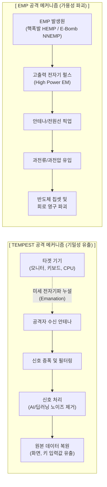

# 전자기파 이용 공격 (EMP & TEMPEST)

---

## I. 무선 주파수 대역의 치명적 위협, 전자기파 이용 공격의 개요

* **정의**: IT 기기에서 누설되는 미세 전자기파를 포착하여 데이터를 복원하는 도청 기법(TEMPEST)과 강력한 전자기 펄스를 방출하여 기기의 물리적 파괴를 유발하는 공격(EMP)의 총칭
* **배경 및 특징**:
* 논리적/물리적 망분리(Air-Gap) 보안 체계의 우회 한계성 극복을 위해 등장
* 국가 핵심 기반시설 및 클라우드 데이터센터에 대한 비대칭 물리적 타격 위협 증대
* **TEMPEST**: [[기밀성]] 위협(수동적/은밀함), **EMP**: [[HA(High Availability)|가용성]] 위협(능동적/파괴적)

---

## II. 전자기파 이용 공격의 아키텍처 및 핵심 구성요소

### 가. EMP 및 TEMPEST 공격의 개념도 및 동작 원리

* **EMP 공격**: 고출력 펄스가 안테나나 케이블을 통해 유입되어 내부 회로를 직접 타격 및 소손
* **TEMPEST 공격**: 기기 구동 중 발생하는 의도치 않은 누설 전자기파를 원격에서 수집하여 원본 정보 복원

### 나. 전자기파 공격 및 방어의 핵심 기술 요소

| 분류 | 요소기술(키워드) | 세부 설명 |
| --- | --- | --- |
| **EMP 공격** | HEMP (고고도 EMP) | 고도 30km 이상에서 핵폭발 시 발생하는 광범위한 고출력 전자기 펄스 |
| **EMP 공격** | NNEMP / IEMI | 핵을 사용하지 않고 폭약이나 마이크로파(HPM) 발생기를 이용한 국지적 전자기 공격 |
| **TEMPEST 공격** | 밴 에크 프리킹 ([[VAN|Van]] Eck) | CRT/LCD 모니터 등에서 발생하는 전자기파를 수신하여 화면을 그대로 복원하는 기법 |
| **TEMPEST 공격** | 부채널 분석 (Side-Channel) | 전력 소비량, 전자파 방출량 등을 분석하여 [[암호화]] 모듈의 비밀키를 탈취하는 기법 |
| **EMP 방어** | 차폐 룸 (Faraday Cage) | 전도성 금속으로 건물 전체를 둘러싸 전자기파 유입을 원천 차단 (MIL-STD-188-125) |
| **EMP 방어** | EMP 필터 / 서지 보호기 | 전원선 및 통신선으로 유입되는 과전압/과전류를 수 나노초 내에 접지로 바이패스 |
| **TEMPEST 방어** | 적색/흑색 구역 분리 | 평문(Red) 처리 구역과 암호화(Black) 처리 구역 간의 물리적 거리 확보 및 분리 설계 |
| **TEMPEST 방어** | 저방사 기기 및 차폐선 | 전자기파 누설을 최소화하도록 설계된 템페스트 인증 기기 및 쉴드 케이블 사용 |

---

## III. EMP와 TEMPEST 비교 및 향후 대응 전망

### 가. EMP vs TEMPEST 공격 특성 비교

| 비교 항목 | EMP (Electromagnetic Pulse) | TEMPEST (Telecommunications Electronics Material Protected...) |
| --- | --- | --- |
| **주요 공격 목적** | 정보 시스템 **가용성 파괴** 및 무력화 | 정보 시스템 **기밀성 유출** 및 도청 |
| **공격 특성** | **능동적 공격** (고출력 에너지 방출) | **수동적 공격** (방출되는 미세 에너지 수집) |
| **피해 인지 여부** | **즉각 인지 가능** (기기 오작동 및 전소) | **인지 불가** (흔적이 남지 않는 은밀한 공격) |
| **주요 공격 대상** | 전력망, 통신망, 데이터센터 인프라 전체 | 모니터, 키보드, 케이블, 암호화 칩셋 |
| **핵심 대응 방안** | 금속 차폐(Shielding), EMP 필터링, 접지 | Red/Black 분리, 신호 마스킹(Jamming), 차폐선 |

### 나. 전자기파 이용 공격의 최근 동향 및 향후 대응 방향

* **AI 기반 TEMPEST 고도화**: 최근 딥러닝과 [[SDR (Software Defined Radio)|SDR]](소프트웨어 정의 라디오) 기술이 결합되면서, 수십 미터 밖에서도 HDMI 케이블이나 [[CPU]]의 미세 전자기파를 분석해 원본 텍스트와 화면을 선명하게 복원할 수 있어 에어갭(Air-Gap) 보안망의 한계 노출
* **국가 주요 시설의 EMP 방호 의무화**: 금융권 데이터센터 및 클라우드 서비스 제공자([[CSP]])를 대상으로 물리적 테러(IEMI)에 대비한 EMP 방호(차폐 효율 80dB 이상) 설비 구축 및 모의훈련이 핵심 보안 컴플라이언스로 강화되는 추세

---

### 🔗 연관 토픽

- **소속 도메인**: [[00_보안_MOC|🛡️ 보안]]
- **세부 분류**: `5. 사이버 공격 기법 & 침해사고 대응`
- **핵심 연관 토픽**:
  - [[기밀성]]
  - [[암호화|암호화 (Encryption)]]
  - [[CSP|CSP (Cloud Service Provider)]]
  - [[VAN]]
  - [[SDR (Software Defined Radio)]]
