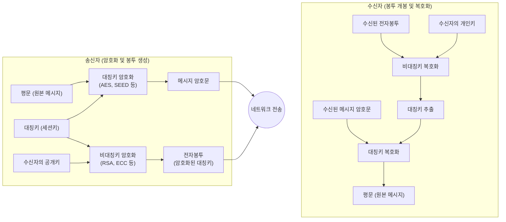

# 전자봉투 (Digital Envelope)

---

## I. 안전한 세션키 교환을 위한 하이브리드 암호화, 전자봉투의 개요

* **정의**: 대용량 데이터 암호화에 사용된 '대칭키(세션키)'를 '수신자의 공개키'로 암호화하여, 원본 암호문과 함께 전송하는 [[기밀성]] 보장 [[암호화]] 기법
* **등장배경**: 대칭키 암호방식의 **키 분배(Key Distribution) 문제** 해결, 비대칭키 암호방식의 **느린 암호화 연산 속도** 극복 필요성 대두
* **특징**: 기밀성 보장, 하이브리드 암호 체계(대칭키의 속도 + 비대칭키의 안전성 결합), 인가된 수신자(개인키 소유자)만 복호화 가능

---

## II. 전자봉투의 개념도 및 핵심 구성요소

### 가. 전자봉투의 아키텍처 및 동작 원리

* 송신자는 일회성 세션키로 데이터를 고속 암호화하고, 해당 세션키를 수신자의 공개키로 암호화(봉투 생성)하여 전송함
* 수신자는 오직 자신만이 소유한 개인키로 전자봉투를 개봉(복호화)하여 세션키를 획득하고 데이터를 복호화함

### 나. 전자봉투의 핵심 기술 요소

| 분류 | 요소기술(키워드) | 세부 설명 |
| --- | --- | --- |
| **암호화 키** | 대칭키 ([[Session Layer|Session]] Key) | 난수 발생기를 통해 생성되는 일회성 키로 원본 메시지를 고속으로 암호화 |
| **암호화 키** | 수신자의 공개키 (Public Key) | 대칭키(세션키)를 암호화하여 전자봉투를 생성하는 데 사용되는 키 |
| **복호화 키** | 수신자의 개인키 (Private Key) | 수신자가 전자봉투를 복호화하여 내부의 대칭키를 안전하게 추출하는 유일한 키 |
| **[[알고리즘]]** | 대칭키 [[암호 알고리즘]] | 데이터 기밀성 보장을 위해 [[AES]], ARIA, SEED 등 [[블록 암호화]] 기법 적용 |
| **알고리즘** | 비대칭키 암호 알고리즘 | 키 분배 안전성 보장을 위해 [[RSA (Rivest Shamir Adleman)|RSA]], [[ECC]] 등 공개키 기반 암호화 기법 적용 |
| **보안 메커니즘** | 난수 생성기 (RNG/TRNG) | 예측 불가능한 세션키를 생성하여 재생 공격(Replay Attack) 방지 및 엔트로피 확보 |
| **차세대 기술** | KEM (Key Encapsulation) | [[양자내성암호]](PQC) 체계에서 전자봉투와 동일한 역할을 수행하는 안전한 키 [[캡슐화]] 기법 |
| **적용 [[프로토콜]]** | S/MIME, PGP, TLS | 이메일 보안, 웹 통신 등 하이브리드 암호화가 필요한 다양한 애플리케이션 계층 적용 |

---

## III. 전자봉투 vs 전자서명 비교 및 활용 전망

### 가. 전자봉투(Digital Envelope)와 전자서명(Digital Signature) 비교

| 비교 항목 | 전자봉투 (Digital Envelope) | 전자서명 (Digital Signature) |
| --- | --- | --- |
| **주요 목적** | **기밀성 (Confidentiality)** 및 안전한 키 분배 | **[[무결성]], 인증, 부인방지 (Non-repudiation)** |
| **암호화에 사용되는 키** | **수신자의 공개키** (수신자만 열 수 있도록) | **송신자의 개인키** (송신자가 작성했음을 증명) |
| **복호화(검증)에 사용되는 키** | **수신자의 개인키** (봉투 개봉) | **송신자의 공개키** (누구나 검증 가능) |
| **암호화 대상** | 일회성 **대칭키 (세션키)** | 메시지의 **해시값 (Message Digest)** |
| **보안 특성** | 인가된 1인(수신자)만 내용 확인 가능 | 누구나 검증할 수 있으나 위조 불가능 |

### 나. 전자봉투 기술의 동향 및 산업 적용 전망

* **PQC 기반 KEM(Key Encapsulation Mechanism)으로의 진화**: 양자 컴퓨터의 쇼어(Shor) 알고리즘에 의해 기존 RSA/ECC 기반 전자봉투가 무력화될 위험에 대비, NIST 주도로 ML-KEM(Kyber) 등 격자 기반 양자내성 키 캡슐화 기술로의 마이그레이션이 보안 산업의 핵심 과제로 대두됨
* **완전한 보안 프로토콜을 위한 결합**: 현대 정보 보안에서는 기밀성만 제공하는 전자봉투를 단독으로 쓰기보다는, 전자서명과 해시 함수를 결합하여 **기밀성, 무결성, 인증, 부인방지**를 모두 충족하는 통합 보안 [[프레임워크]](예: PGP, S/MIME) 형태로 지속 활용 중임

---

### 🔗 연관 토픽

- **소속 도메인**: [[00_보안_MOC|🛡️ 보안]]
- **세부 분류**: `1. 정보보안 원칙 & 거버넌스 · 인증`
- **핵심 연관 토픽**:
  - [[암호화|암호화 (Encryption)]]
  - [[기밀성]]
  - [[암호 알고리즘]]
  - [[블록 암호화|블록 암호화 (Block Cipher)]]
  - [[RSA (Rivest Shamir Adleman)]]
