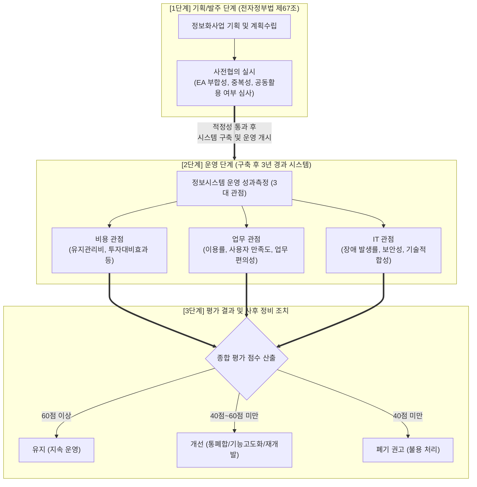

# 전자정부 성과관리 지침

---

## I. 공공 IT 투자 효율성 확보, 전자정부 성과관리 지침의 개요

* **정의**: 공공 정보화사업의 중복 투자 방지 및 정보시스템의 지속 운영 여부(라이프사이클)를 판단하기 위해 사전협의 및 운영 성과측정 기준과 절차를 규정한 행정안전부 고시
* **등장배경**: 부처별 무분별한 사일로(Silo)형 정보시스템 구축으로 인한 예산 낭비 심화, 노후화된 레거시 시스템의 [[유지보수]] 비용 급증 및 방치 문제 해결
* **특징**: EA(범정부 정보기술아키텍처) 기반 중복성 검증, 발주 전(사전협의)-운영 중(성과측정) 전주기 관리, 3대 관점(비용/업무/IT) 기반의 정량적 라이프사이클(폐기/통폐합) 통제

---

## II. 전자정부 성과관리 지침의 개념도 및 핵심 구성요소

### 가. 전자정부 성과관리 지침의 체계도 및 프로세스

* 발주 전 '사전협의'를 통해 중복 구축을 원천 차단하고, 운영 3년 차 이상 시스템은 '성과측정'을 거쳐 기준 미달 시 강제적인 정비(폐기 및 통폐합) 절차를 수행함

### 나. 전자정부 성과관리 지침의 핵심 구성요소

| 구분 | 요소기술(키워드) | 세부 설명 |
| --- | --- | --- |
| **발주 통제** | 사전협의 제도 | 사업 발주 전 타 기관 시스템과의 중복성, 연계성, 정보 공동활용 가능성을 심사 |
| **운영 평가** | 운영 성과측정 | 가동 3년이 경과한 시스템을 대상으로 매년 지속 운영 가치를 객관적으로 평가 |
| **평가 관점** | 비용 관점 (Cost) | 시스템 운영 유지비용의 적정성 및 예산 투입 대비 산출 효과 측정 |
| **평가 관점** | 업무 관점 (Biz) | 대국민 서비스 이용률, 처리 시간 단축, 사용자 업무 만족도 등 편익 진단 |
| **평가 관점** | IT 관점 (Tech) | 시스템 가동률, 장애 발생 빈도, 보안 취약점 점검 및 최신 기술 부합성 진단 |
| **통제 기구** | 성과관리심의위원회 | 행정안전부 산하 기구로 특별점검 대상 지정 및 부처 간 이해관계 심의·조정 |
| **기준 지표** | EA (엔터프라이즈 아키텍처) | 범정부 EA 포털(GEAP)의 현황 데이터를 기반으로 참조모형 기반 중복성 검증 |
| **예외 조항** | 폐기 권고 면제 | 생명/안보 관련 시스템, 타 법령 근거 시스템은 40점 미만이라도 폐기 유예 가능 |

---

## III. 성과평가 기반 시스템 정비 기준 및 향후 발전 방향

### 가. 운영 성과평가 결과에 따른 시스템 정비(조치) 기준

| 평가 구간 (총점 100점) | 유지관리 유형 결정 | 세부 조치 및 정비 방안 |
| --- | --- | --- |
| **60점 이상** | **유지** | 현행 시스템 아키텍처 및 서비스 수준을 그대로 유지하며 지속 운영 |
| **40점 이상 ~ 60점 미만** | **개선 (정비)** | 업무 효율성 제고를 위해 **통폐합, 기능 고도화, 전면 재개발** 계획 수립 |
| **40점 미만** | **폐기** | 효용성이 다한 것으로 판단하여 서비스 종료 및 **물품관리법에 따른 폐기** |

### 나. 공공 IT 환경 변화에 따른 전자정부 성과관리 발전 방향

* **디지털플랫폼정부(DPG) 실현과 연계**: 단순 시스템 폐기를 넘어, 부처 간 칸막이를 허물기 위해 레거시 시스템을 통폐합하고 하나의 클라우드(공공 SaaS 기반)로 통합하는 잣대로 성과측정 결과 적극 활용
* **평가 지표의 최신 기술(AI/Cloud) 반영**: 최신 개정 및 정책 방향에 따라, 시스템 고도화 및 재개발 심사 시 '[[클라우드 네이티브]](Cloud-Native) 전환율' 및 '초거대 AI 융합 가능성'을 성과관리 핵심 가점 지표로 도입하는 추세

---

### 🔗 연관 토픽

- **소속 도메인**: [[00_경영전략_MOC|📈 경영전략]]
- **세부 분류**: `2. IT 거버넌스 & 엔터프라이즈 아키텍처 (EA/ISP)`
- **핵심 연관 토픽**:
  - [[유지보수]]
  - [[클라우드 네이티브]]
  - [[ISMP|ISMP (Information System Master Plan)]]
  - [[EAI]]
  - [[MES|MES (Manufacturing Execution System)]]
