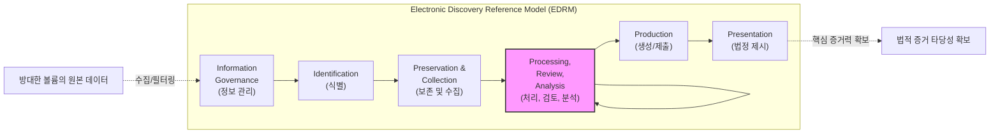

# 전자증거개시제도 (e-Discovery)

---

## I. 법적 분쟁 대응을 위한 전자 증거 확보 체계, e-Discovery의 개요

* **정의**: 민사 및 형사 소송 과정에서 법적 증거로 활용하기 위해, 전자적으로 저장된 정보(ESI)를 식별, 보존, 수집, 분석 및 제출하는 IT 기반의 법적 절차 체계
* **등장배경**: 기업 업무 환경의 디지털화에 따른 폭발적인 ESI(이메일, 문서, 메신저 등) 증가, 막대한 수작업 문서 검토 비용 절감, 국제 소송(특히 영미권) 시 법적 의무 준수 필요성 대두
* **특징**: EDRM(표준 참조 모델) 기반의 절차적 정당성 확보, 증거 보관 사슬(Chain of Custody)을 통한 [[무결성]] 유지, AI 기반 TAR(기술지원검토) 활용을 통한 검토 효율화

---

## II. e-Discovery의 절차 모델(EDRM) 및 핵심 기술 요소

### 가. e-Discovery의 아키텍처 및 동작 원리 (EDRM 프레임워크)

* 초기 데이터 볼륨(Volume)은 방대하나, 처리(Processing)와 검토(Review) 단계를 거치며 데이터 양은 감소하고 증거의 연관성(Relevance)은 극대화되는 깔때기(Funnel) 구조
* 무결성 보장을 위해 각 단계 전환 시 해시(Hash) 기반 원본 대조 및 보관 사슬(Chain of Custody) 유지 필수

### 나. e-Discovery의 핵심 기술 및 구성 요소

| 구분 | 요소기술(키워드) | 세부 설명 |
| --- | --- | --- |
| **관리 대상** | ESI (Electronically Stored Information) | 이메일, 오피스 문서, 메신저 로그, 클라우드 데이터 등 모든 전자적 정보 |
| **무결성 보장** | Chain of Custody (보관 사슬) | 증거의 수집부터 제출까지 생성, 변경, 폐기 등의 이력을 끊김없이 기록·관리 |
| **무결성 보장** | 해시 [[알고리즘]] (SHA-256 등) | 원본 데이터와 복제본 간의 해시값을 비교하여 위변조가 없음을 법적으로 입증 |
| **검토 자동화** | TAR (Technology-Assisted Review) | 기계학습을 활용하여 인간의 문서 검토 결과를 학습하고, 나머지 방대한 문서를 자동 분류 |
| **검토 자동화** | Predictive Coding (예측 코딩) | 통계적 알고리즘([[서포트 벡터 머신|SVM]] 등) 및 자연어처리를 통해 소송과 연관성이 높은 문서를 예측 산출 |
| **데이터 처리** | OCR 및 NLP | 스캔된 이미지의 텍스트 추출(OCR) 및 형태소 분석 기반의 키워드 추출(NLP) |
| **데이터 처리** | 디-듀플리케이션 (De-duplication) | 방대한 수집 데이터 중 내용이 완벽히 동일한 중복 문서를 식별하여 검토 대상에서 제외 |
| **규제 준수** | Legal Hold (소송 보존 방침) | 소송 예견 시, 관련된 모든 ESI의 자동 삭제나 변경을 즉시 중단시키는 법적/시스템적 조치 |

---

## III. e-Discovery와 디지털 포렌식 비교 및 향후 전망

### 가. e-Discovery vs 디지털 포렌식(Digital Forensics) 비교

| 비교 항목 | e-Discovery (전자증거개시) | [[디지털 포렌식]] (Digital Forensics) |
| --- | --- | --- |
| **주요 목적** | 민사 소송에서의 관련 **증거(문서) 식별 및 제출** | 침해사고, 형사 사건의 **원인 규명 및 행위 입증** |
| **분석 대상** | ESI (이메일, 기안문, 메신저, 계약서 등 콘텐츠) | 시스템 아티팩트 (메모리, 로그, 레지스트리, 삭제 데이터) |
| **요구 역량** | 방대한 문서의 빠른 분류, 법률적 연관성 검토 (법무 주도) | 안티포렌식 우회, 비할당 영역 복구 등 심층 기술 (엔지니어 주도) |
| **관련 [[프레임워크]]** | **EDRM** (Electronic Discovery Reference Model) | **디지털 수사 표준 절차** (수집-조사-분석-보고) |
| **발전 방향** | AI/[[초거대 언어 모델|LLM]] 기반 시맨틱 리뷰, 클라우드 데이터 포괄 수집 | IoT 포렌식, 클라우드/안티포렌식 무력화 기술 |

### 나. e-Discovery 기술 동향 및 산업 적용 전망

* **생성형 AI(LLM) 기반의 차세대 TAR 도입**: 기존 키워드 기반 검색 및 통계 기반 예측 코딩을 넘어, LLM을 활용해 문서의 문맥과 숨겨진 의도(Semantic)까지 파악하는 지능형 리뷰 시스템으로 진화 중
* **멀티 클라우드 및 협업 툴 대응 한계 극복**: 슬랙(Slack), 팀즈(Teams) 등 실시간 협업 도구와 SaaS 환경 내 파편화된 ESI를 식별하고 수집하기 위한 [[클라우드 네이티브]](Cloud-Native) e-Discovery 솔루션 구축이 기업 컴플라이언스의 핵심으로 대두

---

### 🔗 연관 토픽

- **소속 도메인**: [[00_보안_MOC|🛡️ 보안]]
- **세부 분류**: `6. 개인정보보호 & 프라이버시 강화 기술`
- **핵심 연관 토픽**:
  - [[디지털 포렌식|디지털 포렌식(Digital Forensic)]]
  - [[디지털 면역 시스템|디지털 면역 시스템(DIS, Digital Immune System)]]
  - [[프레임워크]]
  - [[클라우드 네이티브]]
  - [[DevSecOps]]
