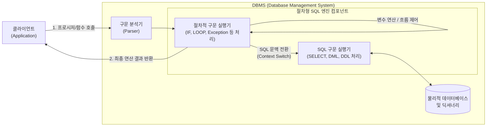

# 절차형 SQL (Procedural SQL)

---

## I. 복잡한 비즈니스 로직의 DB 내부 처리, 절차형 SQL의 개요

* **정의**: 관계형 데이터베이스에서 표준 [[SQL(Structured Query Language)|SQL]]의 비절차적 한계를 극복하기 위해 변수, 제어문(조건/반복), 커서, 예외처리 등의 프로그래밍 기능을 추가한 SQL 확장 언어
* **등장배경**: 집합 연산 위주의 표준 SQL로 구현하기 어려운 복잡한 조건 분기 및 로직 처리 필요, 클라이언트와 DB 서버 간 네트워크 트래픽 감소 요구
* **특징**: [[DBMS]] 벤더별 특화(PL/SQL, T-SQL 등), [[캡슐화]] 및 모듈화를 통한 코드 [[재사용]], 보안 강화(테이블 직접 접근 차단), 네트워크 부하 경감

---

## II. 절차형 SQL의 개념도 및 핵심 기술 요소

### 가. 절차형 SQL의 개념도 및 동작 원리

* 클라이언트가 프로시저를 단일 호출하면, DBMS 내부의 엔진이 절차적 구문과 SQL 구문을 분리하여 자체 처리함으로써 네트워크 라운드트립(Round-trip)을 최소화함

### 나. 절차형 SQL의 핵심 기술 및 구성 요소

| 분류 | 요소기술(키워드) | 세부 설명 |
| --- | --- | --- |
| **핵심 객체** | 저장 [[프로시저]] (Stored Procedure) | 일련의 쿼리 및 제어문을 마치 하나의 메서드처럼 캡슐화하여 DB에 저장 및 실행 |
| **핵심 객체** | 사용자 정의 함수 (UDF) | 프로시저와 유사하나, 반드시 단일 값(또는 테이블)을 반환하며 SELECT 절 등에서 사용 가능 |
| **핵심 객체** | 트리거 (Trigger) | INSERT, UPDATE, DELETE 등 특정 [[DML]] 이벤트 발생 시 자동으로 실행되는 특수 프로시저 |
| **제어 기술** | 제어문 (Control Structure) | 조건식(IF~THEN~ELSE, CASE), 반복문(LOOP, WHILE, FOR)을 통한 프로그램 흐름 제어 |
| **데이터 제어** | 커서 (Cursor) | 다중 행 쿼리 결과를 메모리에 적재하고, 한 행(Row)씩 순차적으로 접근하여 처리하는 포인터 |
| **안정성 확보** | 예외 처리 (Exception Handling) | 실행 중 발생하는 런타임 에러(Data Not Found 등)를 감지하고 트랜잭션을 롤백 또는 우회 처리 |
| **[[트랜잭션]]** | [[무결성]] 제어 (TCL) | BEGIN, COMMIT, ROLLBACK을 통해 절차 내 여러 DML 작업의 원자성(Atomicity) 보장 |
| **벤더 종속성** | PL/SQL, T-SQL, PL/pgSQL | Oracle, SQL Server, PostgreSQL 등 각 RDBMS 벤더가 독자적으로 확장한 문법과 아키텍처 |

---

## III. 절차형 SQL과 비절차형 SQL(표준 SQL) 비교 및 향후 전망

### 가. 절차형 SQL vs 비절차형 SQL(표준 SQL) 비교

| 비교 항목 | 절차형 SQL (Procedural SQL) | 표준 SQL (Non-Procedural SQL) |
| --- | --- | --- |
| **데이터 처리 방식** | **레코드(행) 단위 처리** (커서 활용 등) | **집합(Set) 단위 처리** (테이블 단위 연산) |
| **지향점** | **How** (어떻게 처리할 것인가, 제어 흐름) | **What** (무엇을 조회/변경할 것인가, 결과) |
| **제어/변수 문법** | 지원함 (IF, WHILE, 변수 선언 등) | 미지원 (단순 조건 [[연산자]] 및 내장 함수 제공) |
| **실행 위치** | 주로 DBMS 서버 내부 (Stored/Compiled) | 클라이언트에서 전송되어 DBMS에서 파싱/실행 |
| **트래픽 및 성능** | 네트워크 부하 **감소** (1회 호출로 일괄 처리) | 다중 쿼리 시 네트워크 부하 **증가** 가능성 |
| **대표적인 종류** | PL/SQL(Oracle), T-SQL(MSSQL) | ANSI SQL (SELECT, INSERT, UPDATE 등) |

### 나. 절차형 SQL의 활용 동향 및 향후 전망

* **[[MSA (Micro Service Architecture)|MSA]] 환경에서의 역할 변화 방안**: [[클라우드 네이티브]] 및 MSA 아키텍처에서는 DB 스케일아웃의 어려움으로 인해 비즈니스 로직을 API 서버(애플리케이션 계층)로 분리하고, 절차형 SQL은 순수 데이터 정합성 유지 목적으로 최소화하는 추세임
* **클라우드 DW 및 데이터 엔지니어링 활용 확대**: Snowflake Scripting, BigQuery Procedural Language 등 클라우드 분석 환경에서는 대용량 데이터의 [[스케줄링]], ETL 파이프라인 오케스트레이션 및 데이터 변환 작업(ELT)을 위해 절차형 SQL이 핵심 언어로 적극 진화 중임

---

### 🔗 연관 토픽

- **소속 도메인**: [[00_데이터베이스_MOC|🗄️ 데이터베이스]]
- **세부 분류**: `3. 장애 회복 기법 & 데이터 무결성`
- **핵심 연관 토픽**:
  - [[무결성]]
  - [[트랜잭션]]
  - [[DBMS]]
  - [[DML]]
  - [[SQL(Structured Query Language)]]
