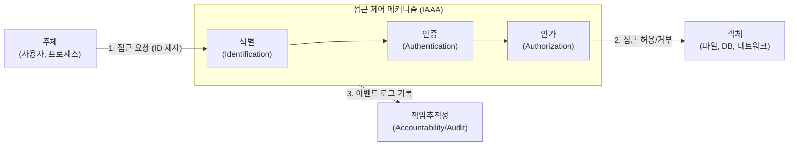

# 접근 제어 (Access Control)

---

## I. 정보 보안의 핵심 방어 기제, 접근 제어의 개요

* **정의**: 비인가된 사용자의 침입을 막고, 인가된 주체(Subject)에게만 객체(Object)에 대한 접근 권한을 부여하여 시스템의 보안성을 보장하는 보안 통제 메커니즘
* **등장배경**: 내부자 위협 증가 및 권한 남용 방지, 정보 자산의 [[기밀성]](C)/[[무결성]](I)/[[HA(High Availability)|가용성]](A) 보장, 제로 트러스트([[제로 트러스트 보안모델|Zero Trust]]) 및 클라우드 환경 확산에 따른 동적 권한 통제 필요성 증대
* **특징**: IAAA(식별/인증/인가/감사) 절차 준수, 최소 권한의 원칙(Least Privilege) 및 직무 분리의 원칙(SoD) 적용

---

## II. 접근 제어의 메커니즘 및 핵심 구성요소

### 가. 접근 제어의 절차 모델 및 동작 원리

* 사용자(주체)가 객체에 접근 시 식별(ID 확인), 인증(패스워드 등 검증), 인가(권한 확인) 절차를 거치며, 사후 감사를 위해 모든 행위를 로그로 기록(책임추적성)함

### 나. 접근 제어의 핵심 기술 및 구성 요소

| 구분 | 요소기술(키워드) | 세부 설명 |
| --- | --- | --- |
| **통제 모델** | [[DAC]] (임의적 접근 통제) | 데이터 **소유자(Owner)**가 사용자의 신분(Identity)을 기준으로 접근 권한을 임의로 부여 |
| **통제 모델** | [[MAC]] (강제적 접근 통제) | **시스템(관리자)**이 주체의 비밀 취급 인가와 객체의 보안 등급(Label)을 비교하여 접근 통제 |
| **통제 모델** | [[RBAC]] (역할 기반 접근 통제) | 사용자가 소속된 **직무/역할(Role)**을 기반으로 권한을 할당하여 중앙 집중적 권한 관리 용이 |
| **통제 모델** | ABAC (속성 기반 접근 통제) | 주체, 객체, 환경(위치, 시간, 디바이스 상태 등)의 **속성(Attribute)**을 조합하여 동적 권한 제어 |
| **통제 절차** | 식별 (Identification) | 주체가 시스템에 본인임을 주장하는 과정 (예: ID, 사번) |
| **통제 절차** | 인증 (Authentication) | 주체가 주장하는 신원의 진위 여부를 확인하는 과정 (예: 패스워드, 생체 인식, MFA) |
| **통제 절차** | 인가 (Authorization) | 인증된 주체에게 허용된 작업(Read, Write, Execute) 범위를 결정하고 부여하는 과정 |
| **구현 기법** | ACL / Capability Ticket | 객체 관점에서 접근 허용 주체를 명시(ACL), 주체 관점에서 접근 가능 객체를 명시(Capability) |

---

## III. 주요 접근 제어 모델 비교 및 향후 발전 동향

### 가. 3대 주요 접근 제어 모델 비교 (DAC vs MAC vs RBAC)

| 비교 항목 | DAC (Discretionary) | MAC (Mandatory) | RBAC (Role-Based) |
| --- | --- | --- | --- |
| **통제 주체** | **객체 소유자** (Data Owner) | **시스템 관리자** (Admin) | **시스템 관리자** (보안 관리자) |
| **권한 할당 기준** | 사용자의 **신분 (Identity)** | 주체/객체의 **보안 등급 (Label)** | 사용자의 **직무/역할 (Role)** |
| **접근 결정 권한** | 소유자가 임의로 부여/회수 | 시스템의 엄격한 보안 정책 | 역할에 정의된 권한 매핑 |
| **장점** | 유연성 높음, 구현 용이 | 보안성 가장 높음 (군사/공공) | 권한 관리의 편의성 (인사이동 시) |
| **단점** | 트로이 목마 공격 등에 취약 | 관리 오버헤드 큼, 유연성 부족 | 역할 설계 및 초기 구축의 어려움 |

### 나. 접근 제어의 최신 트렌드 및 향후 전망

* **제로 트러스트 기반의 지속적 접근 평가(CAE)**: 최초 1회 인증에 의존하지 않고, [[세션]] 유지 중에도 주체의 상태 변경(위치 이동, 기기 감염 등)을 실시간 모니터링하여 동적으로 권한을 박탈하는 지속 검증 체계 도입 가속화
* **클라우드 인프라 권한 관리(CIEM) 부상**: 멀티 클라우드 환경에서 무분별하게 과다 할당된 권한(Entitlement)을 가시화하고, 머신러닝을 활용해 최소 권한의 원칙에 맞게 권한을 자동 축소 및 회수하는 CIEM 솔루션이 접근 제어의 핵심으로 대두됨

---

### 🔗 연관 토픽

- **소속 도메인**: [[00_보안_MOC|🛡️ 보안]]
- **세부 분류**: `1. 정보보안 원칙 & 거버넌스 · 인증`
- **핵심 연관 토픽**:
  - [[기밀성]]
  - [[RBAC]]
  - [[DAC]]
  - [[제로 트러스트 보안모델|제로 트러스트 (Zero Trust) 보안모델]]
  - [[MAC]]
