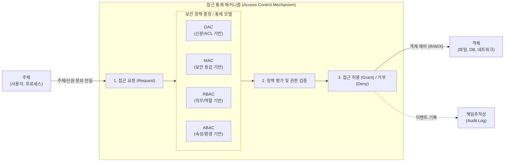

# 접근 통제 모델 (Access Control Models)

---

## I. 정보 자산 보호의 핵심, 접근 통제 모델의 개요

* **정의**: 비인가자의 침입을 차단하고, 인가된 주체(Subject)만이 객체(Object)에 접근할 수 있도록 특정 보안 정책에 기반하여 권한을 부여하고 통제하는 보안 아키텍처 모델
* **등장배경**: 내부자 위협 증가, 트로이 목마 등 악성코드를 통한 우회 공격 방어, 클라우드 및 제로 트러스트([[제로 트러스트 보안모델|Zero Trust]]) 환경에서의 세밀하고 동적인 권한 제어 요구 증대
* **특징**: [[기밀성]]/[[무결성]]/[[HA(High Availability)|가용성]](CIA) 보장, 최소 권한의 원칙(Least Privilege) 적용, 직무 분리(SoD) 구현을 통한 내부 통제 강화

---

## II. 접근 통제 모델의 개념도 및 핵심 기술 요소

### 가. 접근 통제 모델의 아키텍처 및 동작 프로세스

* 사용자(주체)의 접근 요청은 선택된 접근 통제 모델([[DAC]], [[MAC]], [[RBAC]], ABAC)의 보안 정책 엔진을 거쳐 평가되며, 최소 권한 원칙에 따라 동적으로 허용 및 거부가 결정됨

### 나. 접근 통제 모델의 핵심 구성요소 및 기술

| 구분 | 요소기술(키워드) | 세부 설명 |
| --- | --- | --- |
| **기본 모델** | DAC (임의적 접근 통제) | 데이터 **소유자(Owner)**가 사용자의 신분(Identity)을 기준으로 임의로 접근 권한 부여 |
| **기본 모델** | MAC (강제적 접근 통제) | **시스템(관리자)**이 주체의 인가 등급과 객체의 보안 등급(Label)을 비교하여 접근 통제 |
| **확장 모델** | RBAC (역할 기반 접근 통제) | 사용자가 아닌 **직무/역할(Role)**에 권한을 할당하여 잦은 인사이동 시 중앙 집중적 관리 용이 |
| **최신 모델** | ABAC (속성 기반 접근 통제) | 주체, 객체, 환경(위치, 시간, 디바이스)의 **속성(Attribute)**을 결합하여 동적 권한 제어 |
| **핵심 원칙** | 최소 권한의 원칙 | 업무 수행에 필요한 최소한의 권한만 부여하여 권한 탈취 시 피해 범위 최소화 |
| **핵심 원칙** | 직무 분리의 원칙 (SoD) | 단일 주체가 권한을 독점하여 부정행위를 하지 못하도록 승인/실행 [[프로세스]] 분리 통제 |
| **참조 모델** | Bell-LaPadula (BLP) | MAC 기반 모델로 **기밀성** 강조 (No Read Up, No Write Down) |
| **참조 모델** | Biba 모델 | MAC 기반 모델로 **무결성** 강조 (No Read Down, No Write Up) |

---

## III. 주요 접근 통제 모델 비교 및 향후 전망

### 가. 4대 주요 접근 통제 모델 (DAC, MAC, RBAC, ABAC) 비교

| 비교 항목 | DAC (Discretionary) | MAC (Mandatory) | RBAC (Role-Based) | ABAC (Attribute-Based) |
| --- | --- | --- | --- | --- |
| **통제 주체** | **객체 소유자** | **시스템 (보안관리자)** | **시스템 (보안관리자)** | **정책 엔진 (Policy Engine)** |
| **접근 결정 기준** | 사용자의 **신분 (ID)** | 주체/객체의 **보안 등급** | 주체에 할당된 **역할(Role)** | 주/객체 및 환경의 **속성 조합** |
| **장점** | 유연한 권한 관리 | 최고 수준의 기밀성 보장 | 권한 관리 용이, SoD 구현 | 세밀하고 동적인 컨텍스트 제어 |
| **단점** | 트로이 목마 등 보안 취약 | 구현 복잡, 유연성 부족 | 역할(Role) 설계의 어려움 | 복잡한 속성/정책 룰 설계 필요 |
| **활용 환경** | 일반 OS, 상용 [[DBMS]] | 군사/공공 기관 망분리 | 기업 인트라넷, ERP 권한 | 제로 트러스트(ZTA), 클라우드 |

### 나. 접근 통제 모델의 최근 기술 동향 및 향후 전망

* **제로 트러스트 아키텍처(ZTA) 확산**: "신뢰하지 않고 항상 검증한다"는 원칙 하에, ABAC 모델과 결합된 지속적 적응형 리스크 및 신뢰 평가(CARTA) 체계로 통제 패러다임 전환 중
* **클라우드 인프라 권한 관리(CIEM) 고도화**: 멀티 클라우드 환경에서 머신러닝을 활용해 과다 할당된 클라우드 접근 권한(Entitlement)을 실시간 모니터링하고 자동 회수하는 기능이 필수 보안 통제 요소로 대두됨

---

### 🔗 연관 토픽

- **소속 도메인**: [[00_보안_MOC|🛡️ 보안]]
- **세부 분류**: `1. 정보보안 원칙 & 거버넌스 · 인증`
- **핵심 연관 토픽**:
  - [[기밀성]]
  - [[RBAC]]
  - [[DAC]]
  - [[제로 트러스트 보안모델|제로 트러스트 (Zero Trust) 보안모델]]
  - [[MAC]]
