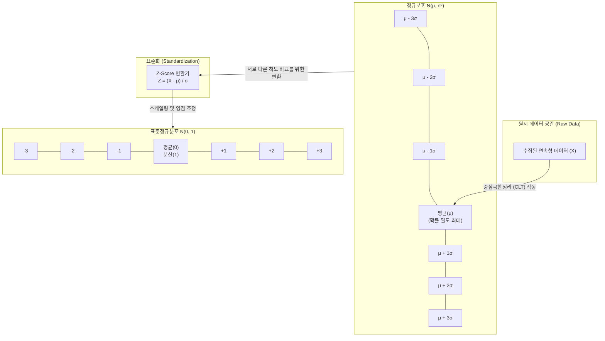

# 정규분포 (Normal Distribution)

---

## I. 통계적 추론과 인공지능 모델링의 기반, 정규분포의 개요

* **정의**: 데이터가 평균 주변에 가장 많이 모여 있고, 양극단으로 갈수록 그 수가 대칭적으로 감소하는 종 모양(Bell-shape)의 연속확률분포 (가우시안 분포)
* **등장배경**: 자연계 및 사회 현상의 데이터 분포 설명 모델 필요, 서로 다른 척도를 가진 데이터 간의 비교 및 통계적 [[가설 검정]] 기준 요구
* **특징**: 평균=중앙값=최빈값 동일, [[중심극한정리]](CLT) 기반 수렴성, 68-95-99.7% 경험 법칙, Z-점수 기반 표준정규분포 변환 용이성

---

## II. 정규분포의 개념도 및 핵심 기술 요소

### 가. 정규분포의 개념도 및 동작 원리

* 자연계의 데이터는 정규분포를 따르며, 이를 머신러닝이나 통계 분석에 활용하기 위해 평균을 0, 분산을 1로 맞추는 표준정규분포로 변환(Z-Score)하여 분석 수행

### 나. 정규분포의 핵심 수학적/기술적 요소

| 분류 | 요소기술(키워드) | 세부 설명 |
| --- | --- | --- |
| **핵심 파라미터** | 평균 ($\mu$, Mean) | 데이터 분포의 중심 위치를 결정 (종 모양의 중앙점) |
| **핵심 파라미터** | 분산/표준편차 ($\sigma$) | 데이터가 평균으로부터 흩어진 정도를 결정 (곡선의 폭과 높이) |
| **통계 원리** | 확률밀도함수 (PDF) | 특정 구간 내에 확률 변수가 존재할 확률을 면적으로 나타내는 수학적 함수 |
| **통계 원리** | 중심극한정리 (CLT) | 표본의 크기(n)가 충분히 클 때, 모집단 분포에 상관없이 표본 평균의 분포가 정규분포에 근사함 |
| **경험 법칙** | 68-95-99.7 Rule | 데이터가 $1\sigma$(68.2%), $2\sigma$(95.4%), $3\sigma$(99.7%) 구간 안에 존재할 확률 법칙 |
| **데이터 변환** | Z-점수 (Z-Score) | 원시 데이터에서 평균을 빼고 표준편차로 나누어 표준정규분포로 스케일링하는 기법 |
| **AI 적용 기법** | [[배치 정규화]] (Batch Norm) | [[딥러닝]] 은닉층의 입력을 미니배치 단위로 정규화(평균 0, 분산 1)하여 기울기 소실 방지 |
| **AI 적용 기법** | 잠재 공간 모델링 ([[VAE]]) | 생성형 AI에서 데이터를 정규분포 확률 변수로 맵핑(Reparameterization Trick)하여 새로운 데이터 생성 |

---

## III. 정규분포와 표준정규분포 비교 및 IT 분야 활용

### 가. 정규분포와 표준정규분포(Standard Normal Distribution) 비교

| 비교 항목 | 일반 정규분포 (Normal Distribution) | 표준정규분포 (Standard Normal Distribution) |
| --- | --- | --- |
| **표기법** | $N(\mu, \sigma^2)$ | $N(0, 1)$ |
| **평균과 분산** | 변수마다 다름 (임의의 실수 평균/분산) | **평균 = 0, 분산 = 1** (고정값) |
| **형태** | 파라미터에 따라 넓고 좁음의 형태가 변동됨 | 완벽히 규격화된 하나의 형태만 가짐 |
| **측정 척도(Scale)** | 원시 데이터의 척도(cm, kg, 원 등) 유지 | 단위를 상실한 무차원 수 (Z-Score) |
| **활용 목적** | 자연 현상, 실세계 데이터 분포의 단순 요약 | **서로 다른 척도 데이터 간의 비교**, 가설 검정 |

### 나. 정규분포의 IT 및 데이터 분석 분야 적용 동향

* **가우시안 이상 탐지([[Anomaly(이상현상)|Anomaly]] Detection) 고도화**: 사이버 보안(FDS) 시스템에서 사용자 행위나 트래픽이 정규분포의 임계치($3\sigma$ 밖)를 벗어날 경우, 이를 이상(Outlier) 징후로 판단하는 통계적 보안 모델에 폭넓게 활용
* **생성형 AI(Diffusion/VAE)의 노이즈 [[스케줄링]]**: 최신 이미지 및 음성 생성형 AI 모델들은 완전한 가우시안 노이즈(정규분포)에서 점진적으로 데이터를 복원(Denoising)하는 마르코프 체인 방식을 채택하여 고품질의 생성 결과물을 도출 중임

---

### 🔗 연관 토픽

- **소속 도메인**: [[00_인공지능_MOC|🤖 인공지능]]
- **세부 분류**: `1. 수학 · 통계학 & 데이터 전처리`
- **핵심 연관 토픽**:
  - [[가설 검정]]
  - [[중심극한정리|중심극한정리 (Central Limit Theorem)]]
  - [[확률분포]]
  - [[확률분포와 확률 밀도 함수]]
  - [[이항분포|이항분포 (Binomial Distribution)]]
