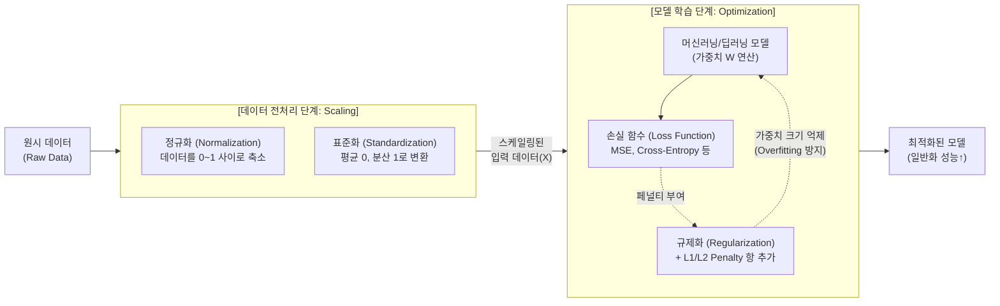

# 정규화(Normalization), 규제화(Regularization), 표준화(Standardization)

---

## I. 머신러닝 모델의 성능과 안정성 확보를 위한 핵심 기법 개요

* **정의**: 머신러닝/[[딥러닝]] 모델의 학습 속도 향상과 지역 최적해(Local Minima) 방지를 위해 데이터를 변환하는 기법(정규화, 표준화)과 과적합(Overfitting) 방지를 위해 가중치에 페널티를 부여하는 최적화 기법(규제화)
* **필요성 및 배경**:
* 입력 변수(Feature) 간 척도(Scale) 차이로 인한 가중치 왜곡 및 [[경사하강법]] 수렴 지연 방지
* 복잡한 모델이 훈련 데이터의 노이즈까지 학습하여 [[일반화]] 성능이 저하되는 현상 통제

* **특징**: [[데이터 전처리]] 단계(Scaling)와 모델 학습 단계(Penalty)의 분리, 모델의 예측 정확도 및 강건성(Robustness) 향상

---

## II. 3대 기법의 개념도 및 핵심 기술 요소

### 가. 정규화/표준화/규제화의 아키텍처 및 동작 프로세스

* **정규화/표준화**는 원시 데이터를 모델이 학습하기 좋은 형태로 스케일링하며, **규제화**는 손실 함수에 페널티를 추가하여 학습 시 가중치(W)가 과도하게 커지는 것을 통제함

### 나. 3대 기법의 핵심 기술 및 구성 요소

| 기법 분류 | 요소기술(키워드) | 세부 설명 |
| --- | --- | --- |
| **정규화** | Min-Max Scaler | $X_{norm} = (X - X_{min}) / (X_{max} - X_{min})$, 범위를 [0, 1]로 변환 |
| **정규화** | [[이상치]](Outlier) 민감성 | 최댓값/최솟값에 직접적 영향을 받으므로 이상치 존재 시 왜곡 발생 가능 |
| **표준화** | Z-Score Scaler | $Z = (X - \mu) / \sigma$, 데이터를 평균 0, 표준편차 1인 [[정규분포]] 형태로 변환 |
| **표준화** | 가우시안 가정 | 특성(Feature)이 정규분포를 따른다고 가정하는 [[알고리즘]]([[서포트 벡터 머신|SVM]], 로지스틱 회귀)에 필수 |
| **규제화** | L1 규제 (Lasso) | 가중치의 절댓값 합($\lambda \sum \vert w \vert$)을 손실함수에 더해 불필요한 가중치를 0으로 만듦 (Feature Selection 효과) |
| **규제화** | L2 규제 (Ridge) | 가중치의 제곱합($\lambda \sum w^2$)을 더해 가중치의 크기를 전반적으로 작게 축소 (가중치 감쇠) |
| **규제화** | Elastic Net | L1 규제와 L2 규제를 선형 결합하여 두 기법의 장점(변수 선택 + 안정성)을 융합 |
| **하이퍼파라미터** | 람다($\lambda$, Penalty Term) | 페널티 항의 크기를 조절하여 규제의 강도를 결정하는 핵심 하이퍼파라미터 |

---

## III. 정규화, 규제화, 표준화 비교 및 최신 동향

### 가. 3대 핵심 기법 상세 비교

| 비교 항목 | 정규화 (Normalization) | 표준화 (Standardization) | 규제화 (Regularization) |
| --- | --- | --- | --- |
| **목적** | 특성 간의 **척도(Scale) 통일** | 특성 간의 척도 통일 및 **분포 변환** | 모델의 **과적합 방지 및 일반화** |
| **적용 대상/단계** | 입력 데이터 (전처리 단계) | 입력 데이터 (전처리 단계) | 모델의 가중치 $W$ (학습 단계) |
| **수학적 결과물** | 모든 데이터가 **0~1 사이**에 분포 | 데이터가 **평균 0, 분산 1**을 가짐 | 크기가 통제된 **최적 가중치 분포** |
| **주요 적용 알고리즘** | K-NN, 인공신경망, 이미지 픽셀 | 선형 회귀, SVM, [[PCA(Principal Component Analysis)|PCA]] | 딥러닝 층, 다항 회귀 모델 |
| **이상치(Outlier) 영향** | 이상치에 **매우 취약함** | 이상치에 상대적으로 덜 민감함 | (데이터 변환이 아니므로 논외) |

### 나. 딥러닝 모델에서의 적용 동향 및 향후 전망

* **[[배치 정규화]](Batch Normalization)의 일반화**: 입력 데이터 전처리(표준화/정규화)를 넘어, 딥러닝 은닉층 내부의 입력값 분포가 변하는 '내부 공변량 변화(Internal Covariate Shift)'를 막기 위해 학습 중 미니배치 단위로 정규화를 수행하는 기법이 필수 아키텍처로 자리 잡음
* **[[초거대 언어 모델|LLM]] 파인튜닝 시 규제화 기법의 융합**: 초거대 AI 모델의 미세조정([[Fine-Tuning|Fine-tuning]]) 과정에서 과적합을 막기 위해 전통적 L2 규제(Weight Decay)와 더불어 드롭아웃([[Dropout]]), 얼리 스토핑(Early Stopping)을 복합적인 규제화 기법으로 혼용하여 학습 안정성을 극대화하는 추세임

---

### 🔗 연관 토픽

- **소속 도메인**: [[00_인공지능_MOC|🤖 인공지능]]
- **세부 분류**: `3. 딥러닝 핵심 아키텍처 & 신경망`
- **핵심 연관 토픽**:
  - [[딥러닝]]
  - [[초거대 언어 모델|초거대 언어 모델(Large Language Model)]]
  - [[이상치]]
  - [[PCA(Principal Component Analysis)]]
  - [[서포트 벡터 머신|서포트 벡터 머신 SVM(Support Vector Machine)]]
