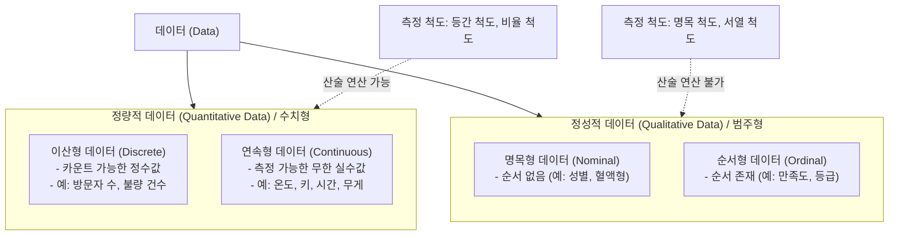

# 정량적 데이터 (Quantitative Data)

---

## I. 객관적 의사결정과 통계적 분석의 기반, 정량적 데이터의 개요

* **정의**: 관측된 객체의 특성을 수치(Number)로 표현하여, 크기나 양을 객관적으로 측정하고 산술적 연산(덧셈, 평균 등)이 가능한 데이터
* **등장배경**: 데이터 기반(Data-Driven)의 객관적 의사결정 요구 증대, 비즈니스 성과(KPI)의 수치적 측정 필요성, 빅데이터 및 머신러닝 모델의 수학적 연산 기반 제공
* **특징**: 산술 연산 가능, 연속형/이산형 분류, 시각화(히스토그램, 산점도 등) 용이, 통계적 검정 및 수학적 모델링의 필수 요소

---

## II. 정량적 데이터의 개념도 및 핵심 기술 요소

### 가. 정량적 데이터의 체계도 및 분류 기준

* 데이터는 크게 수치 기반의 정량적 데이터와 범주 기반의 정성적 데이터로 나뉘며, 정량적 데이터는 값의 연속성 유무에 따라 이산형과 연속형으로 세분화됨

### 나. 정량적 데이터의 핵심 기술 및 구성 요소

| 구분 | 요소기술(키워드) | 세부 설명 |
| --- | --- | --- |
| **세부 분류** | 이산형 (Discrete) | 셀 수 있는 단위로 쪼개어지지 않는 정수형 데이터 (예: 트래픽 건수) |
| **세부 분류** | 연속형 (Continuous) | 측정 도구에 따라 무한히 쪼갤 수 있는 실수형 데이터 (예: 응답 지연 시간) |
| **측정 척도** | 등간 척도 (Interval) | 수치 간 간격이 동일하나 절대 영점(0)이 없는 척도 (예: 섭씨온도) |
| **측정 척도** | 비율 척도 (Ratio) | 수치 간 간격이 동일하고 절대 영점이 존재하여 배수 연산 가능 (예: 몸무게) |
| **전처리 기법** | 스케일링 (Scaling) | 특성 간 단위 차이 극복을 위해 정규화(Min-Max) 및 표준화(Z-Score) 수행 |
| **전처리 기법** | [[이상치]] (Outlier) 처리 | IQR, Z-Score 등을 활용하여 분포를 왜곡하는 극단치 탐지 및 제거/대체 |
| **통계 분석** | [[기술 통계]] (Descriptive) | 평균, 중앙값, 분산, 표준편차 등을 통해 데이터의 중심 경향 및 산포도 파악 |
| **시각화 기법** | 히스토그램 / 산점도 | 연속형 데이터의 분포(히스토그램) 및 두 변수 간의 상관관계(산점도) 시각화 |

---

## III. 정량적 데이터와 정성적 데이터 비교 및 최신 동향

### 가. 정량적 데이터 vs 정성적 데이터 비교

| 비교 항목 | 정량적 데이터 (Quantitative) | 정성적 데이터 (Qualitative) |
| --- | --- | --- |
| **데이터 성질** | **수치형 (Numerical)** | **범주형 (Categorical)** |
| **핵심 질문** | How many? How much? | What type? Which category? |
| **주요 척도** | 등간 척도, 비율 척도 | 명목 척도, 순서 척도 |
| **산술 연산** | 가능 (덧셈, 뺄셈, 곱셈, 나눗셈, 평균 등) | 불가능 (빈도수, 최빈값 정도만 산출) |
| **분석 방법** | [[회귀분석]], [[t-검정 (t-test)|t-검정]], 분산분석([[ANOVA(Analysis of variance)|ANOVA]]) | 교차분석(카이제곱 검정), 로지스틱 회귀 |
| **시각화 도구** | 산점도(Scatter), 박스 플롯, 선 그래프 | 막대 그래프(Bar), 파이 차트(Pie) |

### 나. 데이터 분석 환경에서의 융합 트렌드 및 향후 전망

* **정성적 데이터의 정량화 (Vectorization)**: 워드 임베딩(Word2Vec, [[BERT]]) 및 비전 모델([[CNN]], ViT)을 통해 텍스트, 비정형 이미지 등 정성적 데이터를 고차원의 실수 벡터(정량적 데이터)로 변환하여 [[딥러닝]] 연산에 활용하는 기법이 필수적임
* **혼합 연구 기법(Mixed Methods) 확산**: 빅데이터 분석 플랫폼(Hadoop, Spark) 상에서 고객 행동 로그(정량)와 리뷰/VoC 감성 분석(정성)을 결합하여 분석의 신뢰성과 인사이트의 깊이를 동시에 확보하는 하이브리드 접근법이 주류로 안착함

---

### 🔗 연관 토픽

- **소속 도메인**: [[00_인공지능_MOC|🤖 인공지능]]
- **세부 분류**: `1. 수학 · 통계학 & 데이터 전처리`
- **핵심 연관 토픽**:
  - [[기술 통계|기술 통계(Descriptive statistics)]]
  - [[CNN|CNN (Convolutional Neural Network)]]
  - [[이상치]]
  - [[t-검정 (t-test)]]
  - [[ANOVA(Analysis of variance)]]
