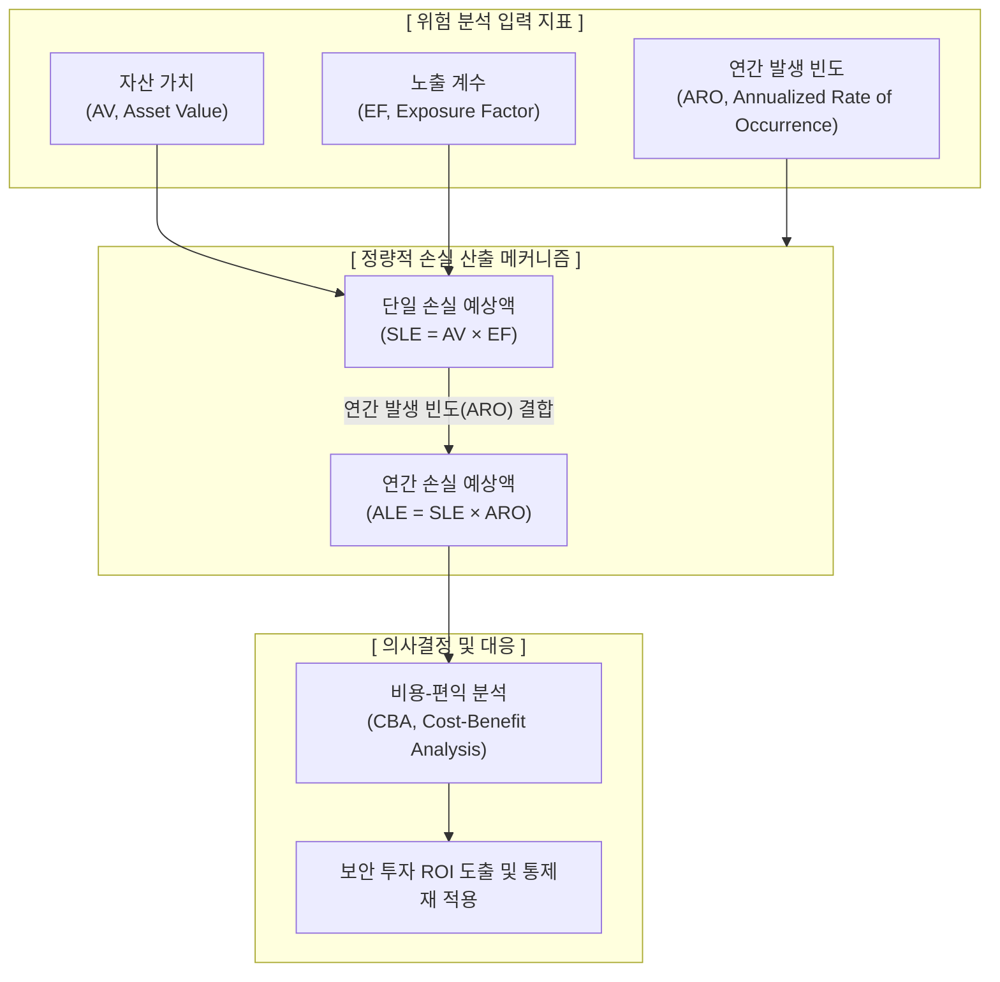

# 정량적 위험 분석 (Quantitative Risk Analysis)

---

## I. 객관적 수치 기반의 정보보호 투자 타당성 평가, 정량적 위험 분석의 개요

* **정의**: IT 자산의 가치, 위협의 발생 확률, 취약점의 노출 정도를 수학적·통계적 기법을 활용하여 객관적인 화폐 가치(금액)로 환산하고 평가하는 위험 분석 기법
* **필요성 및 특징**:
* **필요성**: 정성적 위험 분석의 주관적 판단 한계 극복, 경영진 및 이사회 설득을 위한 재무적 투자대비효과(ROI) 입증 필요
* **특징**: 객관성 및 [[신뢰성]] 높음, 복잡한 수식과 통계 자료 요구, 시간과 비용이 많이 소모됨

---

## II. 정량적 위험 분석의 개념도 및 핵심 산출 요소

### 가. 정량적 위험 분석의 개념도 및 동작 원리

* 자산 가치(AV)에 노출 계수(EF)를 곱하여 단일 손실 예상액(SLE)을 산출하고, 과거 데이터를 바탕으로 한 연간 발생 빈도(ARO)를 곱해 최종 연간 예상 총 손실액(ALE)을 도출함

### 나. 정량적 위험 분석의 핵심 구성 요소 및 기법

| 분류 | 요소기술(키워드) | 세부 설명 |
| --- | --- | --- |
| **핵심 산출 지표** | AV (Asset Value) | 해당 IT 자산을 획득, 개발, 유지보수하는 데 소요된 총 금전적 가치 |
| **핵심 산출 지표** | EF (Exposure Factor) | 특정 위협 발생 시 자산이 입게 되는 손실 규모를 0%~100% 사이의 비율로 표현 |
| **핵심 산출 지표** | SLE (Single Loss Expectancy) | 한 번의 보안 사고(위협) 발생 시 예상되는 단일 피해액 ($AV \times EF$) |
| **핵심 산출 지표** | ARO (Annual Rate of Occurrence) | 1년 동안 동일한 위협이 발생할 것으로 예상되는 통계적 빈도 횟수 |
| **핵심 산출 지표** | ALE (Annual Loss Expectancy) | 특정 위협으로 인해 1년간 발생할 것으로 예상되는 총 금전적 손실액 ($SLE \times ARO$) |
| **분석 기법** | 과거 자료 분석법 | 과거에 발생한 보안 사고 통계 자료를 바탕으로 위협 발생 확률과 피해 규모를 산정 |
| **분석 기법** | [[몬테카를로 시뮬레이션]] | 난수(Random Number)를 발생시켜 다수의 시나리오를 반복 수행해 위험 확률 분포 도출 |
| **분석 기법** | 의사결정 나무 (Decision Tree) | 발생 가능한 각 경로별 확률과 재무적 기대치(EMV)를 시각화하여 최적의 대안 선택 |

---

## III. 정량적 분석과 정성적 분석 비교 및 향후 동향

### 가. 정량적 위험 분석 vs 정성적 위험 분석 비교

| 비교 항목 | 정량적 위험 분석 (Quantitative) | [[정성적 위험 분석]] (Qualitative) |
| --- | --- | --- |
| **평가 기준** | 객관적 수치, 화폐 가치 ($, ₩) | 주관적 판단, 서열화 (상/중/하) |
| **주요 기법** | 과거 자료 분석, 몬테카를로, EMV | 델파이(Delphi) 기법, 시나리오법, 순위결정법 |
| **소요 시간/비용** | 매우 높음 (방대한 데이터 수집 필요) | 상대적으로 낮음 (전문가 직관 의존) |
| **결과물 형태** | 비용-편익 분석(CBA)을 위한 재무 지표 | 위험의 우선순위가 매겨진 리스트(Risk Matrix) |
| **경영진 보고** | 투자 수익률(ROI) 증빙 및 예산 승인에 유리 | 전반적인 리스크 트렌드 파악 및 빠른 대응에 유리 |

### 나. 정량적 위험 분석의 최신 트렌드 및 향후 전망

* **FAIR (Factor Analysis of Information Risk) [[프레임워크]] 확산**: 기존의 주관적 정성 평가를 탈피하고, 정보 보안 위험을 재무적 언어로 변환하여 이사회와 소통하기 위한 국제 표준 CRQ(사이버 리스크 정량화) 모델로 FAIR 도입이 금융권 및 엔터프라이즈를 중심으로 급증함
* **AI 및 빅데이터 기반 동적 리스크 정량화**: 과거 데이터의 부재라는 한계를 극복하기 위해, 글로벌 위협 인텔리전스([[CTI]]) 피드와 AI 기반 예측 모델을 결합하여 자산의 실시간 위험 가치를 화폐 단위로 자동 산출하는 GRC(거버넌스, 리스크, 컴플라이언스) 플랫폼 융합 추세임

---

### 🔗 연관 토픽

- **소속 도메인**: [[00_소프트웨어공학_MOC|🏗️ 소프트웨어공학]]
- **세부 분류**: `6. 소프트웨어 테스팅 & 품질 보증 (QA/QC)`
- **핵심 연관 토픽**:
  - [[정성적 위험 분석]]
  - [[프레임워크]]
  - [[신뢰성]]
  - [[CTI]]
  - [[코드 커버리지|코드 커버리지(Code Coverage)]]
