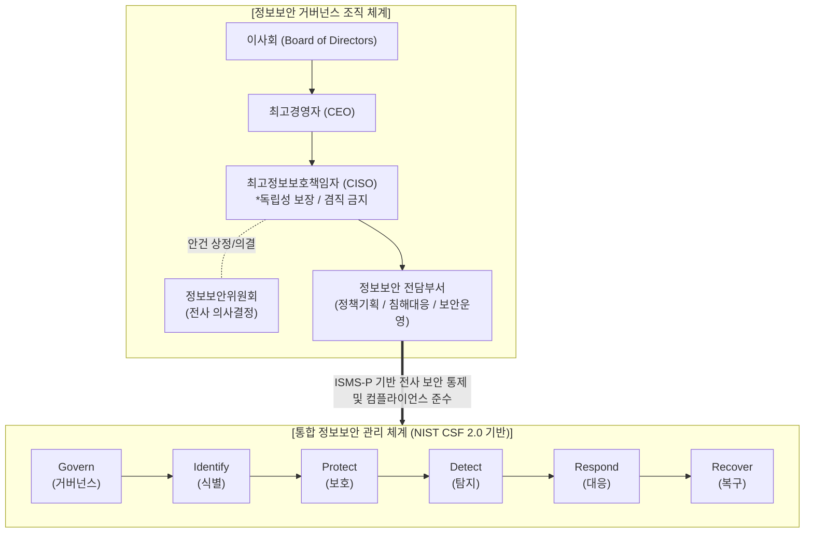

# 정보보안 부서의 신설과 정보보안 체계

---

## I. 기업 디지털 자산 보호의 구심점, 정보보안 부서 신설 및 체계 개요

* **정의**: 조직의 비즈니스 연속성 보장과 사이버 위협 대응을 위해, 독립적인 CISO(최고정보보호책임자) 산하에 전담 조직을 신설하고 GRC 기반의 통합 보안 프레임워크를 구축하는 거버넌스 활동
* **배경 및 필요성**: 법적 규제 강화(CISO 겸직 금지, [[ISMS-P]] 인증 의무), 지능형 사이버 위협(Ransomware, APT) 급증, 클라우드 및 원격근무 확산에 따른 제로 트러스트([[제로 트러스트 보안모델|Zero Trust]]) 보안 환경 요구 증대
* **특징**: 비즈니스 연계성(IT-Biz Alignment), 예방-탐지-대응-복구의 전주기 관리, 관리적/기술적/물리적 보안의 통합

---

## II. 정보보안 부서 및 체계의 개념도 및 핵심 구성요소

### 가. 정보보안 거버넌스 및 프레임워크 개념도

* CISO를 주축으로 하는 독립적 전담 조직이 경영진과 정보보안위원회의 지원을 받아, 전사적 정보보안 [[프레임워크]](식별~복구)를 기획하고 실행하는 구조

### 나. 정보보안 체계 구축의 핵심 구성요소

| 분류 | 요소기술(키워드) | 세부 설명 |
| --- | --- | --- |
| **보안 거버넌스** | CISO 전담조직 | 정보통신망법에 의거, IT 운영 부서와 분리된 독립적인 최고정보보호책임자 및 전담 인력 구성 |
| **보안 거버넌스** | GRC 통합 체계 | 거버넌스(Governance), 위험관리(Risk), 규제준수(Compliance)를 비즈니스 목표와 일치시켜 관리 |
| **관리적 보안** | ISMS-P 인증 | 조직에 적합한 정보보호 및 개인정보보호 관리체계를 수립, 운영하고 공인 기관으로부터 인증 획득 |
| **관리적 보안** | 사이버 복원력 | 침해사고 완벽 차단(불가능) 대신, 사고 발생 시 비즈니스 중단을 최소화하고 신속히 정상화하는 회복력 |
| **기술적 보안** | 제로 트러스트 (ZTA) | "아무것도 신뢰하지 않고 항상 검증한다"는 원칙하에, 신원(Identity) 기반의 마이크로 [[세그멘테이션]] 및 동적 접근 통제 |
| **기술적 보안** | [[DevSecOps]] | 시스템 개발, 운영 전주기([[SDLC]])에 보안 점검 자동화 도구([[SAST]], [[DAST]])를 내재화하여 취약점 사전 차단 |
| **보안 운영** | [[SOAR (Security Orchestration, Automation and Response)|SOAR]] / AI-[[SIEM]] | 플레이북(Playbook) 기반의 보안 위협 대응 자동화(SOAR) 및 [[인공지능]] 기반 이상징후 통합 관제 |
| **물리적 보안** | 망분리 및 출입통제 | 중요 내부망과 외부 인터넷망의 논리적/물리적 분리 및 생체 인식을 활용한 핵심 시설 출입 통제 |

---

## III. 전통적 보안 체계와 차세대 보안 체계 비교 및 향후 동향

### 가. 전통적 보안 체계 vs 차세대 보안 체계 비교

| 비교 항목 | 전통적 정보보안 체계 | 차세대 정보보안 체계 |
| --- | --- | --- |
| **부서 위상** | IT 부서 산하의 하위 운영 부서 | **CEO 직속 / 독립된 CISO 전담 부서** |
| **핵심 패러다임** | 경계 방어 (Perimeter Security) | **제로 트러스트 (Zero Trust) 및 복원력** |
| **대응 방식** | 사후 대응 및 수동 분석 중심 | **AI/ML 기반 선제적 탐지 및 자동 대응(SOAR)** |
| **인프라 환경** | 온프레미스(On-Premise) 내부망 중심 | **멀티/하이브리드 클라우드 (CNAPP 적용)** |
| **보안 프레임워크** | 자산/네트워크 방어 위주 (기존 보안지침) | **NIST CSF 2.0 (거버넌스 및 공급망 보안 강조)** |

### 나. 정보보안 부서 역할의 최신 동향 및 향후 전망

* **보안 거버넌스의 이사회 책임 강화**: 최근 SEC(미국 증권거래위원회) 규제 및 국내 관련 법령 강화로 사이버 보안 사고에 대한 이사회 공시 의무가 발생함에 따라, 정보보안 부서는 이사회와 직접 소통하는 경영 핵심 부서로 격상 중
* **생성형 AI(GenAI) 기반 보안 운영 고도화**: 부족한 보안 관제 인력을 보완하기 위해, 정보보안 전담 부서는 Security Copilot 등 생성형 AI를 활용하여 악성코드 분석, 침해사고 보고서 작성, 취약점 패치 코드를 자동 생성하는 체계로 진화 중

---

### 🔗 연관 토픽

- **소속 도메인**: [[00_보안_MOC|🛡️ 보안]]
- **세부 분류**: `1. 정보보안 원칙 & 거버넌스 · 인증`
- **핵심 연관 토픽**:
  - [[제로 트러스트 보안모델|제로 트러스트 (Zero Trust) 보안모델]]
  - [[ISMS-P]]
  - [[DevSecOps]]
  - [[SDLC]]
  - [[SIEM]]
