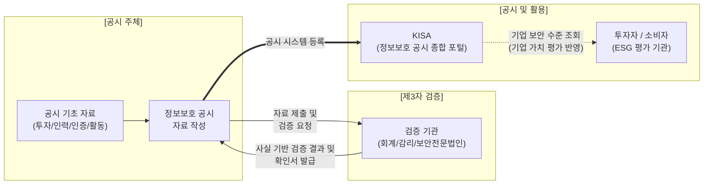

# 정보보호 공시제도

---

## I. 투명한 정보보호 투자와 알 권리 보장, 정보보호 공시제도의 개요

* **정의**: 기업이 정보보호 투자, 전담 인력, 인증 현황 등 정보보호 활동 내역을 공개하여 이용자의 알 권리를 보장하고 정보보호 투자를 촉진하는 법적 제도 (정보보호산업진흥법 기반)
* **배경 및 특징**:
* 사이버 위협 증가로 인한 기업 정보보호 수준의 투명성 요구 및 주주/이용자의 알 권리 강화
* 일정 규모 이상(매출, 이용자 수 등) 기업의 의무화(미이행 시 과태료), 제3자 검증을 통한 [[신뢰성]] 확보, 자율공시 기업 대상 인센티브([[ISMS-P]] 수수료 감면 등) 제공

---

## II. 정보보호 공시제도의 프로세스 및 핵심 구성 요소

### 가. 정보보호 공시제도의 프로세스 및 구성도

* 기업은 가이드라인에 따라 4대 항목을 작성하고, 회계법인 등의 외부 제3자 검증을 거쳐 신뢰성을 확보한 후 한국인터넷진흥원(KISA) 종합 포털에 전자 공시함

### 나. 정보보호 공시제도의 4대 항목 및 핵심 요소

| 구분 | 요소기술(키워드) | 세부 설명 |
| --- | --- | --- |
| **공시 항목 1** | 정보보호 투자 현황 | 전체 정보기술(IT) 부문 투자액 대비 **정보보호 부문 투자액 및 비율(%)** 산출 |
| **공시 항목 2** | 정보보호 인력 현황 | 전체 정보기술(IT) 부문 인력 대비 **내부/외부 정보보호 전담 인력 수 및 비율(%)** |
| **공시 항목 3** | 인증/평가 현황 | ISMS, ISMS-P, ISO27001, 주요정보통신기반시설 취약점 평가 등 획득 현황 |
| **공시 항목 4** | 이용자 보호 활동 | CISO 지정, 침해사고 대응 모의훈련, 보안 배상책임보험 가입 등 기타 보호 활동 |
| **신뢰성 확보** | 제3자 검증 제도 | 회계법인, 정보시스템감리법인 등을 통해 공시 데이터의 정합성 및 객관성 확인 |
| **의무 대상** | 의무 공시 기업 | [[ISP (Information Strategy Plan)|ISP]], IDC 사업자, 매출액 3,000억 이상 또는 일평균 이용자 100만 명 이상 기업 |
| **제재 수단** | 과태료 부과 | 의무 대상 기업이 공시를 이행하지 않거나 허위 공시 시 1천만 원 이하 과태료 부과 |
| **활성 정책** | 자율 공시 인센티브 | 자율공시 기업 대상 우수기업 표창 및 ISMS-P 인증 수수료 감면 (최대 30%) 혜택 |

---

## III. 정보보호 공시제도의 효과 및 향후 발전 방향

### 가. 정보보호 공시제도 도입에 따른 기대 효과

| 구분 | 주요 효과 및 내용 |
| --- | --- |
| **기업 (Enterprise)** | - 이사회 보고 및 외부 공시를 통한 자발적인 정보보호 예산 및 인력 확보 용이- 침해사고 발생 시 '이용자 보호 활동' 내역을 기반으로 한 선량한 관리자 의무 입증 |
| **이용자/주주 (Public)** | - 객관적 지표를 통한 기업의 보안 수준 파악 및 안전한 서비스/투자처 선택권 보장 |
| **국가/산업 (Industry)** | - 정보보호 산업 생태계 활성화 및 국가 전반의 사이버 복원력(Resilience) 상향 평준화 |

### 나. 최신 동향 및 향후 발전 방향

* **[[ESG 경영]] 지표와의 강력한 결합**: 정보보안 역량이 단순한 IT 리스크 관리를 넘어, ESG 평가의 핵심 지표(Governance 체계 및 Social 책임)로 편입됨에 따라, 국내외 기관 투자자들의 기업 가치 평가(Valuation) 기준으로 공시 데이터가 적극 활용되는 추세임
* **공시 데이터 신뢰성 및 자율공시 지원 확대**: 공시 제도의 실효성을 높이기 위해 중소/중견기업 대상 자율공시 컨설팅 지원이 확대되고 있으며, CISO의 독립성 강화 및 공시 데이터 허위 기재에 대한 검증 체계 고도화(자동화 연계 등)가 지속적으로 추진 중임

---

### 🔗 연관 토픽

- **소속 도메인**: [[00_보안_MOC|🛡️ 보안]]
- **세부 분류**: `6. 개인정보보호 & 프라이버시 강화 기술`
- **핵심 연관 토픽**:
  - [[ISMS-P]]
  - [[신뢰성]]
  - [[ISP (Information Strategy Plan)]]
  - [[개인정보보호법]]
  - [[ESG 경영]]
