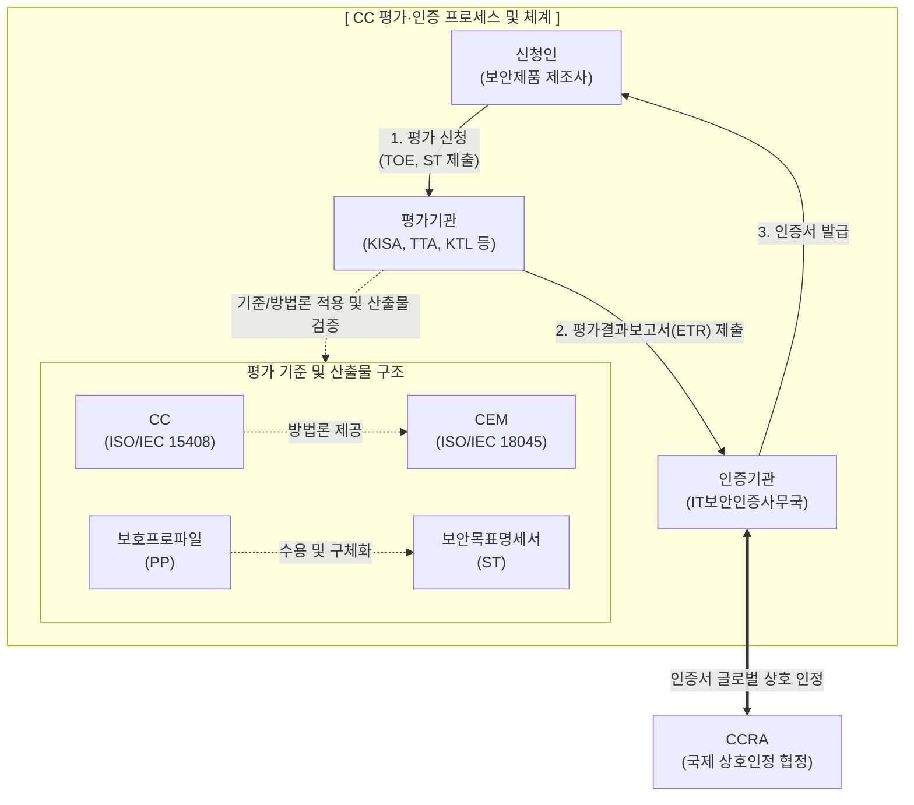

# 정보보호제품 평가·인증 (CC 평가·인증) 제도

---

## I. 정보보호제품의 신뢰성 검증 표준, CC 평가·인증 제도의 개요

* **정의**: 정보보호제품의 보안 기능과 보증 수준이 국제표준(CC, ISO/IEC 15408)에 부합하는지 평가기관이 평가하고 인증기관이 인증하여 신뢰성을 부여하는 제도
* **필요성/등장배경**: 국가·공공기관 도입 IT 보안 제품의 객관적 안전성 검증 필요, 수출입 시 국가별 상이한 평가 기준에 따른 중복 평가 비용 및 시간 낭비 해소
* **특징**: 국제 상호 인정(CCRA), 구현 독립적 요구사항(PP)과 구현 종속적 요구사항(ST)의 분리, 7단계 평가 보증 등급(EAL 1~7) 체계 적용

---

## II. CC 평가·인증의 개념도 및 핵심 기술 요소

### 가. CC 평가·인증 프레임워크 및 프로세스

* 신청인은 보안목표명세서(ST)와 제품(TOE)을 평가기관에 제출하고, 평가기관은 CC/CEM 기반으로 평가 후 인증기관을 통해 최종 인증서를 발급하여 CCRA 가입국 간 통용됨

### 나. CC 평가·인증 제도의 핵심 구성 요소

| 분류 | 요소기술(키워드) | 세부 설명 |
| --- | --- | --- |
| **국제 표준** | CC (Common Criteria) | ISO/IEC 15408, 정보보호제품 보안 평가를 위한 공통 기준([[프레임워크]]) |
| **국제 표준** | CEM (Common Eval Method) | ISO/IEC 18045, CC 기반의 객관적이고 공통된 평가 방법론 |
| **핵심 문서** | PP (Protection Profile) | [[방화벽]], [[VPN]] 등 특정 '제품군'에 대한 구현 독립적인 공통 보안 요구사항 |
| **핵심 문서** | ST (Security Target) | 특정 제품(TOE)에 실제 구현된 보안 기능과 보증 수준을 명시한 문서 |
| **평가 대상** | TOE (Target of Evaluation) | 평가의 대상이 되는 정보보호제품 자체 또는 IT 시스템 |
| **보증 등급** | EAL (Eval Assurance Level) | EAL 1(기능 테스트)부터 EAL 7(정형적 검증)까지 7단계로 구성된 보증 등급 |
| **협정 체계** | CCRA (상호인정협정) | CC 인증서를 가입국 간 상호 인정하여 중복 평가를 방지하는 국제 협정 |
| **최신 기준** | cPP (Collaborative PP) | CCRA 가입국들이 공동으로 개발하고 채택한 국제 공통 보호프로파일 |

---

## III. CC 인증과 보안기능 확인서 비교 및 향후 전망

### 가. CC 인증 vs 보안기능 확인서 비교

| 비교 항목 | CC 인증 (Common Criteria) | 보안기능 확인서 (Security Features Confirmation) |
| --- | --- | --- |
| **주요 목적** | 제품의 전반적 보안성 및 보증 수준 국제 공인 | 국가·공공기관 도입용 **신속 보안성 검증** |
| **제도 근거** | ISO/IEC 15408, CCRA 협정 | 국가정보원 정보보안지침 및 보안요구사항 |
| **효력 및 인정** | **CCRA 가입국 간 국제적 인정** | **국내 (국가/공공기관 도입 시) 한정 인정** |
| **평가 기준** | ST(보안목표명세서) 및 제품군별 PP | 국가용 보안요구사항 (네트워크 장비, [[SDN(Software Defined Network)|SDN]] 등) |
| **소요 기간** | 비교적 장기 (최소 6개월 ~ 1년 이상) | 비교적 단기 (보안 적합성 검증 간소화) |

### 나. 정보보호제품 평가 체계의 향후 전망 및 동향

* **cPP(국제공통 보호프로파일) 중심의 체계 전환**: 과거 EAL 등급 중심의 평가에서 벗어나, 글로벌 상호 인정이 보장되는 cPP에 대한 정확한 부합성(Exact Conformance)을 입증하는 방식으로 국제 CCRA 정책이 변화 중
* **클라우드/IoT/AI 융합 보안 제품 신속 평가 요구**: [[클라우드 네이티브]] 기반 보안 솔루션([[SecaaS (Security as a Service)|SECaaS]]) 및 AI 탑재 보안 기기가 급증함에 따라, 전통적 CC 인증의 장기 소요 문제를 극복하기 위한 [[DevSecOps]] 연계 신속 평가 모델 및 클라우드 보안인증([[CSAP]])과의 체계적 연동 방안 마련 활발

---

### 🔗 연관 토픽

- **소속 도메인**: [[00_보안_MOC|🛡️ 보안]]
- **세부 분류**: `6. 개인정보보호 & 프라이버시 강화 기술`
- **핵심 연관 토픽**:
  - [[DevSecOps]]
  - [[방화벽]]
  - [[SecaaS (Security as a Service)]]
  - [[CSAP|CSAP, CSAP(Cloud Security Assurance Program)]]
  - [[디지털 면역 시스템|디지털 면역 시스템(DIS, Digital Immune System)]]
