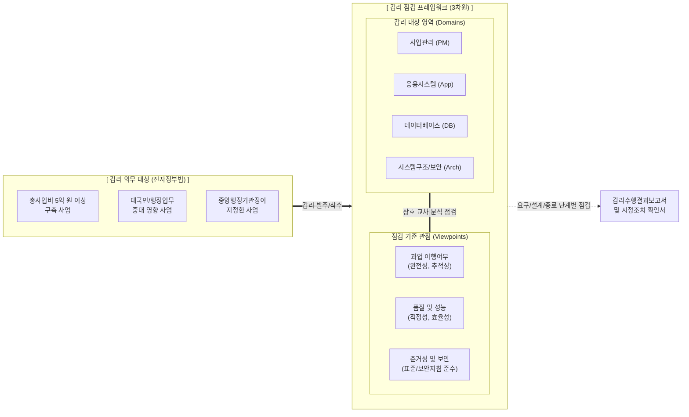

# 정보시스템 감리 의무 대상과 관점별 점검 기준

---

## I. 공공 IT 사업의 투명성 확보 체계, 정보시스템 감리 개요

* **정의**: 전자정부법 제57조에 따라 일정 규모 이상의 공공 정보화 사업에 대해, 독립된 제3자(감리법인)가 4대 영역과 3대 관점 기준에 따라 객관적으로 품질을 점검하고 개선을 권고하는 법적 통제 활동
* **필요성 및 배경**: 공공 IT 투자의 투명성 및 비용 효율성 제고, 대규모 시스템의 복잡도 증가에 따른 사업 실패 리스크 최소화, 품질/보안 결함에 대한 예방적 사전 통제 의무화
* **특징**: 제3자 독립성/객관성 유지, 3차원 점검 매트릭스(단계 $\times$ 영역 $\times$ 관점) 적용, 현장 감리 후 시정조치 이행 확인을 통한 실효성 보장

---

## II. 정보시스템 감리의 개념도 및 핵심 구성 요소

### 가. 감리 의무 대상 및 3차원 점검 프레임워크 개념도

* 법적으로 규정된 감리 의무 대상을 바탕으로, 감리원은 사업의 특정 단계(요구, 설계, 종료)마다 감리 영역과 점검 관점을 교차하여 객관적인 품질 및 결함 여부를 진단함

### 나. 정보시스템 감리 의무 대상 및 관점별 점검 기준의 핵심 요소

| 분류 | 요소기술(키워드) | 세부 설명 |
| --- | --- | --- |
| **의무 대상** | 총사업비 5억 원 이상 | 전자정부법 시행령 제71조에 의거한 정보시스템 구축 사업 (단순 장비 구입 등 제외) |
| **의무 대상** | 대국민 서비스 중요 사업 | 예산 5억 미만이라도 대국민 서비스나 행정 업무에 중대한 영향을 미치는 경우 필수 포함 |
| **점검 관점** | 과업 이행 여부 | 제안서, 요구사항 정의서 등 과업 내용 대비 시스템 기능이 **누락 없이 완전하게 구현(추적성)**되었는지 점검 |
| **점검 관점** | 산출물/시스템 품질 | ISO/IEC 25010 등 품질 특성 기반으로 산출물 정합성, 시스템 응답 속도 및 [[HA(High Availability)|가용성]] 확보 여부 점검 |
| **점검 관점** | 준거성 및 보안성 | EA 참조모형 준수, [[공공데이터]] 개방 표준, 소프트웨어 [[시큐어코딩]](보안 약점 47개) 등 규정 준수 점검 |
| **감리 영역** | 4대 감리 영역 | 점검 대상인 사업관리, 응용시스템, [[데이터베이스]], 시스템구조 및 보안 영역 |
| **평가 척도** | 적합 / 부적합 / 점검제외 | 항목별 점검 결과에 따라 상태를 명시하고, 결함 사항에 대한 개선 권고안 구체적 제시 |
| **사후 관리** | 시정조치 확인 | 감리원이 지적한 개선 권고 사항에 대해 주관기관과 사업자가 적절히 시정(조치)했는지 최종 점검 |

---

## III. 현행 감리 제도의 한계 및 최신 발전 동향

### 가. 전통적 감리 제도의 한계점

| 항목 | [[워터폴|폭포수]](Waterfall) 모델 기반 감리의 한계 | 해결/대응 방안 |
| --- | --- | --- |
| **개입 시점** | 특정 단계(요구, 설계, 종료)에만 단기적으로 개입하여 사업 전반의 지속적인 이슈 추적 불가 | 상주 감리 및 [[PMO]](사업관리조직) 제도 병행 활용 |
| **유연성 부족** | 클라우드 전환 및 애자일([[Agile]]) 기반 사업 수행 시 기존 단계별 산출물 점검 [[프레임워크]] 적용 한계 | 애자일 프레임워크에 특화된 상시 감리 가이드라인 적용 |

### 나. 최신 IT 환경 변화에 따른 정보시스템 감리 동향

* **디지털플랫폼정부(DPG) 클라우드/애자일 대응 상시 감리**: [[MSA (Micro Service Architecture)|MSA]](마이크로서비스 아키텍처) 및 애자일 방법론이 공공에 도입됨에 따라, 3단계(요구/설계/종료)의 경직된 감리를 탈피하여 스프린트(Sprint) 주기별로 점검을 수행하는 **상시 감리(Continuous Audit)** 체계로 전환 중
* **[[DevSecOps]] 연계 지능형 자동화 감리 도입**: 감리원의 수작업 소스코드 점검 한계를 극복하기 위해, CI/CD 파이프라인 상의 [[SAST]]/[[DAST]] 도구 및 AI 기반 자동화 정적 분석 툴을 감리 과정에 통합 연계하여 점검의 효율성과 정확성을 극대화하는 추세임

---

### 🔗 연관 토픽

- **소속 도메인**: [[00_소프트웨어공학_MOC|🏗️ 소프트웨어공학]]
- **세부 분류**: `6. 소프트웨어 테스팅 & 품질 보증 (QA/QC)`
- **핵심 연관 토픽**:
  - [[워터폴]]
  - [[프레임워크]]
  - [[MSA (Micro Service Architecture)]]
  - [[시큐어코딩]]
  - [[Agile]]
