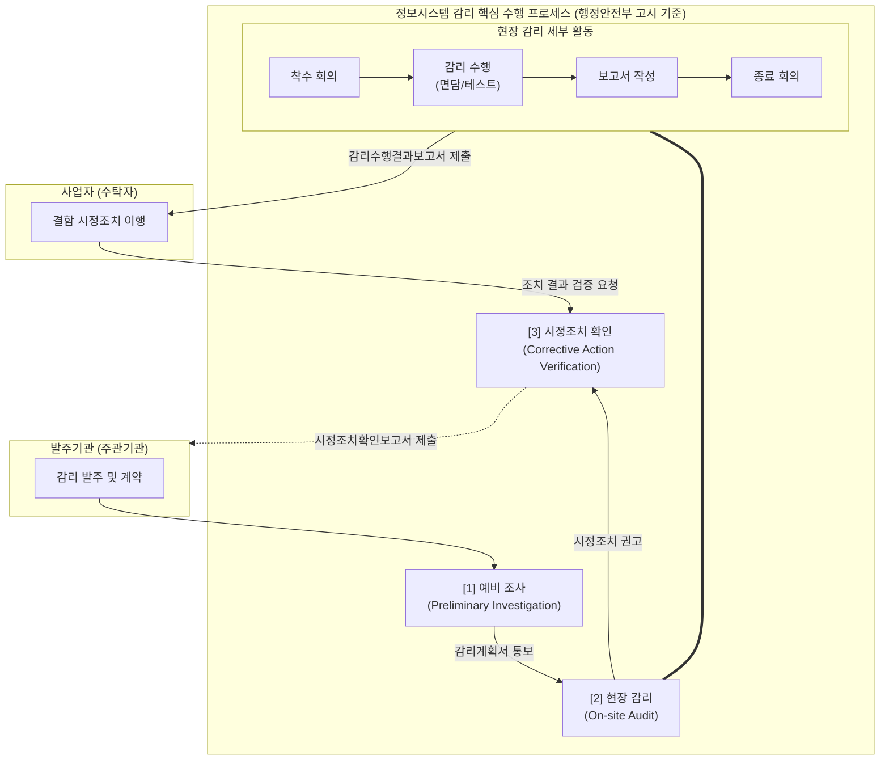

# 정보시스템 감리 절차 (Information System Audit Process)

---

## I. 공공 IT 사업의 품질 보증 프레임워크, 정보시스템 감리 절차 개요

* **정의**: 정보화 사업의 성공적 완수를 위해 발주기관, 사업자, 감리법인 간 독립적 관점에서 예비조사, 현장감리, 시정조치 확인으로 이어지는 일련의 객관적 품질 검증 및 통제 과정
* **필요성/특징**: 전자정부법 및 행정안전부 고시 기반 법적 의무 이행, 단계별(요구/설계/종료) 품질 결함 사전 식별 및 예방, 객관적 산출물 기반의 이해관계자 간 이견 조율 및 투명성 확보

---

## II. 정보시스템 감리 절차의 개념도 및 핵심 수행 단계

### 가. 정보시스템 감리의 표준 절차 및 동작 원리

* 감리는 예비조사를 통해 점검 기준(체크리스트)을 수립하고, 현장감리에서 실제 결함을 도출하여 개선을 권고한 후, 사업자의 조치 결과를 최종 확인(시정조치 확인)하는 순환 구조를 가짐

### 나. 정보시스템 감리 절차별 핵심 구성 요소 및 활동

| 구분 | 단계/요소 (키워드) | 세부 수행 활동 및 설명 |
| --- | --- | --- |
| **준비 단계** | 예비 조사 | 본 감리 착수 전 사업 현황 파악, 영역별 감리원 배정 및 중점 점검 항목 도출 |
| **준비 단계** | 감리계획서 수립 | 예비조사 결과를 바탕으로 감리 일정, 점검 [[프레임워크]], 체크리스트 확정 및 통보 |
| **실행 단계** | 착수 회의 | 발주기관, 사업자, 감리원 전원이 참석하여 감리 방향성 공유 및 협조 사항 요청 |
| **실행 단계** | 현장 감리 (수행) | 사업 현장에 상주하여 문서 검토, 담당자 면담, 소스코드 및 시스템 텍스트를 통한 결함 도출 |
| **실행 단계** | 종료 회의 | 감리 기간 중 발견된 결함 및 개선 권고 사항에 대해 사업자와 이견 조율 및 브리핑 |
| **보고 단계** | 감리수행결과보고서 | 현장감리 결과를 공식적으로 문서화하여 발주기관 및 사업자에게 제출 (개선 권고안 포함) |
| **조치 단계** | 시정조치 이행 (사업자) | 감리수행결과보고서의 지적 사항에 대해 사업자가 자체적으로 결함 수정 및 조치 수행 |
| **확인 단계** | 시정조치 확인 | 사업자가 제출한 조치결과에 대해 감리원이 현장에서 재검증 후 최종 **시정조치확인보고서** 발행 |

---

## III. 감리 절차 패러다임의 변화 및 최신 동향

### 가. 전통적 감리 절차와 상시 감리(Continuous Audit) 절차 비교

| 비교 항목 | 전통적 감리 ([[폭포수 모델]] 기반) | 상시 감리 (애자일/클라우드 환경 기반) |
| --- | --- | --- |
| **개입 시점 및 주기** | 요구, 설계, 종료 등 **특정 단계별** 단기 투입 | 스프린트(Sprint) 단위 **상시 투입 및 지속적 점검** |
| **핵심 점검 대상** | 단계별 산출물 문서 중심 (명세서 기반) | **동작하는 소프트웨어 (Working SW)** 및 코드 중심 |
| **결함 발견 시기** | 특정 마일스톤 도달 시 사후 발견 | CI/CD 파이프라인 내에서 **실시간/조기 발견 (Shift-Left)** |
| **점검 도구 활용** | 수작업 기반 문서 대조 및 면담 위주 | 정적/동적 분석 도구([[SAST]]/[[DAST]]) 등 **자동화 툴 연계** |

### 나. 감리 절차의 자동화 및 지능화 발전 전망

* **[[DevSecOps]] 기반 지능형 자동 감리 체계 융합**: 디지털플랫폼정부(DPG) 클라우드 환경에서는 현장감리 시 수작업 점검을 최소화하고, GitHub Actions 등 CI/CD 파이프라인에 감리 점검 룰(보안 약점 47개 등)을 내재화하여 실시간으로 시정조치 여부를 확인하는 자동화 절차가 점진적으로 의무화되는 추세임
* **[[초거대 언어 모델|LLM]] 기반 감리 산출물 검증 보조**: 거대언어모델(LLM)을 예비조사 및 현장감리 절차에 도입하여 방대한 제안서와 요구사항 정의서 간의 추적성(Traceability) 매트릭스를 자동 생성하고 점검 체크리스트 초안을 도출하는 지능형 감리 기법 연구가 활발히 진행 중임

---

### 🔗 연관 토픽

- **소속 도메인**: [[00_프로젝트관리_MOC|📋 프로젝트관리]]
- **세부 분류**: `1. PMBOK 표준 & 프로젝트 거버넌스`
- **핵심 연관 토픽**:
  - [[DevSecOps]]
  - [[SAST]]
  - [[DAST]]
  - [[RACI 매트릭스]]
  - [[초거대 언어 모델|초거대 언어 모델(Large Language Model)]]
