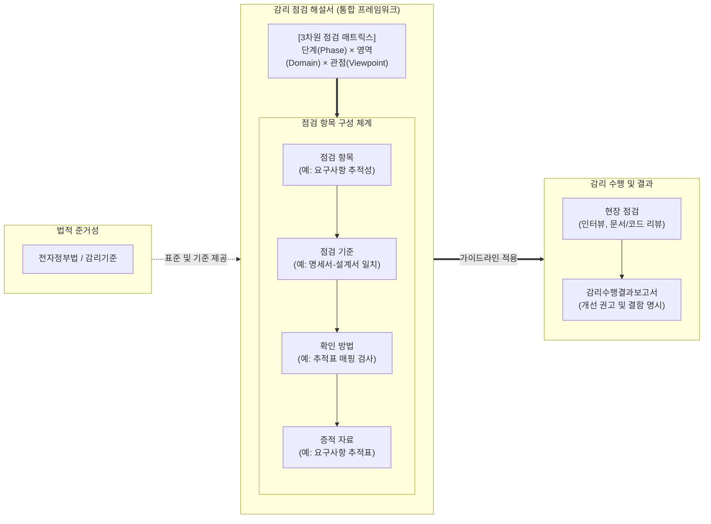

# 정보시스템 감리 점검 해설서

---

## I. 감리 품질의 객관성 및 일관성 확보, 감리 점검 해설서의 개요

* **정의**: 공공 정보화 사업 감리 시, 감리원 간의 편차를 최소화하고 객관적인 품질 검증을 수행하기 위해 점검 단계·영역별 세부 점검 항목, 기준, 확인 방법론을 집대성한 실무 표준 가이드
* **등장배경**: 감리인의 주관적 경험에 의존한 감리 한계 극복, 기술 발전에 따른(Cloud, AI, [[Agile]] 등) 새로운 평가 기준의 표준화 필요, 고품질 감리수행결과보고서 도출 요구
* **특징**: 3차원 점검 매트릭스(단계×영역×관점) 적용, 실무 중심의 구체적 증적 자료 명시, 최신 정보기술 및 법·제도(보안 규정 등)의 주기적 현행화

---

## II. 감리 점검 해설서의 개념도 및 핵심 구성요소

### 가. 감리 점검 해설서 기반의 현장 감리 체계도

* 법적 기준을 토대로 작성된 감리 점검 해설서는 구체적인 '점검 기준 $\rightarrow$ 확인 방법 $\rightarrow$ 증적 자료' 체계를 감리원에게 제공하여, 주관적 편견이 배제된 객관적 현장 점검을 가능하게 함

### 나. 감리 점검 해설서의 핵심 구성 요소

| 분류 | 요소기술(키워드) | 세부 설명 |
| --- | --- | --- |
| **점검 단계** | 3단계 [[프레임워크]] | 과업 범위 확정(요구정의), 아키텍처 확정(설계), 테스트 및 이행(종료) 단계별 가이드 |
| **점검 영역** | 4대 감리 영역 | 사업관리(PM), 응용시스템(App), [[데이터베이스]](DB), 시스템구조 및 보안(Arch/Sec) |
| **점검 관점** | 3대 점검 관점 | 과업 이행 여부(추적성), 산출물/시스템 품질(성능/[[HA(High Availability)|가용성]]), 규정/보안 준거성(지침 준수) |
| **상세 구성** | 점검 항목/기준 | 각 도메인별로 감리원이 반드시 확인해야 할 핵심 Check Point 및 평가의 척도 |
| **상세 구성** | 확인 방법/증적 자료 | 산출물 대조, 담당자 인터뷰, 툴 기반 테스트 등 구체적 검증 방식 및 요구 문서 목록 |
| **최신 가이드** | [[클라우드 감리]] 점검 | IaaS/[[PaaS]] 도입 시 자원 탄력성(Auto-Scaling), 데이터 이관, 클라우드 보안인증([[CSAP]]) 점검 |
| **최신 가이드** | 모바일/UI·UX 점검 | 전자정부 모바일 표준 지침 준수, 웹 접근성, 크로스 브라우징 및 반응형 웹 점검 |
| **보안 점검** | SW 보안약점(47개) | 행정안전부 'SW 개발보안 가이드'에 기반한 소스코드 정적 분석([[SAST]]) 대상 항목 명시 |

---

## III. 감리 점검 체계의 한계 및 최신 발전 동향

### 가. 전통적 점검 해설서의 한계 및 대응 방안

| 한계점 ([[폭포수 모델]] 중심) | 세부 내용 | 대응 및 발전 방안 |
| --- | --- | --- |
| **산출물(문서) 중심 점검** | 방대한 문서 대조 위주로 인해 실제 동작하는 소프트웨어의 숨은 결함 도출 미흡 | 애자일 기반 **'상시 감리 점검 해설서'** 도입을 통해 작동 SW(Working SW) 위주 점검 전환 |
| **최신 IT 환경 반영 지연** | [[MSA (Micro Service Architecture)|MSA]], 오픈소스, AI 등 급변하는 IT 아키텍처 점검 기준 부재 | 분야별 특화 가이드(빅데이터, AI 구축 가이드 등) 제정을 통한 **모듈형 점검 체계** 구축 |

### 나. 지능화 시대를 대비한 감리 점검 해설서의 활용 전망

* **[[초거대 언어 모델|LLM]] 기반 점검 항목 자동 생성(Intelligent Audit)**: 거대언어모델(LLM)에 사업 제안요청서(RFP)와 감리 점검 해설서를 학습시켜, 해당 사업 특성에 최적화된 '맞춤형 점검 체크리스트'를 자동 추출하는 지능형 감리 지원 시스템 도입 추진
* **[[DevSecOps]] 파이프라인 연계**: 소스코드 및 인프라 설정 점검 지표를 CI/CD 도구(Jenkins, SonarQube 등)의 자동화 룰(Rule)로 내재화하여, 감리원의 수동 점검에 의존하던 해설서의 확인 방식을 **'Shift-Left 기반의 상시 자동 검증'** 체계로 고도화 중

---

### 🔗 연관 토픽

- **소속 도메인**: [[00_소프트웨어공학_MOC|🏗️ 소프트웨어공학]]
- **세부 분류**: `2. 애자일(Agile) & 지속적 통합/배포(CI/CD)`
- **핵심 연관 토픽**:
  - [[프레임워크]]
  - [[MSA (Micro Service Architecture)]]
  - [[폭포수 모델]]
  - [[클라우드 감리|클라우드 감리 (Cloud Audit)]]
  - [[DevOps|데브옵스 (DevOps)]]
