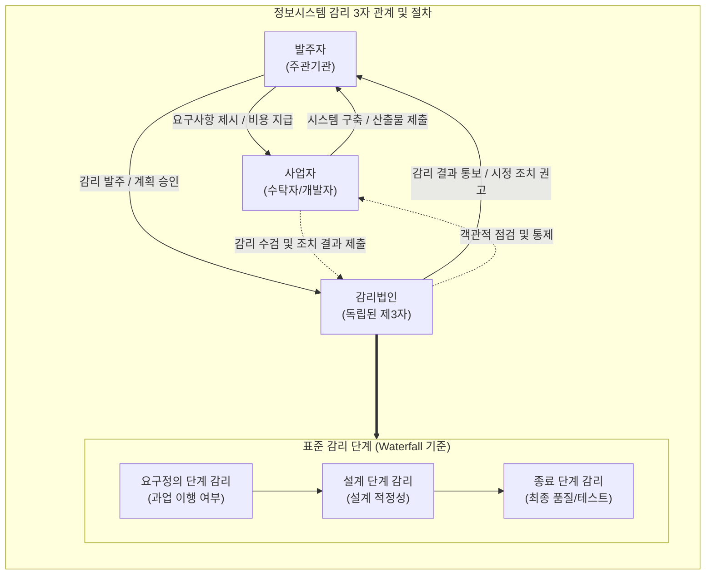

# 정보시스템 감리

---

## I. 공공 IT 사업의 품질 보증 체계, 정보시스템 감리의 개요

* **정의**: 정보시스템의 효율성 향상 및 안전성 확보를 위해 독립된 제3자(감리법인)가 정보시스템의 구축 및 운영에 관한 사항을 종합적으로 점검하고 문제점 개선을 권고하는 객관적 활동
* **등장배경**: 공공 정보화 사업의 잦은 실패 및 예산 낭비 방지, 시스템의 복잡도 증가에 따른 전문적인 품질 통제 필요성 대두 (전자정부법 제57조 의무화)
* **특징**: 독립성 보장(제3자 관점), 객관성 및 전문성 유지, 사업 생명주기에 맞춘 단계별 점검(예방적 품질 통제)

---

## II. 정보시스템 감리의 개념도 및 핵심 구성요소

### 가. 정보시스템 감리의 체계도 및 동작 원리

* 발주자, 사업자, 감리인 간의 독립적 3자 관계를 형성하여 상호 견제와 협력을 도모하며, 일반적으로 요구정의, 설계, 종료 시점의 3단계로 점검을 수행함

### 나. 정보시스템 감리의 핵심 구성 요소

| 구분 | 요소기술(키워드) | 세부 설명 |
| --- | --- | --- |
| **감리 기준** | 전자정부법 제57조 | 공공 정보화 사업 중 일정 규모(5억 원 등) 이상 시 감리 의무화 규정 |
| **감리 기준** | 감리 발주 및 관리 기준 | 행정안전부 고시로 감리인 선정, 대가 산정, 수행 절차 등의 표준 가이드 |
| **감리 단계** | 3단계 표준 감리 | 요구정의(범위 확정), 설계(아키텍처/보안 확정), 종료(테스트/이행) 단계별 수행 |
| **감리 영역** | 4대 감리 도메인 | 사업관리, 응용시스템, [[데이터베이스]], 시스템구조 및 보안 영역 집중 점검 |
| **감리 활동** | 예비 조사 | 본 감리 착수 전 사업 현황 파악, 감리 계획 수립 및 점검 항목(체크리스트) 도출 |
| **감리 활동** | 현장 감리 | 감리원이 사업 현장에 상주하며 인터뷰, 문서 검토, 테스트 등을 통해 결함 도출 |
| **감리 활동** | 시정조치 확인 | 현장 감리 후 지적된 개선 권고 사항에 대해 사업자가 적절히 조치했는지 확인 |
| **감리 산출물** | 감리수행결과보고서 | 현장 감리 종료 시 발주기관 및 사업자에게 제출하는 공식적인 결함 및 개선 권고 문서 |

---

## III. 정보시스템 감리와 PMO 비교 및 향후 전망

### 가. 정보시스템 감리 vs PMO(Project Management Office) 비교

| 비교 항목 | 정보시스템 감리 (Audit) | [[PMO]] (Project Management Office) |
| --- | --- | --- |
| **주요 목적** | 제3자적 시각에서 객관적인 **품질 검증 및 권고** | 발주자를 대리하여 사업의 **성공적 완수 지원 및 관리** |
| **법적 성격** | 공공 정보화 사업 (일정 규모 이상) **의무 사항** | 발주기관의 필요에 따라 **선택적 도입** (대규모/위험도 높을 시) |
| **개입 시점** | 특정 단계(요구정의, 설계, 종료) **점검 시점**에 단기 투입 | 프로젝트 기획부터 종료까지 **전 주기 상주** |
| **역할 및 책임** | 발견된 문제점에 대한 **조언 및 시정 권고** (의사결정권 없음) | 사업 관리에 대한 **직접적 지휘 및 의사결정 지원** |

### 나. 정보시스템 감리의 한계점 및 최신 기술 기반 발전 동향

* **클라우드 및 애자일 기반 상시 감리 체계 전환**: 디지털플랫폼정부(DPG) 실현으로 애자일/[[MSA (Micro Service Architecture)|MSA]] 환경이 확산됨에 따라, [[워터폴|폭포수]] 기반의 '단계별(Point-in-Time) 감리'에서 스프린트 주기에 맞춘 '상시/지속적 감리(Continuous Audit)' 모델로 변화 중
* **감리 자동화 도구 연계([[DevSecOps]])**: 정적 코드 분석([[SAST]]), 취약점 자동 점검 등 CI/CD 파이프라인 내의 자동화 도구를 감리 인프라로 수용하여, 인간의 휴먼 에러를 줄이고 점검의 객관성 및 속도를 극대화하는 지능형 감리 도입 추세

---

### 🔗 연관 토픽

- **소속 도메인**: [[00_소프트웨어공학_MOC|🏗️ 소프트웨어공학]]
- **세부 분류**: `6. 소프트웨어 테스팅 & 품질 보증 (QA/QC)`
- **핵심 연관 토픽**:
  - [[워터폴]]
  - [[감리 PMO 비교표|감리/PMO 비교표]]
  - [[MSA (Micro Service Architecture)]]
  - [[정보시스템 감리 의무 대상과 관점별 점검 기준]]
  - [[DevSecOps]]
