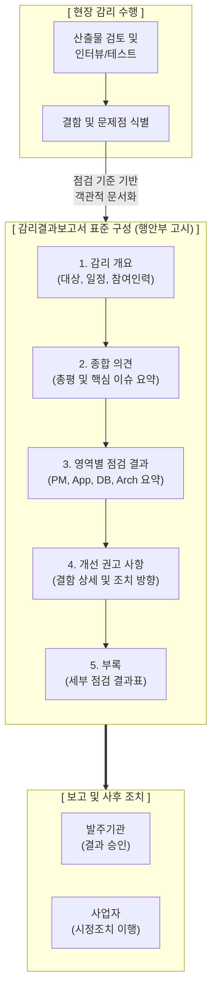

# 정보시스템 감리결과보고서

---

## I. 공공 IT 사업 품질의 객관적 증적, 감리결과보고서의 개요

* **정의**: 현장 감리 수행을 통해 식별된 정보시스템의 결함, 문제점 및 개선 권고 사항을 법적 서식(행정안전부 고시)에 맞춰 발주기관과 사업자에게 공식적으로 통보하는 감리 최종 산출물
* **필요성/특징**: 사업 품질의 객관적 수준 진단 및 가시성 제공, 사업자의 시정조치 이행을 위한 명확한 기준점(Baseline) 제시, 단계별(요구/설계/종료) 품질 통제 이력 자산화

---

## II. 감리결과보고서의 개념도 및 핵심 구성요소

### 가. 감리결과보고서의 개념도 및 작성 프로세스

* 현장 감리에서 식별된 결함을 표준화된 5대 목차 체계로 문서화하며, 평가 척도(적합/부적합)를 명확히 제시하여 사업자의 시정조치를 유도함

### 나. 감리결과보고서의 핵심 구성 및 보고사항

| 구분 | 구성 및 보고사항(키워드) | 세부 설명 |
| --- | --- | --- |
| **기본 구성** | 1. 감리 개요 | 감리 대상 사업명, 감리 기간, 단계, 적용 기준, 감리원 편성 내역 명시 |
| **기본 구성** | 2. 종합 의견 | 전체 사업의 품질 수준에 대한 감리법인의 총평 및 중대한 위험 이슈 요약 |
| **핵심 구성** | 3. 영역별 점검결과 | 사업관리, 응용, DB, 아키텍처/보안 4대 영역별 점검 결과 요약 및 통계 제시 |
| **핵심 구성** | 4. 개선 권고 사항 | 발견된 문제점(현황), 문제로 인한 영향도, 구체적인 개선 방향(권고안) 기술 |
| **상세 보고** | 5. 점검항목별 결과(부록) | 3차원 [[프레임워크]] 기반의 세부 점검항목별 평가 결과 및 확인 방법, 증적 기록 |
| **판정 척도** | 적합 / 부적합 / 점검제외 | 개별 점검 항목에 대해 기준을 충족하면 '적합', 미달 시 '부적합'으로 명확히 판정 |
| **보고 원칙** | 객관성 및 추적성 | 주관적 추측 배제, 발견된 사실(증거)에 기반하여 해당 산출물 위치 등 추적성 제공 |
| **보고 원칙** | 실행 가능성 (Actionable) | 사업자가 기한 내에 현실적으로 조치 가능한 구체적이고 명확한 개선 방향 제시 |

---

## III. 감리보고서 유형 비교 및 향후 발전 전망

### 가. 감리수행결과보고서 vs 시정조치확인보고서 비교

| 비교 항목 | 감리수행결과보고서 (Audit Result Report) | 시정조치확인보고서 (Action Verification Report) |
| --- | --- | --- |
| **작성 및 발행 시점** | **현장 감리 종료 직후** 발행 | 사업자의 **시정조치 완료 통보 후** 발행 |
| **보고서의 핵심 목적** | 사업의 결함 식별 및 **개선 권고(문제 제기)** | 감리 지적 사항에 대한 **조치 완료 여부 검증** |
| **주요 보고 내용** | 영역별 점검 결과, 적합/부적합 판정, 개선 방향 | 지적 사항별 조치 내용, 조치결과 **적정/미흡 판정** |
| **행정적 의미** | 단계별 품질 현황에 대한 1차적 진단 완료 | 다음 단계 진행(또는 사업 대금 지급)을 위한 승인 근거 |

### 나. 감리결과보고서의 한계 및 최신 지능화 동향

* **[[초거대 언어 모델|LLM]] 기반 감리보고서 초안 자동 생성 체계 도입**: 감리원의 수작업 문서 작성에 소요되는 시간적 오버헤드를 줄이기 위해, 감리 현장에서 수집된 결함 데이터와 증적 로그를 거대언어모델(LLM)에 입력하여 법정 서식에 맞춘 '개선 권고 사항' 초안을 자동 생성하는 AI 감리 지원 시스템 도입 추진
* **상시 감리 대시보드(Dashboard) 연계**: 클라우드/애자일 기반 정보화 사업 증가에 따라, 정적인 문서 형태의 보고를 넘어 CI/CD 파이프라인(SonarQube 등)과 연동된 '실시간 감리 점검 대시보드' 형태의 동적 보고 체계로 진화 중

---

### 🔗 연관 토픽

- **소속 도메인**: [[00_소프트웨어공학_MOC|🏗️ 소프트웨어공학]]
- **세부 분류**: `3. 요구사항 공학 & UML 객체지향 분석/설계`
- **핵심 연관 토픽**:
  - [[프레임워크]]
  - [[추상화|추상화 (Abstraction)]]
  - [[정성적 위험 분석]]
  - [[초거대 언어 모델|초거대 언어 모델(Large Language Model)]]
  - [[변동성]]
