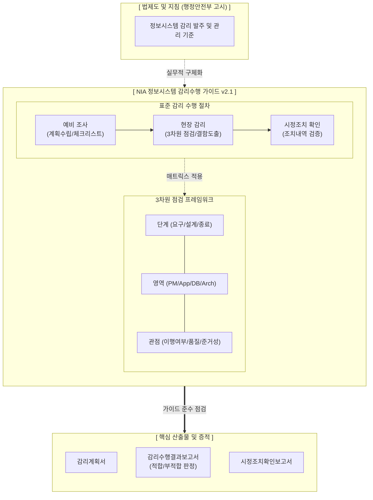

# 정보시스템 감리수행 가이드 v2.1 (NIA)

---

## I. 공공 IT 품질 보증의 실무 나침반, 감리수행 가이드 v2.1 개요

* **정의**: 공공 정보화 사업 감리의 객관성 및 일관성 확보를 위해 행정안전부 고시 기준을 바탕으로 한국지능정보사회진흥원(NIA)이 절차, 점검 [[프레임워크]], 산출물 양식을 표준화한 실무 지침서
* **배경 및 필요성**: 감리원 역량에 따른 평가 편차 최소화, 소프트웨어 진흥법 및 보안 규정(개인정보, [[시큐어코딩]]) 등 최신 법·제도 현행화, 자동화 도구 기반의 객관적 검증 체계 확립
* **특징**: 3차원 점검 매트릭스 적용, 양방향 요구사항 추적성 강조, 명확한 결함 판정 척도(적합/부적합) 제시

---

## II. 감리수행 가이드 v2.1의 개념도 및 핵심 기술 요소

### 가. 감리수행 가이드 기반의 표준 감리 프로세스 및 체계도

* 법적 기준을 바탕으로 예비조사, 현장감리, 시정조치 확인의 3단계 절차와 3차원 점검 매트릭스를 융합하여, 감리원의 주관을 배제한 일관된 평가 결과보고서를 산출함

### 나. 감리수행 가이드 v2.1의 핵심 구성 요소

| 분류 | 요소기술(키워드) | 세부 설명 |
| --- | --- | --- |
| **수행 절차** | 예비조사 및 계획 | 사업 이해, 감리원 편성, 요구사항 기반 특화 체크리스트 작성 및 감리계획서 통보 |
| **수행 절차** | 현장감리 및 보고 | 인터뷰, 문서 대조, 도구 진단을 통한 결함 식별 및 '감리수행결과보고서' 작성/제출 |
| **수행 절차** | 시정조치 확인 | 사업자의 결함 조치 결과를 현장에서 재검증 후 '시정조치확인보고서' 최종 발행 |
| **점검 체계** | 3차원 프레임워크 | **단계(3) $\times$ 영역(4) $\times$ 관점(3)**의 교차 분석을 통해 누락 없는 촘촘한 점검망 구축 |
| **품질 검증** | 요구사항 추적성 | RFP $\rightarrow$ 요구사항정의서 $\rightarrow$ 설계서 $\rightarrow$ 테스트 간의 양방향 매핑(Traceability) 필수 점검 |
| **보안 점검** | SW 개발보안(47개) | 행정안전부 가이드에 따른 시큐어코딩([[SAST]]) 진단 및 [[개인정보 영향평가]] 반영 확인 |
| **검증 도구** | 자동화 도구 활용 | 정적/동적 소스코드 분석기, 성능/부하 테스트(JMeter 등), DB 구조 진단 도구 연계 권고 |
| **판정 척도** | 객관적 결함 판정 | 개별 항목에 대해 **적합, 부적합, 점검제외**로 명확히 판정하고 구체적 개선 권고 기술 |

---

## III. 감리수행 가이드의 한계점 및 향후 발전 동향

### 가. 전통적 감리 수행 체계의 한계점

| 한계점 ([[폭포수 모델]] 중심) | 세부 내용 | 해결 방안 및 진화 방향 |
| --- | --- | --- |
| **정적 산출물 위주 점검** | 방대한 문서 대조에 치중하여 실제 동작하는 시스템(Working SW)의 잠재 결함 식별 미흡 | **동적 테스트([[DAST]])** 비중 강화 및 소스코드 품질 진단 항목 배점 상향 |
| **클라우드/애자일 대응 부족** | 고정된 3단계(요구/설계/종료) 기준은 반복적 스프린트(Sprint)가 발생하는 애자일에 부적합 | **상시 감리(Continuous Audit)** 수행 가이드 별도 신설 및 클라우드([[CSAP]]) 점검 추가 |

### 나. 차세대 정보시스템 감리수행 가이드 발전 전망

* **애자일 및 [[클라우드 네이티브]] 특화 가이드로의 진화**: DPG 인프라 전환에 발맞춰, 기존 [[워터폴|폭포수]] 기반 가이드라인(v2.x)을 [[MSA (Micro Service Architecture)|MSA]], [[컨테이너]], CI/CD 파이프라인 상의 'Shift-Left' 점검이 가능한 상시 감리 실무 가이드(v3.0 이상)로 고도화 중
* **[[초거대 언어 모델|LLM]] 기반 지능형 감리 도구(Intelligent C.A.S.E) 결합**: 감리원의 수작업을 줄이기 위해 제안서와 설계서 간의 추적성 검증 및 맞춤형 체크리스트 초안을 거대언어모델(LLM)이 자동 생성해주는 지능형 감리 시스템 표준 활용 방안이 향후 가이드에 편입될 전망

---

### 🔗 연관 토픽

- **소속 도메인**: [[00_프로젝트관리_MOC|📋 프로젝트관리]]
- **세부 분류**: `4. 품질 보증 · 위험 관리 & 정보시스템 감리`
- **핵심 연관 토픽**:
  - [[프레임워크]]
  - [[클라우드 네이티브]]
  - [[MSA (Micro Service Architecture)]]
  - [[CSAP|CSAP, CSAP(Cloud Security Assurance Program)]]
  - [[시큐어코딩]]
