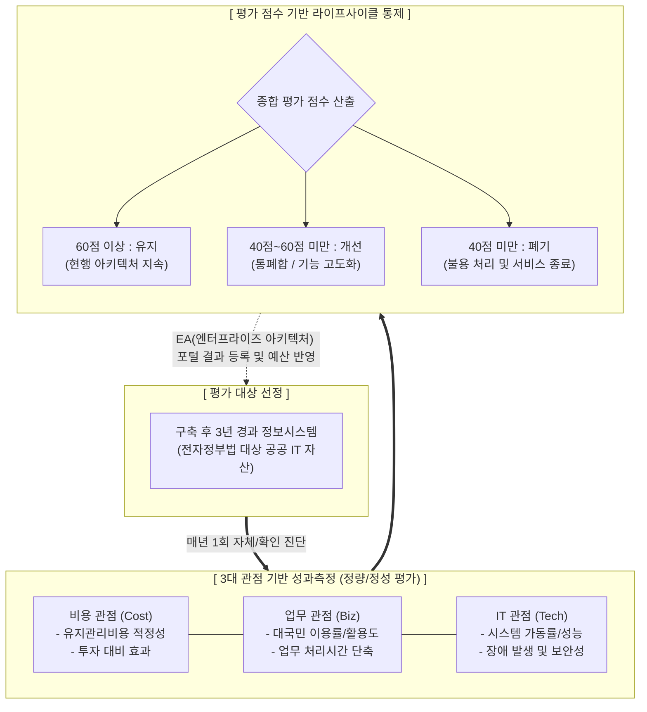

# 정보시스템 운영 성과관리

---

## I. 공공 IT 투자 효율성의 극대화, 정보시스템 운영 성과관리 개요

* **정의**: 정보시스템의 투자 효율성 제고와 서비스 질 향상을 위해 운영 중인 시스템을 대상으로 비용, 업무, IT 관점에서 성과를 정량적으로 측정하고 '유지/개선/폐기'를 결정하는 통제 체계
* **등장배경**: 부처별 사일로(Silo)형 중복 구축으로 인한 예산 낭비 심화, 노후화된 레거시 시스템의 무분별한 운영 방치, 클라우드 전환을 위한 시스템 통폐합 기준 필요성 대두
* **특징**: 전자정부법 및 범정부 EA(GEAP) 기반 법적 의무화, 운영 개시 3년 경과 시스템 대상 매년 평가, 3대 관점(비용/업무/IT) 기반의 라이프사이클 강제 통제

---

## II. 정보시스템 운영 성과관리 개념도 및 핵심 기술 요소

### 가. 정보시스템 운영 성과관리 체계도 및 동작 프로세스

* 운영 3년 차 이상 시스템을 대상으로 매년 3대 관점의 지표를 측정하여, 그 총점에 따라 유지, 개선(고도화/통폐합), 폐기의 실질적인 정비 조치를 강제함

### 나. 정보시스템 운영 성과관리 핵심 구성 요소

| 분류 | 요소기술(키워드) | 세부 설명 |
| --- | --- | --- |
| **운영 대상** | 3년 경과 시스템 | 구축 완료 후 운영을 개시한 지 만 3년이 경과한 공공 정보시스템 (매년 평가 대상) |
| **평가 지표** | 비용 관점 (Cost) | 시스템 운영 유지비용의 예산 범위 준수 여부 및 유지비 대비 업무적 가치 산출 내역 |
| **평가 지표** | 업무 관점 (Biz) | 내부 사용자 만족도, 대국민 서비스 이용 건수, 업무 편의성 및 [[프로세스]] 효율 향상도 |
| **평가 지표** | IT 관점 (Tech) | 시스템 [[응답시간]], 연간 가동률, 장애 발생 횟수, 보안 취약점 점검 및 조치 여부 |
| **정비 기준** | 60점 이상 (유지) | 시스템의 효용성이 인정되어 현행 서비스 수준 및 아키텍처를 그대로 유지 |
| **정비 기준** | 40점~60점 (개선) | 효율성 제고를 위해 유사 시스템과의 **통폐합, 전면 재개발, 기능 고도화** 권고 |
| **정비 기준** | 40점 미만 (폐기) | 효용성이 다한 것으로 판단하여 신규 예산 배정 중단 및 물품관리법에 따른 **불용/폐기** |
| **거버넌스** | 성과관리심의위원회 | 행정안전부 주관으로 범정부 통폐합 대상 지정 및 부처 간 이해관계 심의·조정 수행 |

---

## III. 사전협의 제도와의 비교 및 향후 발전 동향

### 가. 전자정부 사업 사전협의 vs 운영 성과관리 비교

| 비교 항목 | 사전협의 (Pre-Review) | 운영 성과관리 (Performance Mgmt.) |
| --- | --- | --- |
| **적용 시점** | 사업 **기획 및 발주 전** 단계 | 시스템 구축 후 **운영 중 (3년 경과)** |
| **주요 목적** | 중복 구축 방지 및 정보 공동활용 점검 | 시스템 운영 효율성 점검 및 **수명주기 결정** |
| **평가 대상** | 제안요청서(RFP), 사업계획서 | 실제 운영 로그, [[유지보수]] 예산, 시스템 가동률 |
| **의사결정 결과** | 추진 승인, 조건부 승인, 반려 | 유지, 개선(통폐합/재개발), 폐기 |

### 나. 정보시스템 운영 성과관리의 최근 동향 및 향후 전망

* **[[클라우드 네이티브]](Cloud-Native) 전환의 핵심 지표 활용**: 성과측정 결과 '개선(통폐합)' 대상이 된 시스템들을 단순히 고도화하는 것을 넘어, 민간 SaaS(서비스형 소프트웨어) 우선 도입이나 공공 클라우드 센터 통합으로 강제 유도하여 DPG 생태계 전환을 가속화 중
* **AIOps 기반 성과 데이터 수집 자동화**: 과거 담당자의 수작업에 의존하던 증적(로그, 장애 건수, [[CPU]] 사용률 등) 수집 방식에서 벗어나, APM 솔루션 및 AIOps 머신러닝 엔진과 연계하여 IT 관점 지표의 객관성과 신뢰성을 높이는 지능형 성과관리 체계로 고도화 중

---

### 🔗 연관 토픽

- **소속 도메인**: [[00_소프트웨어공학_MOC|🏗️ 소프트웨어공학]]
- **세부 분류**: `6. 소프트웨어 테스팅 & 품질 보증 (QA/QC)`
- **핵심 연관 토픽**:
  - [[응답시간]]
  - [[프로세스]]
  - [[유지보수]]
  - [[Debugging]]
  - [[상용 소프트웨어 품질성능 평가 시험|상용소프트웨어 품질성능 평가 시험]]
