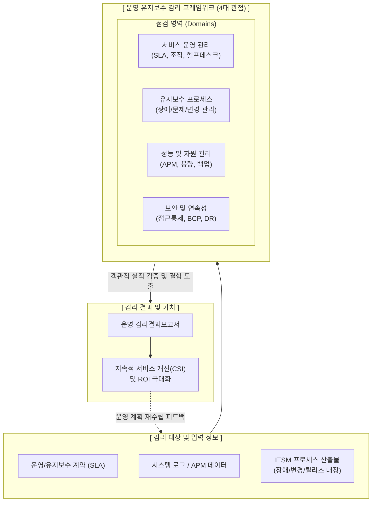

# 정보시스템 운영 유지보수 감리

---

## I. IT 서비스의 신뢰성 및 비용 효율성 확보, 운영 유지보수 감리의 개요

* **정의**: 정보시스템 구축 완료 후 운영 단계에서 IT 서비스의 품질, 보안성, 비용 효율성을 확보하고 [[SLA]](서비스 수준 협약) 준수 여부를 제3자(감리법인)가 객관적으로 평가 및 개선을 권고하는 활동
* **등장배경**: 레거시 시스템 운영 예산(TCO) 증가 및 비효율 심화, 잦은 시스템 장애로 인한 비즈니스 연속성 훼손, 아웃소싱(ITO) 업체의 서비스 품질 저하 및 보안 사고 위험 통제 필요
* **특징**: ITIL/[[ITSM(Information Technology Service Management)|ITSM]] 기반의 [[프로세스]] 통제, SLA/KPI 중심의 정량적 평가, 사후 장애 복구 적정성 및 사전 예방 점검 체계 집중 점검

---

## II. 정보시스템 운영 유지보수 감리 개념도 및 핵심 기술 요소

### 가. 운영 유지보수 감리의 개념도 및 동작 프로세스

* 운영 및 [[유지보수]] 산출물, 시스템 로그를 바탕으로 IT 서비스 관리, 프로세스, 성능, 보안 관점의 객관적 실적 검증을 수행하여 지속적인 서비스 개선(CSI)을 유도함

### 나. 정보시스템 운영 유지보수 감리의 핵심 구성 요소

| 구분 | 요소기술(키워드) | 세부 설명 |
| --- | --- | --- |
| **운영 관리** | SLA / KPI 점검 | 계약서 기반의 서비스 수준 협약 지표(가동률, [[응답시간]] 등) 달성 여부 및 측정 방식의 객관성 점검 |
| **[[프로세스 관리]]** | 장애 / 문제 관리 | 장애 발생 시 복구 절차(MTTR) 준수 및 근본 원인 분석(RCA)을 통한 문제 재발 방지 활동 점검 |
| **프로세스 관리** | 변경 / [[형상 관리]] | 시스템 및 소스코드 변경 시 사전 영향도 분석, 승인 절차(CAB) 준수 및 원복(Rollback) 계획 점검 |
| **성능 관리** | APM / 용량 모니터링 | 시스템 자원([[CPU]], Mem, DB)의 사용 추이 분석, 임계치 알림 설정 및 향후 용량 증설 계획 점검 |
| **보안 관리** | 취약점 / 접근 통제 | 최신 보안 패치 적용 적시성, 퇴사자/외주인력 계정 회수, DB 접근제어 및 망분리 규정 준수 점검 |
| **연속성 관리** | [[BCP]] / DR 모의훈련 | 재난 발생 대비 [[비즈니스 연속성 계획]](BCP) 최신화 여부 및 재해복구(DR) RTO/RPO 달성 모의훈련 점검 |
| **데이터 관리** | 백업 및 복구 검증 | 정기 백업 수행 로그 확인 및 무작위 복구 테스트를 통한 데이터 [[무결성]] 및 복원력 검증 |
| **기준 [[프레임워크]]** | ITIL / ISO 20000 | 글로벌 IT 서비스 관리(ITSM) 표준 프레임워크를 준용하여 유지보수 절차의 성숙도 평가 |

---

## III. 구축 감리와 운영 감리 비교 및 최신 동향

### 가. 시스템 구축 감리 vs 운영 유지보수 감리 비교

| 비교 항목 | 정보시스템 구축 감리 | 정보시스템 운영 유지보수 감리 |
| --- | --- | --- |
| **주요 목적** | 시스템의 **성공적 완수 및 품질 확보** | 서비스의 **안정적 유지 및 효율성 극대화** |
| **투입 시점** | 사업 구축 단계 (요구, 설계, 종료) | 시스템 가동 이후 **운영 및 유지보수 단계** |
| **주요 점검 대상** | [[요구사항 명세서]], 설계서, 소스코드, 테스트 | SLA 지표, 장애/변경 이력, 모니터링 로그, 백업 |
| **핵심 점검 기준** | 과업 이행 여부(추적성), 아키텍처 적정성 | **서비스 [[HA(High Availability)|가용성]], 신속 복구 체계, 규정 준수** |
| **참조 프레임워크** | 소프트웨어 공학, 감리수행가이드 | **ITIL, ISO 20000, ISO 27001 (정보보안)** |

### 나. 운영 유지보수 감리의 최신 동향 및 향후 전망

* **SRE([[SRE (Site Reliability Engineering)|Site Reliability Engineering]]) 지표 기반 감리 체계 확산**: 전통적인 시스템 업타임(Uptime) 중심의 평가에서 벗어나, SLI(서비스 수준 지표)와 SLO(서비스 수준 목표)를 바탕으로 Error Budget 소진율을 측정하는 사용자 체감 중심의 운영 감리 방식으로 진화 중
* **[[클라우드 네이티브]] 및 AIOps 기반 자동화 점검 도입**: 인프라가 클라우드로 전환됨에 따라 [[CSP]] 제어판 설정 검증 및 IaC(코드 기반 인프라) 변경 이력을 점검하며, AIOps 시스템이 제공하는 이상 탐지([[Anomaly(이상현상)|Anomaly]] Detection) 데이터의 정합성을 검증하는 지능형 감리 기법이 필수로 대두됨

---

### 🔗 연관 토픽

- **소속 도메인**: [[00_소프트웨어공학_MOC|🏗️ 소프트웨어공학]]
- **세부 분류**: `6. 소프트웨어 테스팅 & 품질 보증 (QA/QC)`
- **핵심 연관 토픽**:
  - [[응답시간]]
  - [[유지보수]]
  - [[무결성]]
  - [[클라우드 네이티브]]
  - [[CSP|CSP (Cloud Service Provider)]]
